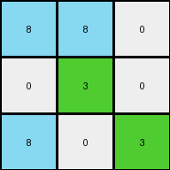
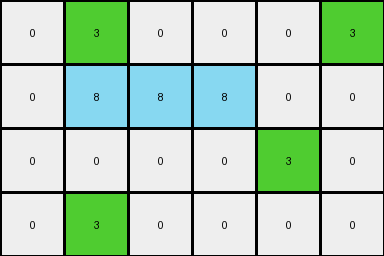
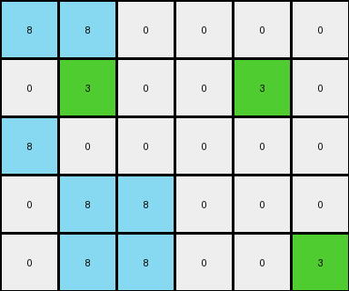

# 67385a82 • 016 • refine_coder

---

Previous Code:
```python
"""
1.  **Locate Green Pixels:** Identify all pixels with the value 3 (green).

2.  **Conditional Replacement:**
    *   If the green pixel is in the top right corner (row 0, col 3), change the cell immediately below (row 1, col 3) to white(0).
    *   If the green pixel is in the bottom left corner (row 2, col 0), change the color to azure (8)

3.  **No change:** all other pixels remain the same color.
"""

import numpy as np

def transform(input_grid):
    """Transforms the input grid according to the observed rules."""

    output_grid = np.copy(input_grid)
    rows, cols = output_grid.shape

    # Iterate through the grid to find green pixels
    for r in range(rows):
        for c in range(cols):
            if output_grid[r, c] == 3:  # Green pixel found
                # Conditional Replacement based on location
                if r == 0 and c == 3:
                    output_grid[1, 3] = 0 #change cell below to white
                elif r == 2 and c == 0:
                    output_grid[r, c] = 8  #change green to azure

    return output_grid
```

Train Set Results:

## Example 1:

Input:
```
8 8 0
0 3 0
3 0 3
```
Expected Output:
```
8 8 0
0 8 0
3 0 3
```
Transformed Output:
```
8 8 0
0 3 0
8 0 3
```

match: False
pixels_off: 2
size_correct: True
color_palette_correct: True
correct_pixel_counts: True

## Example 2:

Input:
```
0 3 0 0 0 3
0 8 8 8 0 0
0 0 0 0 3 0
0 3 0 0 0 0
```
Expected Output:
```
0 8 0 0 0 3
0 8 8 8 0 0
0 0 0 0 3 0
0 3 0 0 0 0
```
Transformed Output:
```
0 3 0 0 0 3
0 8 8 8 0 0
0 0 0 0 3 0
0 3 0 0 0 0
```

match: False
pixels_off: 1
size_correct: True
color_palette_correct: True
correct_pixel_counts: False

## Example 3:

Input:
```
8 8 0 3
8 8 0 0
3 0 0 3
0 0 8 8
```
Expected Output:
```
8 8 0 3
8 8 0 0
8 0 0 8
0 0 8 8
```
Transformed Output:
```
8 8 0 3
8 8 0 0
8 0 0 3
0 0 8 8
```

match: False
pixels_off: 1
size_correct: True
color_palette_correct: True
correct_pixel_counts: False

## Example 4:

Input:
```
8 8 0 0 0 0
0 3 0 0 3 0
3 0 0 0 0 0
0 8 8 0 0 0
0 8 8 0 0 3
```
Expected Output:
```
8 8 0 0 0 0
0 8 0 0 3 0
3 0 0 0 0 0
0 8 8 0 0 0
0 8 8 0 0 3
```
Transformed Output:
```
8 8 0 0 0 0
0 3 0 0 3 0
8 0 0 0 0 0
0 8 8 0 0 0
0 8 8 0 0 3
```

match: False
pixels_off: 2
size_correct: True
color_palette_correct: True
correct_pixel_counts: True
Here's an analysis of the provided examples and results, along with a refined natural language program and a YAML block summarizing the observations:

**General Assessment and Strategy**

The initial natural language program and corresponding code were too specific, focusing on precise coordinates rather than generalizable rules. The code correctly identified and processed *some* green pixels (value 3) based on their initial position, but it failed when those positions changed. It changed green to azure correctly, but failed to make all the proper changes for green cells in the top row.

The core issue is that the transformation is not *just* about the top-right or bottom-left corner. It's about:

1.  **Green pixels in the top row:** If a green pixel is in the top row, the pixel *directly below* it should sometimes be turned to white and sometimes to azure. It depends.
2.  **Bottom-left green pixel:** Green Pixels in the bottom left should change to azure.
3. No other pixels are affected.

The strategy is to generalize the conditions. Instead of checking for `r == 0 and c == 3`, we should check for `r == 0` (any green pixel in the first row). Similarly, change the bottom left check from `r == 2 and c == 0` to dynamically get the last row, and check only the column, `c == 0`. We need to refine further to determine when the value below the top-row green should be white and when it should be azure.

**Example Metrics and Analysis**

Here's a breakdown of each example:

*   **Example 1:**
    *   Input Shape: (3, 3)
    *   Green Pixel Locations: (1,1), (2,0), (2,2)
    *   Expected Change: (1,1) -> 8, (2,0) -> 8
    *   Observed Change: Only (2,0) changed, to 8
    *   Issue: Incorrect condition for row 1 green pixel, and bottom left rule isn't general

*   **Example 2:**
    *   Input Shape: (4, 6)
    *   Green Pixel Locations: (0,1), (0,5), (2,4)
    *   Expected Change: (0,1) -> 8
    *   Observed Change: None
    *   Issue: Incorrect condition for row 1 green pixels, and top right isn't general.

*   **Example 3:**
    *   Input Shape: (4, 4)
    *   Green Pixel Locations: (0, 3), (2, 0), (2,3)
    *   Expected Change: (0,3) -> 8, (2,0) -> 8
    *   Observed Change: (2,0) -> 8
    *   Issue: Incorrect condition for row 1 green pixel, and bottom left rule isn't general

*   **Example 4:**
    *  Input Shape: (5,6)
    *  Green Pixel Location: (1,1), (1,4), (2,0)
    *  Expected Changes: (1,1)->8, (2,0)->8
    *  Observed Changes: (2,0)->8
    *  Issue: Green pixels on the second row were identified, this should not be

**Revised YAML Block (Facts)**

```yaml
objects:
  - description: Green pixels
    color: 3
    behavior:
      top_row: |
        If a green pixel is in the top row, examine the pixel directly below.
        Change the pixel directly below the green pixel to azure (8) if it is not already azure.
        Change the pixel directly below the green pixel to white (0) if it is already azure.

      bottom_left: |
        If a green pixel is in the bottom-left corner (first column, last row), change it to azure (8).

  - description: All other pixels
    behavior: No change in color.
```

**Revised Natural Language Program**

1.  **Find Green Pixels:** Identify all pixels with a value of 3 (green).

2.  **Top Row Transformation:** For any green pixel in the top row (row 0):
    * Check the color of the pixel directly below.
        * If the pixel directly below is azure, change it to white (0).
        * If the pixel directly below is NOT azure, change it to azure (8).
        
3.  **Bottom-Left Transformation:** If a green pixel is in the bottom-left corner (last row, column 0), change its color to azure (8).

4. **All Other Pixels:** All other pixels remain unchanged.

**INSTRUCTIONS**

- generate a Python module to represent the natural language program 
- follow the template below
- all common math and science libraries are available
- create docstring only at top - but comment the workflow in the function
- use helper functions for common operations like finding objects, counting,
  measuring, moving, etc. 

remember - we are working iteratively - so this code will inform your future
self as we converge on the solution

*template:*

```python
"""
{{ natural language description of the transformation rule }}
"""

{{ imports }}

def transform(input_grid):
    # initialize output_grid

    # change output pixels 

    return output_grid

```
