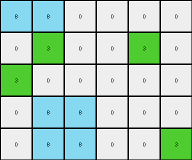

# 67385a82 • 017 • refine_dreamer

---


Previous Code:
```python
"""
1.  **Find Green Pixels:** Identify all pixels with a value of 3 (green).

2.  **Top Row Transformation:** For any green pixel in the top row (row 0):
    * Check the color of the pixel directly below.
        * If the pixel directly below is azure, change it to white (0).
        * If the pixel directly below is NOT azure, change it to azure (8).
        
3.  **Bottom-Left Transformation:** If a green pixel is in the bottom-left corner (last row, column 0), change its color to azure (8).

4. **All Other Pixels:** All other pixels remain unchanged.
"""

import numpy as np

def transform(input_grid):
    """Transforms the input grid according to the observed rules."""

    output_grid = np.copy(input_grid)
    rows, cols = output_grid.shape

    # Iterate through the grid to find green pixels
    for r in range(rows):
        for c in range(cols):
            if output_grid[r, c] == 3:  # Green pixel found
                # Top Row Transformation
                if r == 0:
                    if r + 1 < rows: #ensure we are within the grid
                        if output_grid[r+1,c] == 8:
                            output_grid[r+1, c] = 0  # Change to white
                        else:
                            output_grid[r+1, c] = 8  # Change to azure
                # Bottom-Left Transformation
                elif r == rows - 1 and c == 0:
                    output_grid[r, c] = 8  # Change to azure

    return output_grid
```

Train Set Results:

## Example 1:

Input:
```
8 8 0
0 3 0
3 0 3
```
Expected Output:
```
8 8 0
0 8 0
3 0 3
```
Transformed Output:
```
8 8 0
0 3 0
8 0 3
```

match: False
pixels_off: 2
size_correct: True
color_palette_correct: True
correct_pixel_counts: True

## Example 2:

Input:
```
0 3 0 0 0 3
0 8 8 8 0 0
0 0 0 0 3 0
0 3 0 0 0 0
```
Expected Output:
```
0 8 0 0 0 3
0 8 8 8 0 0
0 0 0 0 3 0
0 3 0 0 0 0
```
Transformed Output:
```
0 3 0 0 0 3
0 0 8 8 0 8
0 0 0 0 3 0
0 3 0 0 0 0
```

match: False
pixels_off: 3
size_correct: True
color_palette_correct: True
correct_pixel_counts: False

## Example 3:

Input:
```
8 8 0 3
8 8 0 0
3 0 0 3
0 0 8 8
```
Expected Output:
```
8 8 0 3
8 8 0 0
8 0 0 8
0 0 8 8
```
Transformed Output:
```
8 8 0 3
8 8 0 8
3 0 0 3
0 0 8 8
```

match: False
pixels_off: 3
size_correct: True
color_palette_correct: True
correct_pixel_counts: False

## Example 4:

Input:
```
8 8 0 0 0 0
0 3 0 0 3 0
3 0 0 0 0 0
0 8 8 0 0 0
0 8 8 0 0 3
```
Expected Output:
```
8 8 0 0 0 0
0 8 0 0 3 0
3 0 0 0 0 0
0 8 8 0 0 0
0 8 8 0 0 3
```
Transformed Output:
```
8 8 0 0 0 0
0 3 0 0 3 0
3 0 0 0 0 0
0 8 8 0 0 0
0 8 8 0 0 3
```

match: False
pixels_off: 1
size_correct: True
color_palette_correct: True
correct_pixel_counts: False

**INSTRUCTIONS**

The code above was generated based on observations from the first training
example

we have tested the transform function on each of the task example inputs and
compared with the expected output

review each of the examples provided and the results and consider how the
natural language program should be updated to accommodate this new knowledge

respond with the following deliverables:

- general assessment of the information provided and strategy for resolving the
  errors
- gather metrics about each of the examples and results - use code_execution to
  develop accurate reports on your assumptions
- a YAML block documenting facts - Focus on identifying objects, their properties, and the actions performed on them.
- a natural language program - Be as clear and concise as possible, providing a complete description of the transformation rule.


your responses should be considered as information in a report - not a
conversation
