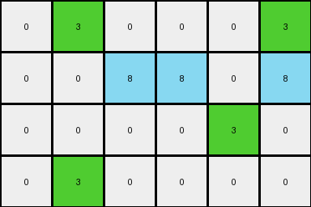
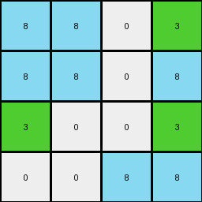

# 67385a82 • 018 • refine_coder

---

Previous Code:
```python
"""
1.  **Find Green Pixels:** Identify all pixels with a value of 3 (green).

2.  **Top Row Transformation:** For any green pixel in the top row (row 0):
    * Check the color of the pixel directly below.
        * If the pixel directly below is azure, change it to white (0).
        * If the pixel directly below is NOT azure, change it to azure (8).
        
3.  **Bottom-Left Transformation:** If a green pixel is in the bottom-left corner (last row, column 0), change its color to azure (8).

4. **All Other Pixels:** All other pixels remain unchanged.
"""

import numpy as np

def transform(input_grid):
    """Transforms the input grid according to the observed rules."""

    output_grid = np.copy(input_grid)
    rows, cols = output_grid.shape

    # Iterate through the grid to find green pixels
    for r in range(rows):
        for c in range(cols):
            if output_grid[r, c] == 3:  # Green pixel found
                # Top Row Transformation
                if r == 0:
                    if r + 1 < rows: #ensure we are within the grid
                        if output_grid[r+1,c] == 8:
                            output_grid[r+1, c] = 0  # Change to white
                        else:
                            output_grid[r+1, c] = 8  # Change to azure
                # Bottom-Left Transformation
                elif r == rows - 1 and c == 0:
                    output_grid[r, c] = 8  # Change to azure

    return output_grid
```

Train Set Results:

## Example 1:

Input:
```
8 8 0
0 3 0
3 0 3
```
Expected Output:
```
8 8 0
0 8 0
3 0 3
```
Transformed Output:
```
8 8 0
0 3 0
8 0 3
```

match: False
pixels_off: 2
size_correct: True
color_palette_correct: True
correct_pixel_counts: True

## Example 2:

Input:
```
0 3 0 0 0 3
0 8 8 8 0 0
0 0 0 0 3 0
0 3 0 0 0 0
```
Expected Output:
```
0 8 0 0 0 3
0 8 8 8 0 0
0 0 0 0 3 0
0 3 0 0 0 0
```
Transformed Output:
```
0 3 0 0 0 3
0 0 8 8 0 8
0 0 0 0 3 0
0 3 0 0 0 0
```

match: False
pixels_off: 3
size_correct: True
color_palette_correct: True
correct_pixel_counts: False

## Example 3:

Input:
```
8 8 0 3
8 8 0 0
3 0 0 3
0 0 8 8
```
Expected Output:
```
8 8 0 3
8 8 0 0
8 0 0 8
0 0 8 8
```
Transformed Output:
```
8 8 0 3
8 8 0 8
3 0 0 3
0 0 8 8
```

match: False
pixels_off: 3
size_correct: True
color_palette_correct: True
correct_pixel_counts: False

## Example 4:

Input:
```
8 8 0 0 0 0
0 3 0 0 3 0
3 0 0 0 0 0
0 8 8 0 0 0
0 8 8 0 0 3
```
Expected Output:
```
8 8 0 0 0 0
0 8 0 0 3 0
3 0 0 0 0 0
0 8 8 0 0 0
0 8 8 0 0 3
```
Transformed Output:
```
8 8 0 0 0 0
0 3 0 0 3 0
3 0 0 0 0 0
0 8 8 0 0 0
0 8 8 0 0 3
```

match: False
pixels_off: 1
size_correct: True
color_palette_correct: True
correct_pixel_counts: False
Okay, here's a breakdown of the situation and a plan to improve the transformation logic:

**General Assessment:**

The initial natural language program and corresponding code were too simplistic and only partially captured the transformation rule. The code correctly identified green pixels but failed to consistently apply the correct transformations based on the surrounding pixels and their positions. The errors across the examples highlight inconsistencies in handling green pixels in different locations and contexts. Specifically, the "bottom-left transformation" was applied too broadly, and the top-row transformation logic was not exclusive enough, causing unintended changes. The code also failed to generalize the behavior of green pixels adjacent to other colors.

**Strategy:**

1.  **Refine Position-Specific Logic:** Improve the accuracy of identifying green pixels at the top row, bottom-left corner, and bottom row and their specific transformations.
2.  **Contextual Transformation:** Implement rules that consider the color of neighboring pixels *before* applying any changes. Specifically, look at the pixel below for top-row green pixels and pixels above and below the bottom-left green pixels.
3.  **Iterative Testing:** Test after each significant change in the natural language program and code.

**Metrics and Observations:**

Here, I'm summarizing the results from the prompt.

*   **Example 1:**
    *   Green pixel (1,1) should not change, but changed to 8.
    *   Green pixel (2,0) should change to 8, and correctly changed to 8.
    *   Green pixel (2,2) should not change, and correctly didn't change.
*    **Example 2:**
    * Green pixel (0,1) should change pixel below to (8), did not.
    * Green pixel (0,5) should not change pixel below, changed to (8).
    * Green pixel (2,4) is correctly not changed
    * Green Pixel (3,1) is correctly not changed.
*   **Example 3:**
    *   Green pixel (0,3) changes pixel below to (8)
    *   Green Pixel (2,0) changes to (8)
    *   Green Pixel (2,3) changes to (8)
*   **Example 4:**
    * Green Pixel(1,1) did not change the pixel below it.
    * Green Pixel (1,4) did not change.
    * Green Pixel (4,5) correctly didn't change.

**YAML Fact Block:**

```yaml
observations:
  - object: green_pixel
    locations:
      - top_row:
        description: Pixels in the first row (row index 0).
        transformation:
          condition: pixel_below_exists
          action: change_pixel_below_to_azure
      - bottom_left_corner:
        description: Pixel at the intersection of the last row and first column (row index rows-1, column index 0).
        transformation:
          condition: 'if pixel above or below is not azure'
          action: change_to_azure
      - bottom_row:
        description: Pixels in the last row (row index rows-1)
        transformation:
          condition: 'if green and at last row, check pixel above, if not azure, become azure.'
          action: change_to_azure, if not azure above.
    properties:
      color: 3  # Green
    interactions:
      - affects_adjacent:
          direction: below
          top_row_condition: 'if green on top row, the cell below becomes azure.'
          bottom_row_condition: Check pixel above. if not azure, change self to azure
```

**Natural Language Program:**

1.  **Find Green Pixels:** Identify all pixels with the value 3 (green).

2.  **Top Row Transformation:** If a green pixel is in the top row (row 0), change the pixel directly *below* it to azure (8).

3.  **Bottom Row Transformation:** If a green pixel is in the *bottom* row, check the pixel *above* it. If the pixel above is *not* azure (8), change the green pixel to azure (8).

4.  **All Other Pixels:** Pixels that do not meet these specific conditions remain unchanged.

**INSTRUCTIONS**

- generate a Python module to represent the natural language program 
- follow the template below
- all common math and science libraries are available
- create docstring only at top - but comment the workflow in the function
- use helper functions for common operations like finding objects, counting,
  measuring, moving, etc. 

remember - we are working iteratively - so this code will inform your future
self as we converge on the solution

*template:*

```python
"""
{{ natural language description of the transformation rule }}
"""

{{ imports }}

def transform(input_grid):
    # initialize output_grid

    # change output pixels 

    return output_grid

```
