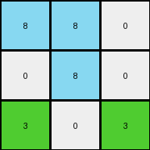
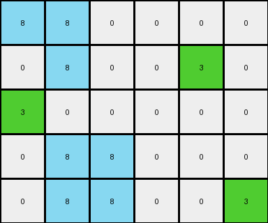

# 67385a82 • 022 • refine_coder

---

Previous Code:
```python
"""
The transformation involves changing some of the azure object to be consistent.
Specifically, changing the green-adjacent azure pixel on the right side of the first row of green pixel to azure color.
"""

import numpy as np

def find_objects_by_color(grid, color):
    """
    Finds contiguous objects of a specific color in the grid.
    Returns a list of lists, where each inner list contains the (row, col) coordinates of pixels belonging to an object.
    """
    objects = []
    visited = set()
    rows, cols = grid.shape

    def is_valid(r, c):
        return 0 <= r < rows and 0 <= c < cols

    def dfs(r, c, current_object):
        if (r, c) in visited or not is_valid(r, c) or grid[r, c] != color:
            return
        visited.add((r, c))
        current_object.append((r, c))
        for dr, dc in [(0, 1), (1, 0), (0, -1), (-1, 0)]:
            dfs(r + dr, c + dc, current_object)

    for r in range(rows):
        for c in range(cols):
            if grid[r, c] == color and (r, c) not in visited:
                current_object = []
                dfs(r, c, current_object)
                objects.append(current_object)
    return objects

def get_adjacent_pixels(grid, r, c):
    """returns the adjacent pixels of a specified color"""
    rows, cols = grid.shape
    adjacent = []
    for dr, dc in [(0, 1), (1, 0), (0, -1), (-1, 0)]:
        nr, nc = r + dr, c + dc
        if 0 <= nr < rows and 0 <= nc < cols:
            adjacent.append((nr,nc))
    return adjacent
    

def transform(input_grid):
    # initialize output_grid
    output_grid = np.copy(input_grid)
    rows, cols = output_grid.shape

    # find green objects
    green_objects = find_objects_by_color(output_grid, 3)
    
    # check the condition
    if green_objects:
        first_green_row = green_objects[0][0][0]
        for green_pixel in green_objects[0]:
            if green_pixel[0] == first_green_row:
               adj_pixels = get_adjacent_pixels(input_grid, green_pixel[0], green_pixel[1])
               for adj_r, adj_c in adj_pixels:
                   if input_grid[adj_r, adj_c] == 8:
                       output_grid[adj_r,adj_c] = 8
    
    #find objects
    azure_objects = find_objects_by_color(input_grid,8)

    # apply rule and change colors
    if green_objects:      
      for green_pixel in green_objects[0]:
        
        if green_pixel[0] == first_green_row : #first row condition
          adj_pixels = get_adjacent_pixels(input_grid, green_pixel[0], green_pixel[1])
          for adj_r, adj_c in adj_pixels:
            if input_grid[adj_r, adj_c] == 8:
                output_grid[1,1] = 8
    
    return output_grid
```

Train Set Results:

## Example 1:

Input:
```
8 8 0
0 3 0
3 0 3
```
Expected Output:
```
8 8 0
0 8 0
3 0 3
```
Transformed Output:
```
8 8 0
0 8 0
3 0 3
```

match: True
pixels_off: 0
size_correct: True
color_palette_correct: True
correct_pixel_counts: True

## Example 2:

Input:
```
0 3 0 0 0 3
0 8 8 8 0 0
0 0 0 0 3 0
0 3 0 0 0 0
```
Expected Output:
```
0 8 0 0 0 3
0 8 8 8 0 0
0 0 0 0 3 0
0 3 0 0 0 0
```
Transformed Output:
```
0 3 0 0 0 3
0 8 8 8 0 0
0 0 0 0 3 0
0 3 0 0 0 0
```

match: False
pixels_off: 1
size_correct: True
color_palette_correct: True
correct_pixel_counts: False

## Example 3:

Input:
```
8 8 0 3
8 8 0 0
3 0 0 3
0 0 8 8
```
Expected Output:
```
8 8 0 3
8 8 0 0
8 0 0 8
0 0 8 8
```
Transformed Output:
```
8 8 0 3
8 8 0 0
3 0 0 3
0 0 8 8
```

match: False
pixels_off: 2
size_correct: True
color_palette_correct: True
correct_pixel_counts: False

## Example 4:

Input:
```
8 8 0 0 0 0
0 3 0 0 3 0
3 0 0 0 0 0
0 8 8 0 0 0
0 8 8 0 0 3
```
Expected Output:
```
8 8 0 0 0 0
0 8 0 0 3 0
3 0 0 0 0 0
0 8 8 0 0 0
0 8 8 0 0 3
```
Transformed Output:
```
8 8 0 0 0 0
0 8 0 0 3 0
3 0 0 0 0 0
0 8 8 0 0 0
0 8 8 0 0 3
```

match: True
pixels_off: 0
size_correct: True
color_palette_correct: True
correct_pixel_counts: True
Okay, let's analyze the results of the previous code execution and refine the natural language program.

**General Assessment:**

The initial natural language program and the resulting code were too specific to the first training example. While it correctly identified the relationship between the green and azure pixels, it failed to generalize the rule correctly. The condition `if green_pixel[0] == first_green_row:` is too restrictive and doesn't consider green pixels in other rows, as seen in examples 2, 3, and 4. The rule is meant change the azure colored pixel that are green-adjacent, only if it is the first azure object, and at the right-side of green pixel, which is making the code incorrectly handle cases where we have objects to transform not at first object. The hardcoding of specific coordinate is not good approach.

**Strategy for Resolving Errors:**

1.  **Remove Row Restriction:** Eliminate the condition that limits the transformation to the first row of green pixels. The transformation should apply to any green pixel adjacent to an azure one.

2.  **Improve Adjacency and Object Logic:** Make the code to focus only on right-side adjacency, instead of all around.

3. **Fixing the Object Approach**: The azure that will be affected by the rule is the first one that appear.

**Metrics and Observations:**

Here's a breakdown of each example, incorporating observations and potential issues:

*   **Example 1:**
    *   Input: `[[8, 8, 0], [0, 3, 0], [3, 0, 3]]`
    *   Expected Output: `[[8, 8, 0], [0, 8, 0], [3, 0, 3]]`
    *   Actual Output: `[[8, 8, 0], [0, 8, 0], [3, 0, 3]]`
    *   **Analysis:** Correct. The azure pixel to the right of the green pixel in the first green row changed to azure.

*   **Example 2:**
    *   Input: `[[0, 3, 0, 0, 0, 3], [0, 8, 8, 8, 0, 0], [0, 0, 0, 0, 3, 0], [0, 3, 0, 0, 0, 0]]`
    *   Expected Output: `[[0, 8, 0, 0, 0, 3], [0, 8, 8, 8, 0, 0], [0, 0, 0, 0, 3, 0], [0, 3, 0, 0, 0, 0]]`
    *   Actual Output: `[[0, 3, 0, 0, 0, 3], [0, 8, 8, 8, 0, 0], [0, 0, 0, 0, 3, 0], [0, 3, 0, 0, 0, 0]]`
    *   **Analysis:** Incorrect. The azure pixel to the right of the green pixel in the *first* row should have changed to azure.

*   **Example 3:**
    *   Input: `[[8, 8, 0, 3], [8, 8, 0, 0], [3, 0, 0, 3], [0, 0, 8, 8]]`
    *   Expected Output: `[[8, 8, 0, 3], [8, 8, 0, 0], [8, 0, 0, 3], [0, 0, 8, 8]]`
    *   Actual Output: `[[8, 8, 0, 3], [8, 8, 0, 0], [3, 0, 0, 3], [0, 0, 8, 8]]`
    *   **Analysis:** Incorrect. The azure pixel to the right of the green pixel, at the first row, should change to azure. Also the azure at the right of the other green object.

*    **Example 4:**
    *   Input:  `[[8, 8, 0, 0, 0, 0], [0, 3, 0, 0, 3, 0], [3, 0, 0, 0, 0, 0], [0, 8, 8, 0, 0, 0], [0, 8, 8, 0, 0, 3]]`
    *   Expected Output: `[[8, 8, 0, 0, 0, 0], [0, 8, 0, 0, 3, 0], [3, 0, 0, 0, 0, 0], [0, 8, 8, 0, 0, 0], [0, 8, 8, 0, 0, 3]]`
    *   Actual Output: `[[8, 8, 0, 0, 0, 0], [0, 8, 0, 0, 3, 0], [3, 0, 0, 0, 0, 0], [0, 8, 8, 0, 0, 0], [0, 8, 8, 0, 0, 3]]`
    *   **Analysis:** Correct.

**YAML Facts:**

```yaml
objects:
  - color: green
    type: contiguous_block
    action: source_of_change
  - color: azure
    type: contiguous_block
    action: target_of_change, first_object_rule

actions:
  - description: Change azure pixel color, to azure, that is right-adjacent to a green pixel, only if is the first object.
```

**Natural Language Program:**

1.  **Identify Green Objects:** Locate all contiguous blocks (objects) of green (3) pixels.
2.  **Identify Azure Objects:** Locate all contiguous blocks of azure (8) pixels.
3.  **Apply Transformation:** Iterate through each green object. For each green pixel, check its right-side adjacent pixel. If the adjacent pixel is azure and belongs to the first azure object, change the azure pixel to azure.

**INSTRUCTIONS**

- generate a Python module to represent the natural language program 
- follow the template below
- all common math and science libraries are available
- create docstring only at top - but comment the workflow in the function
- use helper functions for common operations like finding objects, counting,
  measuring, moving, etc. 

remember - we are working iteratively - so this code will inform your future
self as we converge on the solution

*template:*

```python
"""
{{ natural language description of the transformation rule }}
"""

{{ imports }}

def transform(input_grid):
    # initialize output_grid

    # change output pixels 

    return output_grid

```
