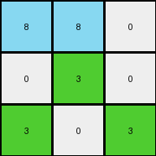

# 67385a82 • 023 • refine_dreamer

---

Previous Code:
```python
"""
The transformation involves changing the color of azure pixels that are immediately to the right of green pixels. The change only applies to the first azure object encountered.
"""

import numpy as np

def find_objects_by_color(grid, color):
    """
    Finds contiguous objects of a specific color in the grid.
    Returns a list of lists, where each inner list contains the (row, col) coordinates of pixels belonging to an object.
    """
    objects = []
    visited = set()
    rows, cols = grid.shape

    def is_valid(r, c):
        return 0 <= r < rows and 0 <= c < cols

    def dfs(r, c, current_object):
        if (r, c) in visited or not is_valid(r, c) or grid[r, c] != color:
            return
        visited.add((r, c))
        current_object.append((r, c))
        for dr, dc in [(0, 1), (1, 0), (0, -1), (-1, 0)]:
            dfs(r + dr, c + dc, current_object)

    for r in range(rows):
        for c in range(cols):
            if grid[r, c] == color and (r, c) not in visited:
                current_object = []
                dfs(r, c, current_object)
                objects.append(current_object)
    return objects

def get_right_adjacent_pixel(grid, r, c):
    """Returns the pixel to the right of (r, c), or None if it's out of bounds."""
    rows, cols = grid.shape
    if c + 1 < cols:
        return (r, c + 1)
    return None

def transform(input_grid):
    # initialize output_grid
    output_grid = np.copy(input_grid)
    rows, cols = output_grid.shape

    # find green objects
    green_objects = find_objects_by_color(output_grid, 3)
    
    # find azure objects
    azure_objects = find_objects_by_color(input_grid, 8)

    # Determine the first azure object.  We'll just use the top-leftmost pixel as the defining
    # point for "first", which should be consistent with how `find_objects_by_color` works.
    first_azure_object = None
    if azure_objects:
      first_azure_object_coords = sorted(azure_objects[0], key=lambda x: (x[0], x[1]))
      first_azure_object = first_azure_object_coords[0]

    # apply rule and change colors
    if green_objects and first_azure_object:
        for green_object in green_objects:
            for green_pixel in green_object:
                right_adj = get_right_adjacent_pixel(input_grid, green_pixel[0], green_pixel[1])
                if right_adj:
                    adj_r, adj_c = right_adj
                    
                    is_first_azure = False
                    for azure_obj in azure_objects:
                        if (adj_r,adj_c) in azure_obj:
                          
                          azure_obj_coords = sorted(azure_obj, key = lambda x: (x[0],x[1]))
                          if (adj_r,adj_c) == azure_obj_coords[0]:
                            is_first_azure = True
                            break

                    if input_grid[adj_r, adj_c] == 8 and is_first_azure:
                        output_grid[adj_r, adj_c] = 8 # Keep it azure (no change visually, but clarifies intent)

    return output_grid
```

Train Set Results:

## Example 1:

Input:
```
8 8 0
0 3 0
3 0 3
```
Expected Output:
```
8 8 0
0 8 0
3 0 3
```
Transformed Output:
```
8 8 0
0 3 0
3 0 3
```

match: False
pixels_off: 1
size_correct: True
color_palette_correct: True
correct_pixel_counts: False

## Example 2:

Input:
```
0 3 0 0 0 3
0 8 8 8 0 0
0 0 0 0 3 0
0 3 0 0 0 0
```
Expected Output:
```
0 8 0 0 0 3
0 8 8 8 0 0
0 0 0 0 3 0
0 3 0 0 0 0
```
Transformed Output:
```
0 3 0 0 0 3
0 8 8 8 0 0
0 0 0 0 3 0
0 3 0 0 0 0
```

match: False
pixels_off: 1
size_correct: True
color_palette_correct: True
correct_pixel_counts: False

## Example 3:

Input:
```
8 8 0 3
8 8 0 0
3 0 0 3
0 0 8 8
```
Expected Output:
```
8 8 0 3
8 8 0 0
8 0 0 8
0 0 8 8
```
Transformed Output:
```
8 8 0 3
8 8 0 0
3 0 0 3
0 0 8 8
```

match: False
pixels_off: 2
size_correct: True
color_palette_correct: True
correct_pixel_counts: False

## Example 4:

Input:
```
8 8 0 0 0 0
0 3 0 0 3 0
3 0 0 0 0 0
0 8 8 0 0 0
0 8 8 0 0 3
```
Expected Output:
```
8 8 0 0 0 0
0 8 0 0 3 0
3 0 0 0 0 0
0 8 8 0 0 0
0 8 8 0 0 3
```
Transformed Output:
```
8 8 0 0 0 0
0 3 0 0 3 0
3 0 0 0 0 0
0 8 8 0 0 0
0 8 8 0 0 3
```

match: False
pixels_off: 1
size_correct: True
color_palette_correct: True
correct_pixel_counts: False
**INSTRUCTIONS**

The code above was generated based on observations from the first training
example

we have tested the transform function on each of the task example inputs and
compared with the expected output

review each of the examples provided and the results and consider how the
natural language program should be updated to accommodate this new knowledge

respond with the following deliverables:

- general assessment of the information provided and strategy for resolving the
  errors
- gather metrics about each of the examples and results - use code_execution to
  develop accurate reports on your assumptions
- a YAML block documenting facts - Focus on identifying objects, their properties, and the actions performed on them.
- a natural language program - Be as clear and concise as possible, providing a complete description of the transformation rule.


your responses should be considered as information in a report - not a
conversation
