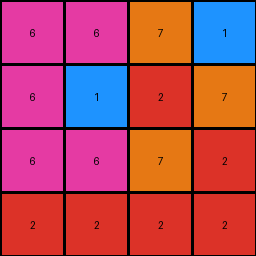
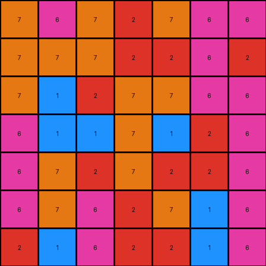

# 67a3c6ac • 009 • refine_dreamer

---


Previous Code:
```python
"""
The output grid is created from the input grid by performing a reflection across the main diagonal (top-left to bottom-right). This is equivalent to transposing the grid. The colors of the pixels are preserved during the transposition.
"""

import numpy as np

def transform(input_grid):
    """
    Transforms the input grid by reflecting it across the main diagonal (transposing it).
    """
    # Convert the input grid to a NumPy array for easier manipulation.
    input_array = np.array(input_grid)

    # Transpose the array.  This swaps rows and columns.
    output_array = input_array.T

    # Convert the transposed array back to a list of lists.
    output_grid = output_array.tolist()

    return output_grid
```

Train Set Results:

## Example 1:

Input:
```
6 6 6 2
6 1 6 2
7 2 7 2
1 7 2 2
```
Expected Output:
```
2 6 6 6
2 6 1 6
2 7 2 7
2 2 7 1
```
Transformed Output:
```
6 6 7 1
6 1 2 7
6 6 7 2
2 2 2 2
```

match: False
pixels_off: 13
size_correct: True
color_palette_correct: True
correct_pixel_counts: True

## Example 2:

Input:
```
7 7 7 6 6 6 2
6 7 1 1 7 7 1
7 7 2 1 2 6 6
2 2 7 7 7 2 2
7 2 7 1 2 7 2
6 6 6 2 2 1 1
6 2 6 6 6 6 6
```
Expected Output:
```
2 6 6 6 7 7 7
1 7 7 1 1 7 6
6 6 2 1 2 7 7
2 2 7 7 7 2 2
2 7 2 1 7 2 7
1 1 2 2 6 6 6
6 6 6 6 6 2 6
```
Transformed Output:
```
7 6 7 2 7 6 6
7 7 7 2 2 6 2
7 1 2 7 7 6 6
6 1 1 7 1 2 6
6 7 2 7 2 2 6
6 7 6 2 7 1 6
2 1 6 2 2 1 6
```

match: False
pixels_off: 35
size_correct: True
color_palette_correct: True
correct_pixel_counts: True

## Example 3:

Input:
```
1 2 7 1 1 1
2 1 7 7 2 6
2 1 2 6 2 1
1 2 1 7 6 2
2 7 1 2 7 1
2 1 6 2 7 7
```
Expected Output:
```
1 1 1 7 2 1
6 2 7 7 1 2
1 2 6 2 1 2
2 6 7 1 2 1
1 7 2 1 7 2
7 7 2 6 1 2
```
Transformed Output:
```
1 2 2 1 2 2
2 1 1 2 7 1
7 7 2 1 1 6
1 7 6 7 2 2
1 2 2 6 7 7
1 6 1 2 1 7
```

match: False
pixels_off: 28
size_correct: True
color_palette_correct: True
correct_pixel_counts: True

**INSTRUCTIONS**

The code above was generated based on observations from the first training
example

we have tested the transform function on each of the task example inputs and
compared with the expected output

review each of the examples provided and the results and consider how the
natural language program should be updated to accommodate this new knowledge

respond with the following deliverables:

- general assessment of the information provided and strategy for resolving the
  errors
- gather metrics about each of the examples and results - use code_execution to
  develop accurate reports on your assumptions
- a YAML block documenting facts - Focus on identifying objects, their properties, and the actions performed on them.
- a natural language program - Be as clear and concise as possible, providing a complete description of the transformation rule.


your responses should be considered as information in a report - not a
conversation
