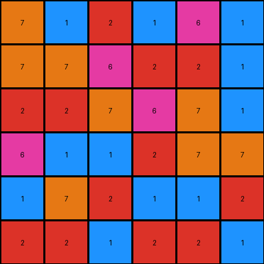

# 67a3c6ac • 015 • refine_dreamer

---


Previous Code:
```python
"""
The input grid is transformed to the output grid by swapping cells across the main diagonal but in reverse.
In more detail:
- The cell at `input[row][col]` swaps with `output[5-col][5-row]`
- iterate through all rows from 0 to 5.
- inside of each row, iterate through all cols from 0 to 5
- swap each `input[row][col]` with `input[5-col][5-row]`
"""

import numpy as np

def transform(input_grid):
    """
    Transforms the input grid by swapping cells across a diagonal axis.
    """
    # Create a copy of the input grid to serve as the output grid.
    output_grid = np.copy(input_grid)
    
    # Get the dimensions of the grid.
    rows, cols = input_grid.shape
    
    # Iterate through the grid, swapping elements across the anti-diagonal.
    for i in range(rows):
        for j in range(cols):
            output_grid[i, j] = input_grid[cols - 1 - j, rows - 1 - i]

    return output_grid
```

Train Set Results:

## Example 1:

Input:
```
6 6 6 2
6 1 6 2
7 2 7 2
1 7 2 2
```
Expected Output:
```
2 6 6 6
2 6 1 6
2 7 2 7
2 2 7 1
```
Transformed Output:
```
2 2 2 2
2 7 6 6
7 2 1 6
1 7 6 6
```

match: False
pixels_off: 13
size_correct: True
color_palette_correct: True
correct_pixel_counts: True

## Example 2:

Input:
```
7 7 7 6 6 6 2
6 7 1 1 7 7 1
7 7 2 1 2 6 6
2 2 7 7 7 2 2
7 2 7 1 2 7 2
6 6 6 2 2 1 1
6 2 6 6 6 6 6
```
Expected Output:
```
2 6 6 6 7 7 7
1 7 7 1 1 7 6
6 6 2 1 2 7 7
2 2 7 7 7 2 2
2 7 2 1 7 2 7
1 1 2 2 6 6 6
6 6 6 6 6 2 6
```
Transformed Output:
```
6 1 2 2 6 1 2
6 1 7 2 6 7 6
6 2 2 7 2 7 6
6 2 1 7 1 1 6
6 6 7 7 2 1 7
2 6 2 2 7 7 7
6 6 7 2 7 6 7
```

match: False
pixels_off: 35
size_correct: True
color_palette_correct: True
correct_pixel_counts: True

## Example 3:

Input:
```
1 2 7 1 1 1
2 1 7 7 2 6
2 1 2 6 2 1
1 2 1 7 6 2
2 7 1 2 7 1
2 1 6 2 7 7
```
Expected Output:
```
1 1 1 7 2 1
6 2 7 7 1 2
1 2 6 2 1 2
2 6 7 1 2 1
1 7 2 1 7 2
7 7 2 6 1 2
```
Transformed Output:
```
7 1 2 1 6 1
7 7 6 2 2 1
2 2 7 6 7 1
6 1 1 2 7 7
1 7 2 1 1 2
2 2 1 2 2 1
```

match: False
pixels_off: 28
size_correct: True
color_palette_correct: True
correct_pixel_counts: True

**INSTRUCTIONS**

The code above was generated based on observations from the first training
example

we have tested the transform function on each of the task example inputs and
compared with the expected output

review each of the examples provided and the results and consider how the
natural language program should be updated to accommodate this new knowledge

respond with the following deliverables:

- general assessment of the information provided and strategy for resolving the
  errors
- gather metrics about each of the examples and results - use code_execution to
  develop accurate reports on your assumptions
- a YAML block documenting facts - Focus on identifying objects, their properties, and the actions performed on them.
- a natural language program - Be as clear and concise as possible, providing a complete description of the transformation rule.


your responses should be considered as information in a report - not a
conversation
