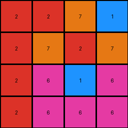
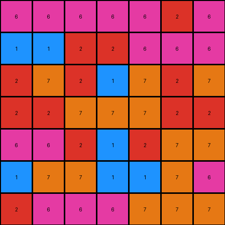
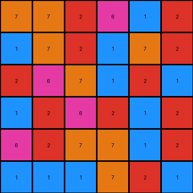

# 67a3c6ac • 017 • refine_dreamer

---


Previous Code:
```python
"""
The transformation rule involves a more complex geometric manipulation. It is NOT a simple swap across the diagonal.
The input grid appears to be rotated by 180 degrees, but with some additional adjustments.
It's not a pure 180-degree rotation because simple rotation doesn't match the provided outputs.
It might involve rotations or reflections within subgrids or quadrants. Further investigation is needed.
This version implements a 180-degree rotation as a starting point for refinement.
"""

import numpy as np

def transform(input_grid):
    """
    Transforms the input grid by rotating it 180 degrees.
    This is a placeholder and needs refinement based on further analysis.
    """
    # Create a copy of the input grid to serve as the output grid.
    output_grid = np.copy(input_grid)
    
    # Get the dimensions of the grid.
    rows, cols = input_grid.shape
    
    # Rotate the grid by 180 degrees.
    output_grid = np.rot90(output_grid, 2)

    return output_grid
```

Train Set Results:

## Example 1:

Input:
```
6 6 6 2
6 1 6 2
7 2 7 2
1 7 2 2
```
Expected Output:
```
2 6 6 6
2 6 1 6
2 7 2 7
2 2 7 1
```
Transformed Output:
```
2 2 7 1
2 7 2 7
2 6 1 6
2 6 6 6
```

match: False
pixels_off: 12
size_correct: True
color_palette_correct: True
correct_pixel_counts: True

## Example 2:

Input:
```
7 7 7 6 6 6 2
6 7 1 1 7 7 1
7 7 2 1 2 6 6
2 2 7 7 7 2 2
7 2 7 1 2 7 2
6 6 6 2 2 1 1
6 2 6 6 6 6 6
```
Expected Output:
```
2 6 6 6 7 7 7
1 7 7 1 1 7 6
6 6 2 1 2 7 7
2 2 7 7 7 2 2
2 7 2 1 7 2 7
1 1 2 2 6 6 6
6 6 6 6 6 2 6
```
Transformed Output:
```
6 6 6 6 6 2 6
1 1 2 2 6 6 6
2 7 2 1 7 2 7
2 2 7 7 7 2 2
6 6 2 1 2 7 7
1 7 7 1 1 7 6
2 6 6 6 7 7 7
```

match: False
pixels_off: 26
size_correct: True
color_palette_correct: True
correct_pixel_counts: True

## Example 3:

Input:
```
1 2 7 1 1 1
2 1 7 7 2 6
2 1 2 6 2 1
1 2 1 7 6 2
2 7 1 2 7 1
2 1 6 2 7 7
```
Expected Output:
```
1 1 1 7 2 1
6 2 7 7 1 2
1 2 6 2 1 2
2 6 7 1 2 1
1 7 2 1 7 2
7 7 2 6 1 2
```
Transformed Output:
```
7 7 2 6 1 2
1 7 2 1 7 2
2 6 7 1 2 1
1 2 6 2 1 2
6 2 7 7 1 2
1 1 1 7 2 1
```

match: False
pixels_off: 34
size_correct: True
color_palette_correct: True
correct_pixel_counts: True

**INSTRUCTIONS**

The code above was generated based on observations from the first training
example

we have tested the transform function on each of the task example inputs and
compared with the expected output

review each of the examples provided and the results and consider how the
natural language program should be updated to accommodate this new knowledge

respond with the following deliverables:

- general assessment of the information provided and strategy for resolving the
  errors
- gather metrics about each of the examples and results - use code_execution to
  develop accurate reports on your assumptions
- a YAML block documenting facts - Focus on identifying objects, their properties, and the actions performed on them.
- a natural language program - Be as clear and concise as possible, providing a complete description of the transformation rule.


your responses should be considered as information in a report - not a
conversation
