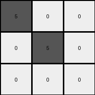

# 6e02f1e3 • 011 • refine_dreamer

---


Previous Code:
```python
"""
Transforms a 3x3 input grid to a 3x3 output grid based on the following rules:

1. If all cells in the input grid have the same color (either all Green (3) or all Yellow (4)), then all cells in the output grid become White (0).
2. If a cell is on the main diagonal (top-left to bottom-right) and its color in the input grid is Red (2), and step 1 did not apply, then the corresponding cell in the output grid becomes Gray (5).
3. Otherwise, if a cell is Green (3) or Yellow (4), make it White (0).
"""

import numpy as np

def _is_uniform(grid, colors):
    """Checks if all cells in the grid have one of the specified colors."""
    first_color = grid[0, 0]
    if first_color not in colors:
        return False
    for i in range(grid.shape[0]):
        for j in range(grid.shape[1]):
            if grid[i, j] != first_color:
                return False
    return True

def _is_on_diagonal(row, col):
    """Checks if a cell is on the main diagonal."""
    return row == col

def transform(input_grid):
    # Initialize output_grid
    output_grid = np.zeros_like(input_grid)
    
    # Check for Uniform Input of Green or Yellow
    if _is_uniform(input_grid, [3, 4]):
        return output_grid #All output is white (0), already initialized
    
    #Iterate Through Each cell
    for i in range(input_grid.shape[0]):
        for j in range(input_grid.shape[1]):
            # Diagonal Transformation for Red
            if _is_on_diagonal(i, j) and input_grid[i, j] == 2:
                output_grid[i, j] = 5 # Set to Gray
            # Other cells: Green or Yellow become White
            elif input_grid[i,j] == 3 or input_grid[i, j] == 4:
                output_grid[i,j] = 0
            #Handle instances of 2 not on the diagonal.
            elif input_grid[i,j] == 2:
                output_grid[i,j] = 0 #Should not execute.  

    return output_grid
```

Train Set Results:

## Example 1:

Input:
```
2 2 2
3 2 3
3 3 3
```
Expected Output:
```
5 0 0
0 5 0
0 0 5
```
Transformed Output:
```
5 0 0
0 5 0
0 0 0
```

match: False
pixels_off: 1
size_correct: True
color_palette_correct: True
correct_pixel_counts: False

## Example 2:

Input:
```
3 3 3
4 2 2
4 4 2
```
Expected Output:
```
0 0 5
0 5 0
5 0 0
```
Transformed Output:
```
0 0 0
0 5 0
0 0 5
```

match: False
pixels_off: 3
size_correct: True
color_palette_correct: True
correct_pixel_counts: False

## Example 3:

Input:
```
4 4 4
4 4 4
4 4 4
```
Expected Output:
```
5 5 5
0 0 0
0 0 0
```
Transformed Output:
```
0 0 0
0 0 0
0 0 0
```

match: False
pixels_off: 3
size_correct: True
color_palette_correct: True
correct_pixel_counts: False

## Example 4:

Input:
```
3 3 3
3 3 3
3 3 3
```
Expected Output:
```
5 5 5
0 0 0
0 0 0
```
Transformed Output:
```
0 0 0
0 0 0
0 0 0
```

match: False
pixels_off: 3
size_correct: True
color_palette_correct: True
correct_pixel_counts: False

## Example 5:

Input:
```
4 4 4
4 4 4
3 3 3
```
Expected Output:
```
5 0 0
0 5 0
0 0 5
```
Transformed Output:
```
0 0 0
0 0 0
0 0 0
```

match: False
pixels_off: 3
size_correct: True
color_palette_correct: True
correct_pixel_counts: False

**INSTRUCTIONS**

The code above was generated based on observations from the first training
example

we have tested the transform function on each of the task example inputs and
compared with the expected output

review each of the examples provided and the results and consider how the
natural language program should be updated to accommodate this new knowledge

respond with the following deliverables:

- general assessment of the information provided and strategy for resolving the
  errors
- gather metrics about each of the examples and results - use code_execution to
  develop accurate reports on your assumptions
- a YAML block documenting facts - Focus on identifying objects, their properties, and the actions performed on them.
- a natural language program - Be as clear and concise as possible, providing a complete description of the transformation rule.


your responses should be considered as information in a report - not a
conversation
