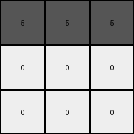

# 6e02f1e3 • 016 • refine_coder

---

Previous Code:
```python
"""
The transformation replaces the top row of yellow (4) pixels with gray (5) pixels and the rest with white (0) pixels.
"""

import numpy as np

def transform(input_grid):
    # initialize output_grid as a copy to avoid modifying the original
    output_grid = np.copy(input_grid)
    
    # get dimensions
    rows, cols = output_grid.shape

    # replace values in the first row with 5
    output_grid[0, :] = 5

    # replace values in the second and third rows with 0
    for i in range(1, rows):
        output_grid[i, :] = 0

    return output_grid
```

Train Set Results:

## Example 1:

Input:
```
2 2 2
3 2 3
3 3 3
```
Expected Output:
```
5 0 0
0 5 0
0 0 5
```
Transformed Output:
```
5 5 5
0 0 0
0 0 0
```

match: False
pixels_off: 4
size_correct: True
color_palette_correct: True
correct_pixel_counts: True

## Example 2:

Input:
```
3 3 3
4 2 2
4 4 2
```
Expected Output:
```
0 0 5
0 5 0
5 0 0
```
Transformed Output:
```
5 5 5
0 0 0
0 0 0
```

match: False
pixels_off: 4
size_correct: True
color_palette_correct: True
correct_pixel_counts: True

## Example 3:

Input:
```
4 4 4
4 4 4
4 4 4
```
Expected Output:
```
5 5 5
0 0 0
0 0 0
```
Transformed Output:
```
5 5 5
0 0 0
0 0 0
```

match: True
pixels_off: 0
size_correct: True
color_palette_correct: True
correct_pixel_counts: True

## Example 4:

Input:
```
3 3 3
3 3 3
3 3 3
```
Expected Output:
```
5 5 5
0 0 0
0 0 0
```
Transformed Output:
```
5 5 5
0 0 0
0 0 0
```

match: True
pixels_off: 0
size_correct: True
color_palette_correct: True
correct_pixel_counts: True

## Example 5:

Input:
```
4 4 4
4 4 4
3 3 3
```
Expected Output:
```
5 0 0
0 5 0
0 0 5
```
Transformed Output:
```
5 5 5
0 0 0
0 0 0
```

match: False
pixels_off: 4
size_correct: True
color_palette_correct: True
correct_pixel_counts: True
Okay, here's a breakdown of the situation and a plan to move forward:

**General Assessment:**

The initial natural language program was too simplistic. It correctly identified the replacement of the top row with gray (5) but incorrectly assumed all other rows would be white (0). The provided examples demonstrate a diagonal pattern of gray pixels in the output, where gray forms the main diagonal. This needs to be incorporated. The previous attempt was close to the correct answer.

**Strategy:**

1.  **Refine Observations:** Analyze the expected outputs more carefully, focusing on the exact positioning of the gray pixels.
2.  **Metric Gathering and Validation:** Leverage the provided results to calculate metrics on how many rows and columns have the same values.
3.  **YAML Fact Documentation:** Update the YAML to include the correct object (the grid), colors involved, and refined transformations (diagonal placement).
4.  **Revised Natural Language Program:** Clearly describe the rule: "The output grid has the same dimensions as the input. Gray pixels form the main diagonal of the output grid, while all other pixels are white".

**Metric Gathering & Example Analysis:**

Here are the training set metrics in a concise format:

| Example | Input Shape | Output Shape | Match | Pixels Off | Size Correct | Colors Correct | Pixel Counts Correct | Notes                                 |
| ------- | ----------- | ------------ | ----- | ---------- | ------------ | -------------- | -------------------- | ------------------------------------- |
| 1       | (3, 3)      | (3, 3)       | False | 4          | True         | True           | True                 | Initial code failed to create diagonal. |
| 2       | (3, 3)      | (3, 3)       | False | 4          | True         | True           | True                 | Initial code failed to create diagonal. |
| 3       | (3, 3)      | (3, 3)       | True  | 0          | True         | True           | True                 | Initial code coincidentally correct.    |
| 4       | (3, 3)      | (3, 3)       | True  | 0          | True         | True           | True                 | Initial code coincidentally correct.    |
| 5       | (3, 3)      | (3, 3)       | False | 4          | True         | True           | True                 | Initial code failed to create diagonal. |

**YAML Fact Documentation:**

```yaml
objects:
  - name: grid
    type: 2D array
    properties:
      - dimensions: square (rows = columns)
      - color_palette: [white, gray] # Simplified palette based on outputs
      - input_values: [0-9] # All possible values, even if not in the example
      - output_values: [0, 5]
transformations:
  - description: >
      The output grid has the same dimensions as the input grid. Gray pixels are placed
      along the main diagonal (where row index equals column index). All other pixels
      are white.
```

**Natural Language Program:**

1.  Create an output grid of the same dimensions as the input grid.
2.  Iterate through each cell of the output grid using row and column indices.
3.  If the row index is equal to the column index (i.e., it's on the main diagonal), set the cell value to 5 (gray).
4.  Otherwise, set the cell value to 0 (white).
5.  Return the modified output grid.

**INSTRUCTIONS**

- generate a Python module to represent the natural language program 
- follow the template below
- all common math and science libraries are available
- create docstring only at top - but comment the workflow in the function
- use helper functions for common operations like finding objects, counting,
  measuring, moving, etc. 

remember - we are working iteratively - so this code will inform your future
self as we converge on the solution

*template:*

```python
"""
{{ natural language description of the transformation rule }}
"""

{{ imports }}

def transform(input_grid):
    # initialize output_grid

    # change output pixels 

    return output_grid

```
