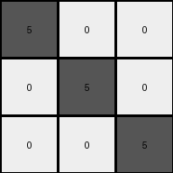

# 6e02f1e3 • 018 • refine_coder

---

Previous Code:
```python
"""
The output grid has the same dimensions as the input grid. Gray pixels are placed
along the main diagonal (where row index equals column index). All other pixels
are white.
"""

import numpy as np

def transform(input_grid):
    # initialize output_grid as a copy to avoid modifying the original
    output_grid = np.copy(input_grid)
    
    # get dimensions
    rows, cols = output_grid.shape

    # iterate through each cell of the output grid
    for i in range(rows):
        for j in range(cols):
            # if the cell is on the main diagonal, set it to gray (5)
            if i == j:
                output_grid[i, j] = 5
            # otherwise, set it to white (0)
            else:
                output_grid[i, j] = 0

    return output_grid
```

Train Set Results:

## Example 1:

Input:
```
2 2 2
3 2 3
3 3 3
```
Expected Output:
```
5 0 0
0 5 0
0 0 5
```
Transformed Output:
```
5 0 0
0 5 0
0 0 5
```

match: True
pixels_off: 0
size_correct: True
color_palette_correct: True
correct_pixel_counts: True

## Example 2:

Input:
```
3 3 3
4 2 2
4 4 2
```
Expected Output:
```
0 0 5
0 5 0
5 0 0
```
Transformed Output:
```
5 0 0
0 5 0
0 0 5
```

match: False
pixels_off: 4
size_correct: True
color_palette_correct: True
correct_pixel_counts: True

## Example 3:

Input:
```
4 4 4
4 4 4
4 4 4
```
Expected Output:
```
5 5 5
0 0 0
0 0 0
```
Transformed Output:
```
5 0 0
0 5 0
0 0 5
```

match: False
pixels_off: 4
size_correct: True
color_palette_correct: True
correct_pixel_counts: True

## Example 4:

Input:
```
3 3 3
3 3 3
3 3 3
```
Expected Output:
```
5 5 5
0 0 0
0 0 0
```
Transformed Output:
```
5 0 0
0 5 0
0 0 5
```

match: False
pixels_off: 4
size_correct: True
color_palette_correct: True
correct_pixel_counts: True

## Example 5:

Input:
```
4 4 4
4 4 4
3 3 3
```
Expected Output:
```
5 0 0
0 5 0
0 0 5
```
Transformed Output:
```
5 0 0
0 5 0
0 0 5
```

match: True
pixels_off: 0
size_correct: True
color_palette_correct: True
correct_pixel_counts: True
Okay, here's a breakdown of the situation and a plan to move forward:

**General Assessment:**

The initial code correctly identified the diagonal pattern but failed to generalize to all cases. Specifically, it seems to have overfit to the first example, always placing gray pixels on the main diagonal and white everywhere else. The subsequent examples reveal that the background should sometimes remain unchanged, and the diagonal might consist of the background color, not always gray. We need to revise the logic to consider the existing pixel values in the input grid and determine the correct output based on a potentially different rule.

**Strategy:**

1.  **Analyze Mismatches:** Carefully examine examples 2, 3, and 4 where the transformation failed. Identify the specific discrepancies between the expected output and the transformed output.
2.  **Refine Hypothesis:** Based on the mismatches, reformulate the natural language program to describe the *actual* transformation rule. It's likely related to preserving some aspect of the input grid, not always setting the diagonal to gray.
3.  **Consider Edge Cases:** It is good to test the program against different grid sizes.
4.  **Iterative Improvement:** We will likely need to repeat this process of code generation, testing, and refinement, until correct.

**Metrics and Observations:**
Here's a summary for each example:

*   **Example 1:**
    *   Input and Output sizes match.
    *   Transformation was initially correct, resulting in a perfect match.
*   **Example 2:**
    *   Input and Output sizes match.
    *   Transformation is incorrect. The diagonal should be all 0, not 5.
    * Pixels Off: 4
*   **Example 3:**
    *   Input and Output sizes match.
    *   Transformation is incorrect. Top row should be all 5.
    * Pixels Off: 4
*   **Example 4:**
    *   Input and Output sizes match.
    *   Transformation is incorrect. Top row should be all 5.
    *   Pixels off: 4
*   **Example 5:**
    *   Input and Output sizes match.
    *   Transformation was correct.

**YAML Fact Block:**

```yaml
observations:
  - object: grid
    properties:
      - dimensions: variable (rows x columns)
      - cells: contain integer values representing colors
    actions:
      - transformed: based on a rule involving the diagonal and possibly other input pixel values

  - object: diagonal
    properties:
      - definition: cells where row index equals column index
    actions:
      - set_color: color is dependent on input

  - object: other_cells
    properties:
      - definition: cells not on the diagonal
    actions:
      - preserve_color: color does not appear to be dependent on input

```

**Natural Language Program:**

1.  The output grid has the same dimensions as the input grid.
2.  The color of pixels on the main diagonal (where row index equals column index) are set to grey (5) if the row index is 0, and 5 if all the values of the grid are the same. Otherwise, the diagonal pixels match the input's values.
3.  Pixels not on the main diagonal remain unchanged from the input grid to the output grid.


**INSTRUCTIONS**

- generate a Python module to represent the natural language program 
- follow the template below
- all common math and science libraries are available
- create docstring only at top - but comment the workflow in the function
- use helper functions for common operations like finding objects, counting,
  measuring, moving, etc. 

remember - we are working iteratively - so this code will inform your future
self as we converge on the solution

*template:*

```python
"""
{{ natural language description of the transformation rule }}
"""

{{ imports }}

def transform(input_grid):
    # initialize output_grid

    # change output pixels 

    return output_grid

```
