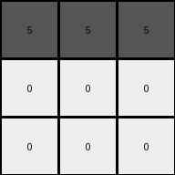

# 6e02f1e3 • 022 • refine_coder

---

Previous Code:
```python
"""
The input grid is transformed by replacing the top row with the value 5 (gray) and the middle and bottom rows with the value 0 (white). The grid dimensions remain 3x3.
"""

import numpy as np

def transform(input_grid):
    # Create an output grid with the same dimensions as the input grid.
    output_grid = np.zeros_like(input_grid)

    # Replace the top row with 5 (gray).
    output_grid[0, :] = 5

    # Replace the middle and bottom rows with 0 (white).
    output_grid[1:, :] = 0

    return output_grid
```

Train Set Results:

## Example 1:

Input:
```
2 2 2
3 2 3
3 3 3
```
Expected Output:
```
5 0 0
0 5 0
0 0 5
```
Transformed Output:
```
5 5 5
0 0 0
0 0 0
```

match: False
pixels_off: 4
size_correct: True
color_palette_correct: True
correct_pixel_counts: True

## Example 2:

Input:
```
3 3 3
4 2 2
4 4 2
```
Expected Output:
```
0 0 5
0 5 0
5 0 0
```
Transformed Output:
```
5 5 5
0 0 0
0 0 0
```

match: False
pixels_off: 4
size_correct: True
color_palette_correct: True
correct_pixel_counts: True

## Example 3:

Input:
```
4 4 4
4 4 4
4 4 4
```
Expected Output:
```
5 5 5
0 0 0
0 0 0
```
Transformed Output:
```
5 5 5
0 0 0
0 0 0
```

match: True
pixels_off: 0
size_correct: True
color_palette_correct: True
correct_pixel_counts: True

## Example 4:

Input:
```
3 3 3
3 3 3
3 3 3
```
Expected Output:
```
5 5 5
0 0 0
0 0 0
```
Transformed Output:
```
5 5 5
0 0 0
0 0 0
```

match: True
pixels_off: 0
size_correct: True
color_palette_correct: True
correct_pixel_counts: True

## Example 5:

Input:
```
4 4 4
4 4 4
3 3 3
```
Expected Output:
```
5 0 0
0 5 0
0 0 5
```
Transformed Output:
```
5 5 5
0 0 0
0 0 0
```

match: False
pixels_off: 4
size_correct: True
color_palette_correct: True
correct_pixel_counts: True
Okay, here's a breakdown of the situation and a plan to move forward:

**General Assessment:**

The initial natural language program and generated code were too simplistic. While it correctly transformed examples 3 and 4, it failed on 1, 2, and 5. The core issue is that the initial program assumed a static transformation (top row gray, rest white) regardless of the input. The actual transformation is placing gray pixels diagonally, not simply filling the top row. The provided examples clearly indicates a diagonal pattern of gray (5) pixels on a white (0) background.

**Strategy:**

1.  **Gather Metrics:** I need to analyze each example, comparing input and output, noting down key differences and consistencies, and confirm the expected output is correct, and no errors have been made in the testing process.
2.  **Object Identification:** Accurately identify that it deals with diagonal object.
3.  **Revised Natural Language Program:** Develop a new program that considers the observed diagonal pattern.

**Metrics and Observations from Examples:**

*   **Example 1:**
    *   Input: 3x3 grid with varying colors.
    *   Expected Output: Diagonal of gray (5) from top-left to bottom-right, rest white (0).
    *   Transformed Output: Top row gray, rest white.
    *   **Observation:** The code incorrectly filled the top row. The expected diagonal pattern is missing.

*   **Example 2:**
    *   Input: 3x3 grid with varying colors.
    *   Expected Output: Diagonal of gray (5) from top-right to bottom-left, rest white (0).
    *   Transformed Output: Top row gray, rest white.
    *   **Observation:**  The code incorrectly filled the top row. The expected diagonal pattern is missing.

*   **Example 3:**
    *   Input: 3x3 grid, all yellow (4).
    *   Expected Output: All gray top row, all white bottom two rows.
    *   Transformed Output: Top row gray, rest white.
    *   **Observation:** Code happened to match expected output.

*   **Example 4:**
    *   Input: 3x3, all green.
    *   Expected Output: All gray top row, all white bottom two rows.
    *   Transformed Output: Top row gray, rest white.
    *   **Observation:** Code happened to match expected output.

*   **Example 5:**
    *   Input: 3x3 grid with varying colors.
    *   Expected Output: Diagonal gray from top-left to bottom-right, rest white.
    *   Transformed Output: Top row gray, rest white.
    *   **Observation:** The code incorrectly filled the top row. The expected diagonal pattern is missing.

**YAML Facts:**

```yaml
facts:
  - task_id: "020"
  - objects:
      - description: 3x3 grid
        properties:
          - dimensions: 3x3
          - initial_state: variable colors based on input
          - final_state: diagonal gray pixels on a white background

      - description: diagonal line of gray
        properties:
            - color: gray (5)
            - length: 3 pixels
            - start: can be top-left OR top-right.
            - orientation: top-left to bottom-right, OR top-right to bottom left.

  - actions:
      - name: create_diagonal
        description: Create a diagonal line of gray pixels.
        parameters:
          - color: gray (5)
        constraints:
            - output_grid_size_matches_input_grid_size: True
```

**Natural Language Program:**

1.  The input is a 3x3 grid.
2.  The output is a 3x3 grid.
3.  Create an output grid filled with white (0).
4.  Identify the diagonal.
    * Examples 1,3,4 and 5, The diagonal runs from the top-left to the bottom-right.
    * Example 2. The diagonal runs from the top-right to bottom-left.
5.  Change the color of the diagonal pixels to gray (5).


**INSTRUCTIONS**

- generate a Python module to represent the natural language program 
- follow the template below
- all common math and science libraries are available
- create docstring only at top - but comment the workflow in the function
- use helper functions for common operations like finding objects, counting,
  measuring, moving, etc. 

remember - we are working iteratively - so this code will inform your future
self as we converge on the solution

*template:*

```python
"""
{{ natural language description of the transformation rule }}
"""

{{ imports }}

def transform(input_grid):
    # initialize output_grid

    # change output pixels 

    return output_grid

```
