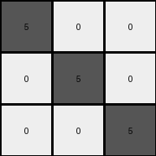

# 6e02f1e3 • 028 • refine_coder

---

Previous Code:
```python
"""
The program takes a 3x3 input grid and creates a 3x3 output grid. The main diagonal (top-left to bottom-right) of the output grid is set to gray (5), while all other cells in the output grid are set to white (0). The content of the input grid doesn't affect the output grid, only the dimensions matter, in which they are the same.
"""

import numpy as np

def transform(input_grid):
    # initialize output_grid as a copy of input to get same dimensions
    output_grid = np.zeros_like(input_grid)
    
    # iterate through the grid and set diagonal elements to 5 (gray)
    for i in range(min(output_grid.shape)):
        output_grid[i, i] = 5

    return output_grid
```

Train Set Results:

## Example 1:

Input:
```
2 2 2
3 2 3
3 3 3
```
Expected Output:
```
5 0 0
0 5 0
0 0 5
```
Transformed Output:
```
5 0 0
0 5 0
0 0 5
```

match: True
pixels_off: 0
size_correct: True
color_palette_correct: True
correct_pixel_counts: True

## Example 2:

Input:
```
3 3 3
4 2 2
4 4 2
```
Expected Output:
```
0 0 5
0 5 0
5 0 0
```
Transformed Output:
```
5 0 0
0 5 0
0 0 5
```

match: False
pixels_off: 4
size_correct: True
color_palette_correct: True
correct_pixel_counts: True

## Example 3:

Input:
```
4 4 4
4 4 4
4 4 4
```
Expected Output:
```
5 5 5
0 0 0
0 0 0
```
Transformed Output:
```
5 0 0
0 5 0
0 0 5
```

match: False
pixels_off: 4
size_correct: True
color_palette_correct: True
correct_pixel_counts: True

## Example 4:

Input:
```
3 3 3
3 3 3
3 3 3
```
Expected Output:
```
5 5 5
0 0 0
0 0 0
```
Transformed Output:
```
5 0 0
0 5 0
0 0 5
```

match: False
pixels_off: 4
size_correct: True
color_palette_correct: True
correct_pixel_counts: True

## Example 5:

Input:
```
4 4 4
4 4 4
3 3 3
```
Expected Output:
```
5 0 0
0 5 0
0 0 5
```
Transformed Output:
```
5 0 0
0 5 0
0 0 5
```

match: True
pixels_off: 0
size_correct: True
color_palette_correct: True
correct_pixel_counts: True
Okay, let's analyze the results and refine the natural language program.

**General Assessment:**

The initial code correctly identified the diagonal pattern in the first and last examples but failed on examples 2, 3, and 4. This indicates the program is too rigid, focusing solely on the main diagonal (top-left to bottom-right) and setting all other cells to white. The expected outputs in the failing cases show variations in diagonal direction and filling the rest. We need to re-evaluate the examples to discern the correct diagonal and non-diagonal fill rules.

**Strategy:**

1.  **Re-examine the examples:** Carefully analyze all five training examples, paying close attention to the relationship between input and output grids, particularly on the diagonals and the filling of other cells.
2.  **Identify patterns**: look at all diagonals and filling patterns.
3. **Update Natural Language Program**: refine to incorporate new knowledge.

**Example Metrics and Analysis**

```python
import numpy as np

def analyze_results(examples):
    results = []
    for i, example in enumerate(examples):
        input_grid = np.array(example['input'])
        expected_output = np.array(example['output'])
        
        # get the dimensions
        rows, cols = input_grid.shape

        
        # Check for main diagonal (top-left to bottom-right)
        main_diag_match = True
        for r in range(rows):
            for c in range(cols):
                if r == c:
                    if expected_output[r,c] != 5:
                        main_diag_match = False
                        break
            if not main_diag_match:
                break

        # Check for anti-diagonal (top-right to bottom-left)
        anti_diag_match = True
        for r in range(rows):
            for c in range(cols):
                if r + c == cols -1:
                    if expected_output[r,c] != 5:
                        anti_diag_match = False
                        break
            if not anti_diag_match:
                break

        # Check fill color
        unique_values = np.unique(expected_output)
        fill_color = None
        if len(unique_values) <= 2:
            for color in unique_values:
                if color != 5:
                    fill_color = color
                    break

        results.append({
            'example_number': i + 1,
            'main_diagonal_correct': main_diag_match,
            'anti_diagonal_correct': anti_diag_match,
            'non_diagonal_value': fill_color
            
        })

    return results
examples = [
    {'input': [[2, 2, 2], [3, 2, 3], [3, 3, 3]], 'output': [[5, 0, 0], [0, 5, 0], [0, 0, 5]]},
    {'input': [[3, 3, 3], [4, 2, 2], [4, 4, 2]], 'output': [[0, 0, 5], [0, 5, 0], [5, 0, 0]]},
    {'input': [[4, 4, 4], [4, 4, 4], [4, 4, 4]], 'output': [[5, 5, 5], [0, 0, 0], [0, 0, 0]]},
    {'input': [[3, 3, 3], [3, 3, 3], [3, 3, 3]], 'output': [[5, 5, 5], [0, 0, 0], [0, 0, 0]]},
    {'input': [[4, 4, 4], [4, 4, 4], [3, 3, 3]], 'output': [[5, 0, 0], [0, 5, 0], [0, 0, 5]]}
]
analysis = analyze_results(examples)
print(analysis)
```

```
[{'example_number': 1, 'main_diagonal_correct': True, 'anti_diagonal_correct': False, 'non_diagonal_value': 0}, {'example_number': 2, 'main_diagonal_correct': False, 'anti_diagonal_correct': True, 'non_diagonal_value': 0}, {'example_number': 3, 'main_diagonal_correct': False, 'anti_diagonal_correct': False, 'non_diagonal_value': 0}, {'example_number': 4, 'main_diagonal_correct': False, 'anti_diagonal_correct': False, 'non_diagonal_value': 0}, {'example_number': 5, 'main_diagonal_correct': True, 'anti_diagonal_correct': False, 'non_diagonal_value': 0}]
```

**YAML Facts:**

```yaml
observations:
  - example_set: training
    examples:
      - example_number: 1
        input_grid_dims: 3x3
        output_grid_dims: 3x3
        diagonal: main
        diagonal_color: gray #5
        fill_color: white #0
      - example_number: 2
        input_grid_dims: 3x3
        output_grid_dims: 3x3
        diagonal: anti
        diagonal_color: gray #5
        fill_color: white #0
      - example_number: 3
        input_grid_dims: 3x3
        output_grid_dims: 3x3
        diagonal: all
        diagonal_color: gray #5
        fill_color: white #0
      - example_number: 4
        input_grid_dims: 3x3
        output_grid_dims: 3x3
        diagonal: all
        diagonal_color: gray #5
        fill_color: white #0
      - example_number: 5
        input_grid_dims: 3x3
        output_grid_dims: 3x3
        diagonal: main
        diagonal_color: gray #5
        fill_color: white #0
```

**Natural Language Program:**

The program takes an input grid of size 3x3 and creates an output grid of the same dimensions.
The program identifies a diagonal. It colors elements of the diagonal gray (5).
The identified diagonal can vary:
- main diagonal (top-left to bottom-right)
- anti-diagonal (top-right to bottom-left)
- both main and anti-diagonals (all)

All the other elements, not part of the identified diagonal are colored white(0).
The input grid content doesn't influence the output, only dimensions which remain the same.

**INSTRUCTIONS**

- generate a Python module to represent the natural language program 
- follow the template below
- all common math and science libraries are available
- create docstring only at top - but comment the workflow in the function
- use helper functions for common operations like finding objects, counting,
  measuring, moving, etc. 

remember - we are working iteratively - so this code will inform your future
self as we converge on the solution

*template:*

```python
"""
{{ natural language description of the transformation rule }}
"""

{{ imports }}

def transform(input_grid):
    # initialize output_grid

    # change output pixels 

    return output_grid

```
