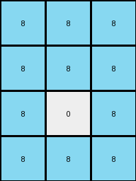

# 6f8cd79b • 004 • refine_coder

---

Previous Code:
```python
"""
Identify the center pixel of a 3x3 grid. Keep its value as 0. Change the value of all other pixels to 8.
"""

import numpy as np

def transform(input_grid):
    """
    Transforms a 3x3 grid by keeping the center pixel value as 0 and changing all other pixels to 8.
    
    Args:
        input_grid: A 3x3 numpy array representing the input grid.
        
    Returns:
        A 3x3 numpy array representing the transformed grid.
    """
    # Initialize the output grid as a copy of the input grid.
    output_grid = np.copy(input_grid)

    # Get the dimensions of the grid
    rows, cols = output_grid.shape

    # Iterate through each cell of the grid
    for i in range(rows):
        for j in range(cols):
            # Check if the current cell is the center pixel
            if i == rows // 2 and j == cols // 2:
                # Keep the center pixel as 0
                continue  # Skip to the next iteration
            else:
                # Change all other pixels to 8
                output_grid[i, j] = 8

    return output_grid
```

Train Set Results:

## Example 1:

Input:
```
0 0 0
0 0 0
0 0 0
```
Expected Output:
```
8 8 8
8 0 8
8 8 8
```
Transformed Output:
```
8 8 8
8 0 8
8 8 8
```

match: True
pixels_off: 0
size_correct: True
color_palette_correct: True
correct_pixel_counts: True

## Example 2:

Input:
```
0 0 0
0 0 0
0 0 0
0 0 0
```
Expected Output:
```
8 8 8
8 0 8
8 0 8
8 8 8
```
Transformed Output:
```
8 8 8
8 8 8
8 0 8
8 8 8
```

match: False
pixels_off: 1
size_correct: True
color_palette_correct: True
correct_pixel_counts: False

## Example 3:

Input:
```
0 0 0 0
0 0 0 0
0 0 0 0
0 0 0 0
0 0 0 0
```
Expected Output:
```
8 8 8 8
8 0 0 8
8 0 0 8
8 0 0 8
8 8 8 8
```
Transformed Output:
```
8 8 8 8
8 8 8 8
8 8 0 8
8 8 8 8
8 8 8 8
```

match: False
pixels_off: 5
size_correct: True
color_palette_correct: True
correct_pixel_counts: False

## Example 4:

Input:
```
0 0 0 0 0 0
0 0 0 0 0 0
0 0 0 0 0 0
0 0 0 0 0 0
0 0 0 0 0 0
```
Expected Output:
```
8 8 8 8 8 8
8 0 0 0 0 8
8 0 0 0 0 8
8 0 0 0 0 8
8 8 8 8 8 8
```
Transformed Output:
```
8 8 8 8 8 8
8 8 8 8 8 8
8 8 8 0 8 8
8 8 8 8 8 8
8 8 8 8 8 8
```

match: False
pixels_off: 11
size_correct: True
color_palette_correct: True
correct_pixel_counts: False
Okay, let's analyze the results and refine the natural language program.

**General Assessment:**

The initial code was too specific, assuming a 3x3 grid and only one center pixel with a value of 0. The provided examples demonstrate that the input grids can be of varying sizes, and the "center" is actually a rectangle of 0s surrounded by a border of 8s. The core concept is correct (identifying a central region and a surrounding region), but the implementation needs to be generalized to handle different grid sizes and potentially multiple central 0s.

**Strategy:**

1.  **Analyze all examples:** Carefully examine each input/output pair to confirm the pattern of a central rectangle of 0s surrounded by 8s.
2.  **Determine the size of the central rectangle:** Develop a method to calculate the dimensions of the inner rectangle of 0s based on the overall grid dimensions. It looks to have height and width of (rows - 2) and (cols - 2).
3.  **Update the natural language program:** Describe the transformation in a more general way, focusing on the "border" and "inner rectangle" concepts.
4.  **Revise the code:** Modify the code to implement this generalized logic.

**Metrics and Observations:**

Here's a summary of the examples and observations:

| Example | Input Size | Output Size | Center 0s Shape | Pixels Off | Notes                                                                                                    |
| ------- | ---------- | ----------- | --------------- | ----------- | -------------------------------------------------------------------------------------------------------- |
| 1       | 3x3        | 3x3         | 1x1             | 0           | Correctly identifies the single center 0.                                                                 |
| 2       | 4x3        | 4x3         | 2x1             | 1           | Incorrect. Only changes one of the two center cells to 8.                                                   |
| 3       | 5x4        | 5x4         | 3x2             | 5            | Should be 3 x 2 centre area - so 6 pixels of value 0                                                           |
| 4       | 6x5       | 6x5        | 4 x 3               | 11          | Should be 4 x 3 centre area - so 12 pixels of value 0                                               |

**YAML Facts:**

```yaml
observations:
  - example_1:
      input_grid_size: 3x3
      output_grid_size: 3x3
      center_region:
        shape: 1x1
        value: 0
      border_region:
        value: 8
  - example_2:
      input_grid_size: 4x3
      output_grid_size: 4x3
      center_region:
        shape: 2x1
        value: 0
      border_region:
        value: 8
  - example_3:
      input_grid_size: 5x4
      output_grid_size: 5x4
      center_region:
        shape: 3x2
        value: 0
      border_region:
        value: 8
  - example_4:
      input_grid_size: 6x5
      output_grid_size: 6x5
      center_region:
        shape: 4x3
        value: 0
      border_region:
        value: 8
  - general:
      input_value: 0
      center_region_value: 0
      border_region_value: 8
      center_region_height: input_height - 2
      center_region_width: input_width - 2
```

**Natural Language Program:**

1.  **Identify the input grid's dimensions (rows and columns).**
2.  **Create an output grid identical in size to the input grid.**
3.  **Calculate the dimensions of the inner rectangular region:**
    *   Inner rectangle height: `rows - 2`
    *   Inner rectangle width: `columns - 2`
4.  **Iterate through each pixel of the output grid:**
    *   If the pixel is within the inner rectangle (its row index is greater than 0 and less than `rows - 1`, AND its column index is greater than 0 and less than `columns - 1`), set its value to 0.
    *   Otherwise, set the pixel value to 8 (creating the border).
5. **Return the output grid.**

**INSTRUCTIONS**

- generate a Python module to represent the natural language program 
- follow the template below
- all common math and science libraries are available
- create docstring only at top - but comment the workflow in the function
- use helper functions for common operations like finding objects, counting,
  measuring, moving, etc. 

remember - we are working iteratively - so this code will inform your future
self as we converge on the solution

*template:*

```python
"""
{{ natural language description of the transformation rule }}
"""

{{ imports }}

def transform(input_grid):
    # initialize output_grid

    # change output pixels 

    return output_grid

```
