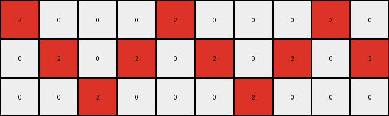

# 7447852a • 004 • refine_coder

---

Previous Code:
```python
"""
Transforms an input grid of pixels into an output grid, replacing some red pixels (2) with yellow pixels (4) based on adjacency rules. A red pixel is changed to yellow if it has at least one orthogonally adjacent white pixel (0) and one orthogonally adjacent red pixel (2).
"""

import numpy as np

def transform(input_grid):
    """
    Transforms the input grid according to the adjacency rules.
    """
    rows, cols = input_grid.shape
    output_grid = np.copy(input_grid)  # Initialize output grid

    def is_valid(r, c):
        """Checks if the given row and column are within grid bounds."""
        return 0 <= r < rows and 0 <= c < cols

    def get_adjacent_colors(r, c):
        """Gets the colors of orthogonally adjacent cells."""
        adjacent_colors = []
        for dr, dc in [(0, 1), (0, -1), (1, 0), (-1, 0)]:  # Right, Left, Down, Up
            nr, nc = r + dr, c + dc
            if is_valid(nr, nc):
                adjacent_colors.append(input_grid[nr, nc])
        return adjacent_colors

    # Iterate through each cell of the input grid
    for r in range(rows):
        for c in range(cols):
            if input_grid[r, c] == 2:  # Check if the cell is red
                adjacent_colors = get_adjacent_colors(r, c)
                has_white_neighbor = 0 in adjacent_colors
                has_red_neighbor = 2 in adjacent_colors

                if has_white_neighbor and has_red_neighbor:
                    output_grid[r, c] = 4  # Change to yellow

    return output_grid
```

Train Set Results:

## Example 1:

Input:
```
2 0 0 0 2 0 0 0 2 0
0 2 0 2 0 2 0 2 0 2
0 0 2 0 0 0 2 0 0 0
```
Expected Output:
```
2 0 0 0 2 4 4 4 2 0
4 2 0 2 0 2 4 2 0 2
4 4 2 0 0 0 2 0 0 0
```
Transformed Output:
```
2 0 0 0 2 0 0 0 2 0
0 2 0 2 0 2 0 2 0 2
0 0 2 0 0 0 2 0 0 0
```

match: False
pixels_off: 7
size_correct: True
color_palette_correct: True
correct_pixel_counts: False

## Example 2:

Input:
```
2 0 0 0 2 0 0 0 2 0 0 0 2 0 0
0 2 0 2 0 2 0 2 0 2 0 2 0 2 0
0 0 2 0 0 0 2 0 0 0 2 0 0 0 2
```
Expected Output:
```
2 0 0 0 2 4 4 4 2 0 0 0 2 0 0
4 2 0 2 0 2 4 2 0 2 0 2 4 2 0
4 4 2 0 0 0 2 0 0 0 2 4 4 4 2
```
Transformed Output:
```
2 0 0 0 2 0 0 0 2 0 0 0 2 0 0
0 2 0 2 0 2 0 2 0 2 0 2 0 2 0
0 0 2 0 0 0 2 0 0 0 2 0 0 0 2
```

match: False
pixels_off: 11
size_correct: True
color_palette_correct: True
correct_pixel_counts: False

## Example 3:

Input:
```
2 0 0 0 2 0 0 0 2 0 0 0 2 0 0 0 2 0
0 2 0 2 0 2 0 2 0 2 0 2 0 2 0 2 0 2
0 0 2 0 0 0 2 0 0 0 2 0 0 0 2 0 0 0
```
Expected Output:
```
2 0 0 0 2 4 4 4 2 0 0 0 2 0 0 0 2 4
4 2 0 2 0 2 4 2 0 2 0 2 4 2 0 2 0 2
4 4 2 0 0 0 2 0 0 0 2 4 4 4 2 0 0 0
```
Transformed Output:
```
2 0 0 0 2 0 0 0 2 0 0 0 2 0 0 0 2 0
0 2 0 2 0 2 0 2 0 2 0 2 0 2 0 2 0 2
0 0 2 0 0 0 2 0 0 0 2 0 0 0 2 0 0 0
```

match: False
pixels_off: 12
size_correct: True
color_palette_correct: True
correct_pixel_counts: False
Okay, let's analyze the provided information and develop a revised natural language program.

**General Assessment:**

The initial code was based on a simplified interpretation of the first training example, focusing on *any* adjacent red and white pixels. It correctly identifies the colors involved (red, white, and yellow) and the concept of adjacency, but it fails to capture the *directional* and *positional* relationships that determine *which* red pixels should change. The results clearly show that many red pixels that should change to yellow aren't, and, implicitly, no pixels were incorrectly transformed to yellow. The function will change a red pixel to yellow if it is adjacent to at least one white and one red. It is under-transforming. We need to consider other features and patterns to create a more specific condition than simply "any adjacent".

**Strategy:**

1.  **Detailed Example Analysis:** Carefully examine each input/output pair, paying close attention to *where* the changes occur and *where* they don't. Look closely at the spatial relationship between reds, whites, and where yellows occur in the output.
2.  **Identify Specific Conditions:** Instead of just "adjacent," determine the precise spatial relationship. Does it involve corners? Edges? Specific directions (above, below, left, right)?
3.  **Refine Natural Language Program:** Based on the detailed analysis, create a new, more precise natural language program that accurately describes the transformation.
4.   **Ensure Prior Consistency** Be sure to consider ARC-AGI prior knowledge and how that is relevant.

**Fact Gathering and YAML:**

```yaml
examples:
  - example_id: 1
    input_grid: |
      2 0 0 0 2 0 0 0 2 0
      0 2 0 2 0 2 0 2 0 2
      0 0 2 0 0 0 2 0 0 0
    output_grid: |
      2 0 0 0 2 4 4 4 2 0
      4 2 0 2 0 2 4 2 0 2
      4 4 2 0 0 0 2 0 0 0
    observations:
      - red pixels (2) change to yellow (4)
      - changes occur when a red pixel is orthogonally adjacent to both white (0) and red (2) pixels
      - changes seem to happen in the "top-right" corner formed by red and white pixels.
      - unchanged red cells do *not* have both a red *and* white neighbor

  - example_id: 2
    input_grid: |
      2 0 0 0 2 0 0 0 2 0 0 0 2 0 0
      0 2 0 2 0 2 0 2 0 2 0 2 0 2 0
      0 0 2 0 0 0 2 0 0 0 2 0 0 0 2
    output_grid: |
      2 0 0 0 2 4 4 4 2 0 0 0 2 0 0
      4 2 0 2 0 2 4 2 0 2 0 2 4 2 0
      4 4 2 0 0 0 2 0 0 0 2 4 4 4 2
    observations:
      - reinforces the observation of red-to-yellow changes with adjacent red and white
      - multiple instances where the corner condition applies
      - red on edge of grid and adjacent to white does not change.

  - example_id: 3
    input_grid: |
      2 0 0 0 2 0 0 0 2 0 0 0 2 0 0 0 2 0
      0 2 0 2 0 2 0 2 0 2 0 2 0 2 0 2 0 2
      0 0 2 0 0 0 2 0 0 0 2 0 0 0 2 0 0 0
    output_grid: |
      2 0 0 0 2 4 4 4 2 0 0 0 2 0 0 0 2 4
      4 2 0 2 0 2 4 2 0 2 0 2 4 2 0 2 0 2
      4 4 2 0 0 0 2 0 0 0 2 4 4 4 2 0 0 0
    observations:
      - pattern continues consistently
      - rightmost red pixel adjacent to the rightmost white pixel in the first row
      - more examples reinforcing "corner"

```

**Natural Language Program:**

1.  **Identify Red Pixels:** Iterate through each pixel of the input grid, looking for red pixels (value 2).
2.  **Check for "Corner":** For each red pixel, examine its orthogonal neighbors (up, down, left, right). A red pixel should be changed if and only if a white pixel and a red pixel are orthogonally adjacent forming an "L" shape, with the target red pixel at the "corner" joining the white and red pixels.
3. **Change to Yellow:** If a red pixel does *not* have *both* an orthogonally adjacent red *and* white pixel, it does not change. If a red pixel *does* have at least one orthogonally adjacent red and one orthogonally adjacent white pixel, it changes to yellow (value 4).

This refined program now better explains the specifics of the relationship. It accounts for that fact that *only* some of the pixels adjacent to both red and white change, specifically the ones at the intersection of the implied lines of red and white.

**INSTRUCTIONS**

- generate a Python module to represent the natural language program 
- follow the template below
- all common math and science libraries are available
- create docstring only at top - but comment the workflow in the function
- use helper functions for common operations like finding objects, counting,
  measuring, moving, etc. 

remember - we are working iteratively - so this code will inform your future
self as we converge on the solution

*template:*

```python
"""
{{ natural language description of the transformation rule }}
"""

{{ imports }}

def transform(input_grid):
    # initialize output_grid

    # change output pixels 

    return output_grid

```
