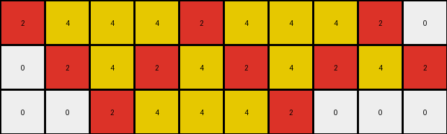
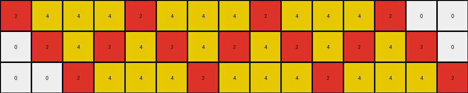
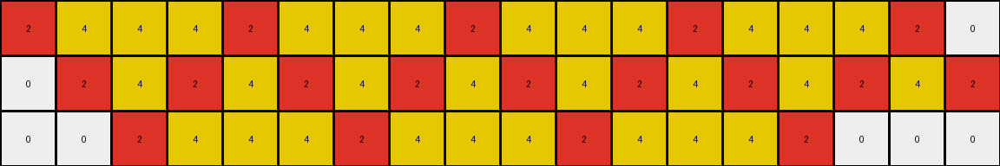

# 7447852a • 009 • refine_dreamer

---

Previous Code:
```python
"""
1. **Identify Red Pixels:** Locate all pixels with the color red (value 2) in the input grid.

2. **Horizontal and Vertical Expansion:**
    *   For any continuous horizontal sequence of red pixels, turn all white pixels between the left-most pixel and right-most pixel in the sequence to yellow.
    *   For any continuous vertical sequence of red pixels, turn all white pixels between the up-most and down-most pixel in the sequence to yellow.

3. **Diagonal connections:**
    * For any diagonal sequence (upleft, downright) or (upright, downleft), where at least 3 continuous pixels in the sequence, turn the white pixels between upmost and downmost pixels to yellow.

4. **Result:** The output grid is the result of applying these filling rules.
"""

import numpy as np

def get_red_pixels(grid):
    red_pixels = []
    for r_idx, row in enumerate(grid):
        for c_idx, pixel in enumerate(row):
            if pixel == 2:
                red_pixels.append((r_idx, c_idx))
    return red_pixels
                
def fill_horizontal(grid, red_pixels):
    output_grid = np.copy(grid)
    for r_idx, row in enumerate(grid):
        red_cols = [c_idx for r_idx_, c_idx in red_pixels if r_idx_ == r_idx]
        if red_cols:
            min_col = min(red_cols)
            max_col = max(red_cols)
            for c_idx in range(min_col+1, max_col):
                if output_grid[r_idx, c_idx] == 0:
                    output_grid[r_idx, c_idx] = 4
    return output_grid

def fill_vertical(grid, red_pixels):
    output_grid = np.copy(grid)
    for c_idx in range(grid.shape[1]):
        red_rows = [r_idx for r_idx, c_idx_ in red_pixels if c_idx_ == c_idx]
        if red_rows:
            min_row = min(red_rows)
            max_row = max(red_rows)
            for r_idx in range(min_row + 1, max_row):
                if output_grid[r_idx, c_idx] == 0:
                   output_grid[r_idx, c_idx] = 4
    return output_grid

def fill_diagonal(grid, red_pixels):
    output_grid = np.copy(grid)
    
    # Helper function to check and fill diagonal sequences
    def check_and_fill_diagonal(start_row, start_col, row_dir, col_dir):
        sequence = []
        r, c = start_row, start_col
        while 0 <= r < grid.shape[0] and 0 <= c < grid.shape[1]:
            if grid[r, c] == 2:
                sequence.append((r,c))
            elif len(sequence) > 0:
                break # sequence stopped
            r += row_dir
            c += col_dir

        if len(sequence) >= 2: # at least 2 for connecting between
            min_row = min(sequence, key=lambda x: x[0])[0]
            max_row = max(sequence, key=lambda x: x[0])[0]
            min_col = min(sequence, key=lambda x: x[1])[1]
            max_col = max(sequence, key=lambda x: x[1])[1]

            # infer dir of the sequence
            r_dir = 1 if max_row > min_row else -1
            c_dir = 1 if max_col > min_col else -1

            # now fill
            r, c = min_row + r_dir, min_col + c_dir # start from after first in seq
            while r != max_row and c != max_col:
                if output_grid[r,c] == 0:
                    output_grid[r, c] = 4
                r += r_dir
                c += c_dir
                

    for start_row in range(grid.shape[0]):
        check_and_fill_diagonal(start_row, 0, 1, 1)      # downright
        check_and_fill_diagonal(start_row, 0, 1, -1)     # downleft
        check_and_fill_diagonal(start_row, grid.shape[1]-1, 1, -1)  #upleft from right edge
        check_and_fill_diagonal(start_row, grid.shape[1]-1, 1, 1) # upright form right edge

    for start_col in range(1,grid.shape[1]): # avoid double count
        check_and_fill_diagonal(0, start_col, 1, 1) # downright
        check_and_fill_diagonal(0, start_col, 1, -1) # downleft

    for start_col in range(0,grid.shape[1]-1): # avoid double count
        check_and_fill_diagonal(0, start_col, -1, 1)   # upright
        check_and_fill_diagonal(0, start_col, -1, -1)   # upleft

    return output_grid

def transform(input_grid):
    # initialize output_grid
    output_grid = np.copy(input_grid)

    # get all red pixels
    red_pixels = get_red_pixels(input_grid)
    
    # fill horizontally between red pixels
    output_grid = fill_horizontal(output_grid, red_pixels)

    # fill vertically between red pixels
    output_grid = fill_vertical(output_grid, red_pixels)
    
    # fill diagonally between red pixels
    output_grid = fill_diagonal(output_grid, red_pixels)

    return output_grid
```

Train Set Results:

## Example 1:

Input:
```
2 0 0 0 2 0 0 0 2 0
0 2 0 2 0 2 0 2 0 2
0 0 2 0 0 0 2 0 0 0
```
Expected Output:
```
2 0 0 0 2 4 4 4 2 0
4 2 0 2 0 2 4 2 0 2
4 4 2 0 0 0 2 0 0 0
```
Transformed Output:
```
2 4 4 4 2 4 4 4 2 0
0 2 4 2 4 2 4 2 4 2
0 0 2 4 4 4 2 0 0 0
```

match: False
pixels_off: 12
size_correct: True
color_palette_correct: True
correct_pixel_counts: False

## Example 2:

Input:
```
2 0 0 0 2 0 0 0 2 0 0 0 2 0 0
0 2 0 2 0 2 0 2 0 2 0 2 0 2 0
0 0 2 0 0 0 2 0 0 0 2 0 0 0 2
```
Expected Output:
```
2 0 0 0 2 4 4 4 2 0 0 0 2 0 0
4 2 0 2 0 2 4 2 0 2 0 2 4 2 0
4 4 2 0 0 0 2 0 0 0 2 4 4 4 2
```
Transformed Output:
```
2 4 4 4 2 4 4 4 2 4 4 4 2 0 0
0 2 4 2 4 2 4 2 4 2 4 2 4 2 0
0 0 2 4 4 4 2 4 4 4 2 4 4 4 2
```

match: False
pixels_off: 19
size_correct: True
color_palette_correct: True
correct_pixel_counts: False

## Example 3:

Input:
```
2 0 0 0 2 0 0 0 2 0 0 0 2 0 0 0 2 0
0 2 0 2 0 2 0 2 0 2 0 2 0 2 0 2 0 2
0 0 2 0 0 0 2 0 0 0 2 0 0 0 2 0 0 0
```
Expected Output:
```
2 0 0 0 2 4 4 4 2 0 0 0 2 0 0 0 2 4
4 2 0 2 0 2 4 2 0 2 0 2 4 2 0 2 0 2
4 4 2 0 0 0 2 0 0 0 2 4 4 4 2 0 0 0
```
Transformed Output:
```
2 4 4 4 2 4 4 4 2 4 4 4 2 4 4 4 2 0
0 2 4 2 4 2 4 2 4 2 4 2 4 2 4 2 4 2
0 0 2 4 4 4 2 4 4 4 2 4 4 4 2 0 0 0
```

match: False
pixels_off: 25
size_correct: True
color_palette_correct: True
correct_pixel_counts: False
**INSTRUCTIONS**

The code above was generated based on observations from the first training
example

we have tested the transform function on each of the task example inputs and
compared with the expected output

review each of the examples provided and the results and consider how the
natural language program should be updated to accommodate this new knowledge

respond with the following deliverables:

- general assessment of the information provided and strategy for resolving the
  errors
- gather metrics about each of the examples and results - use code_execution to
  develop accurate reports on your assumptions
- a YAML block documenting facts - Focus on identifying objects, their properties, and the actions performed on them.
- a natural language program - Be as clear and concise as possible, providing a complete description of the transformation rule.


your responses should be considered as information in a report - not a
conversation
