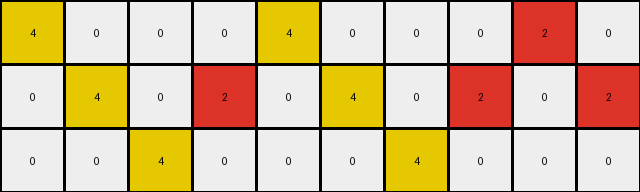
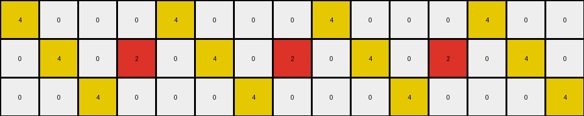
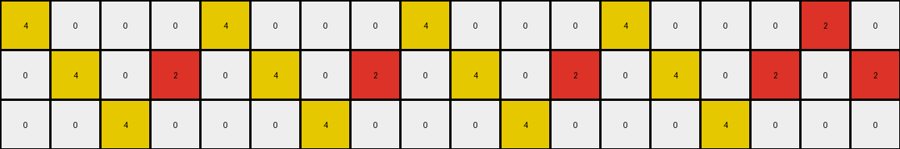

# 7447852a • 017 • refine_dreamer

---


Previous Code:
```python
"""
Copies the input grid and changes the color of red pixels to yellow if they are not part of any 3x3 square's corners, where a square is defined by the potential regions marked by any red pixels.
"""

import numpy as np

def get_potential_squares_regions(grid):
    red_pixels = []
    potential_squares_regions = []
    height, width = grid.shape
    for r in range(height):
        for c in range(width):
            if grid[r,c] == 2:
                red_pixels.append((r,c))

    for r1, c1 in red_pixels:
        for r2, c2 in red_pixels:
            if r2 == r1 + 2 and c2 == c1 + 2:
                # Define the region
                top_left = (r1, c1)
                bottom_right = (r2, c2)
                potential_squares_regions.append((top_left, bottom_right))
    return potential_squares_regions
                

def transform(input_grid):
    # Create a copy of the input grid to serve as the output grid.
    output_grid = np.copy(input_grid)
    height, width = input_grid.shape

    # Get potential 3x3 square regions
    potential_squares_regions = get_potential_squares_regions(input_grid)
    
    # Create set to quickly check region containment.
    regions_set = set()
    for region in potential_squares_regions:
        (r1, c1), (r2, c2) = region
        for r in range(r1, r2 + 1):
            for c in range(c1, c2 + 1):
              regions_set.add((r,c))
    
    red_pixels_to_change = []

    for r in range(height):
        for c in range(width):
            if input_grid[r,c] == 2:
                # Check the region list.
                if (r,c) in regions_set:

                    is_corner = False
                    for (r1,c1), (r2, c2) in potential_squares_regions:
                        if (r, c) == (r1, c1) or (r,c) == (r1, c2) or (r, c) == (r2, c1) or (r,c) == (r2, c2):
                            if input_grid[r1, c1] == 2 and input_grid[r1, c2] == 2 and input_grid[r2, c1] == 2 and input_grid[r2, c2] == 2:
                                is_corner = True
                                break
                    if not is_corner:        
                        red_pixels_to_change.append((r,c))


    # Change color to the identified red pixels.
    for r, c in red_pixels_to_change:
        output_grid[r, c] = 4
    
    return output_grid
```

Train Set Results:

## Example 1:

Input:
```
2 0 0 0 2 0 0 0 2 0
0 2 0 2 0 2 0 2 0 2
0 0 2 0 0 0 2 0 0 0
```
Expected Output:
```
2 0 0 0 2 4 4 4 2 0
4 2 0 2 0 2 4 2 0 2
4 4 2 0 0 0 2 0 0 0
```
Transformed Output:
```
4 0 0 0 4 0 0 0 2 0
0 4 0 2 0 4 0 2 0 2
0 0 4 0 0 0 4 0 0 0
```

match: False
pixels_off: 13
size_correct: True
color_palette_correct: True
correct_pixel_counts: False

## Example 2:

Input:
```
2 0 0 0 2 0 0 0 2 0 0 0 2 0 0
0 2 0 2 0 2 0 2 0 2 0 2 0 2 0
0 0 2 0 0 0 2 0 0 0 2 0 0 0 2
```
Expected Output:
```
2 0 0 0 2 4 4 4 2 0 0 0 2 0 0
4 2 0 2 0 2 4 2 0 2 0 2 4 2 0
4 4 2 0 0 0 2 0 0 0 2 4 4 4 2
```
Transformed Output:
```
4 0 0 0 4 0 0 0 4 0 0 0 4 0 0
0 4 0 2 0 4 0 2 0 4 0 2 0 4 0
0 0 4 0 0 0 4 0 0 0 4 0 0 0 4
```

match: False
pixels_off: 23
size_correct: True
color_palette_correct: True
correct_pixel_counts: False

## Example 3:

Input:
```
2 0 0 0 2 0 0 0 2 0 0 0 2 0 0 0 2 0
0 2 0 2 0 2 0 2 0 2 0 2 0 2 0 2 0 2
0 0 2 0 0 0 2 0 0 0 2 0 0 0 2 0 0 0
```
Expected Output:
```
2 0 0 0 2 4 4 4 2 0 0 0 2 0 0 0 2 4
4 2 0 2 0 2 4 2 0 2 0 2 4 2 0 2 0 2
4 4 2 0 0 0 2 0 0 0 2 4 4 4 2 0 0 0
```
Transformed Output:
```
4 0 0 0 4 0 0 0 4 0 0 0 4 0 0 0 2 0
0 4 0 2 0 4 0 2 0 4 0 2 0 4 0 2 0 2
0 0 4 0 0 0 4 0 0 0 4 0 0 0 4 0 0 0
```

match: False
pixels_off: 24
size_correct: True
color_palette_correct: True
correct_pixel_counts: False

**INSTRUCTIONS**

The code above was generated based on observations from the first training
example

we have tested the transform function on each of the task example inputs and
compared with the expected output

review each of the examples provided and the results and consider how the
natural language program should be updated to accommodate this new knowledge

respond with the following deliverables:

- general assessment of the information provided and strategy for resolving the
  errors
- gather metrics about each of the examples and results - use code_execution to
  develop accurate reports on your assumptions
- a YAML block documenting facts - Focus on identifying objects, their properties, and the actions performed on them.
- a natural language program - Be as clear and concise as possible, providing a complete description of the transformation rule.


your responses should be considered as information in a report - not a
conversation
