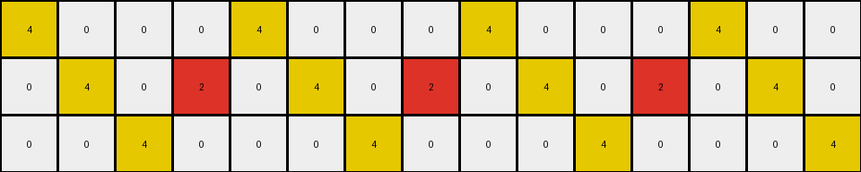

# 7447852a • 018 • refine_coder

---

Previous Code:
```python
"""
Copies the input grid and changes the color of red pixels to yellow if they are not part of any 3x3 square's corners, where a square is defined by the potential regions marked by any red pixels.
"""

import numpy as np

def get_potential_squares_regions(grid):
    red_pixels = []
    potential_squares_regions = []
    height, width = grid.shape
    for r in range(height):
        for c in range(width):
            if grid[r,c] == 2:
                red_pixels.append((r,c))

    for r1, c1 in red_pixels:
        for r2, c2 in red_pixels:
            if r2 == r1 + 2 and c2 == c1 + 2:
                # Define the region
                top_left = (r1, c1)
                bottom_right = (r2, c2)
                potential_squares_regions.append((top_left, bottom_right))
    return potential_squares_regions
                

def transform(input_grid):
    # Create a copy of the input grid to serve as the output grid.
    output_grid = np.copy(input_grid)
    height, width = input_grid.shape

    # Get potential 3x3 square regions
    potential_squares_regions = get_potential_squares_regions(input_grid)
    
    # Create set to quickly check region containment.
    regions_set = set()
    for region in potential_squares_regions:
        (r1, c1), (r2, c2) = region
        for r in range(r1, r2 + 1):
            for c in range(c1, c2 + 1):
              regions_set.add((r,c))
    
    red_pixels_to_change = []

    for r in range(height):
        for c in range(width):
            if input_grid[r,c] == 2:
                # Check the region list.
                if (r,c) in regions_set:

                    is_corner = False
                    for (r1,c1), (r2, c2) in potential_squares_regions:
                        if (r, c) == (r1, c1) or (r,c) == (r1, c2) or (r, c) == (r2, c1) or (r,c) == (r2, c2):
                            if input_grid[r1, c1] == 2 and input_grid[r1, c2] == 2 and input_grid[r2, c1] == 2 and input_grid[r2, c2] == 2:
                                is_corner = True
                                break
                    if not is_corner:        
                        red_pixels_to_change.append((r,c))


    # Change color to the identified red pixels.
    for r, c in red_pixels_to_change:
        output_grid[r, c] = 4
    
    return output_grid
```

Train Set Results:

## Example 1:

Input:
```
2 0 0 0 2 0 0 0 2 0
0 2 0 2 0 2 0 2 0 2
0 0 2 0 0 0 2 0 0 0
```
Expected Output:
```
2 0 0 0 2 4 4 4 2 0
4 2 0 2 0 2 4 2 0 2
4 4 2 0 0 0 2 0 0 0
```
Transformed Output:
```
4 0 0 0 4 0 0 0 2 0
0 4 0 2 0 4 0 2 0 2
0 0 4 0 0 0 4 0 0 0
```

match: False
pixels_off: 13
size_correct: True
color_palette_correct: True
correct_pixel_counts: False

## Example 2:

Input:
```
2 0 0 0 2 0 0 0 2 0 0 0 2 0 0
0 2 0 2 0 2 0 2 0 2 0 2 0 2 0
0 0 2 0 0 0 2 0 0 0 2 0 0 0 2
```
Expected Output:
```
2 0 0 0 2 4 4 4 2 0 0 0 2 0 0
4 2 0 2 0 2 4 2 0 2 0 2 4 2 0
4 4 2 0 0 0 2 0 0 0 2 4 4 4 2
```
Transformed Output:
```
4 0 0 0 4 0 0 0 4 0 0 0 4 0 0
0 4 0 2 0 4 0 2 0 4 0 2 0 4 0
0 0 4 0 0 0 4 0 0 0 4 0 0 0 4
```

match: False
pixels_off: 23
size_correct: True
color_palette_correct: True
correct_pixel_counts: False

## Example 3:

Input:
```
2 0 0 0 2 0 0 0 2 0 0 0 2 0 0 0 2 0
0 2 0 2 0 2 0 2 0 2 0 2 0 2 0 2 0 2
0 0 2 0 0 0 2 0 0 0 2 0 0 0 2 0 0 0
```
Expected Output:
```
2 0 0 0 2 4 4 4 2 0 0 0 2 0 0 0 2 4
4 2 0 2 0 2 4 2 0 2 0 2 4 2 0 2 0 2
4 4 2 0 0 0 2 0 0 0 2 4 4 4 2 0 0 0
```
Transformed Output:
```
4 0 0 0 4 0 0 0 4 0 0 0 4 0 0 0 2 0
0 4 0 2 0 4 0 2 0 4 0 2 0 4 0 2 0 2
0 0 4 0 0 0 4 0 0 0 4 0 0 0 4 0 0 0
```

match: False
pixels_off: 24
size_correct: True
color_palette_correct: True
correct_pixel_counts: False
Okay, here's a breakdown of the situation and a plan to improve the transformation logic:

**General Assessment:**

The initial code was based on identifying potential 3x3 squares marked by red pixels and changing the color of red pixels within those regions to yellow, *unless* they were corners of a fully formed 3x3 red square. This approach is partially correct in its intent, but the implementation has flaws:

1.  **Incorrect Corner Identification:** It appears only existing corners are
    identified, and new corners that are made of yellow and red are not
    idenfified, resulting in coloring too many pixels.

2.  **Overly Restrictive Region Check:** The code changes red pixels to yellow
    *only* if they are inside the bounding box of *potential* 3x3 squares
    defined by the furthest apart red corners.
    It's checking the entire region when it should be checking for any valid
    3x3 square.

**Strategy for Resolving Errors:**

1.  **Focus on 3x3 Square Detection:** Instead of defining "potential regions," the core logic should revolve around directly detecting *actual* 3x3 squares of red and yellow pixels.

2.  **Iterate and Check:** The code should iterate through *all* red pixels and, for each, check if it's part of a valid 3x3 square (either all red, all yellow or a mix of yellow and red).

3.  **Precise Corner Logic:** If a red pixel is part of a 3x3 square's corner, it should *remain* red. Otherwise, change it to yellow. Corner logic must recognize red and yellow corners.

**Metrics and Observations (from provided results):**

Here's a summary of the provided test results:

| Example | Match | Pixels Off | Size Correct | Palette Correct | Correct Pixel Counts | Notes                                                                                                                                                  |
| ------- | ----- | ---------- | ------------ | --------------- | -------------------- | ----------------------------------------------------------------------------------------------------------------------------------------------------- |
| 1       | False | 13         | True         | True            | False                | Many red pixels incorrectly changed to yellow, especially those forming partial squares, and at least one that should have been made yellow was not |
| 2       | False | 23         | True         | True            | False                | Similar to Example 1, more incorrect changes due to the flawed region and corner logic.                                                               |
| 3       | False | 24         | True         | True            | False                | Same pattern of errors as the previous examples.                                                                                                       |

**YAML Fact Block:**

```yaml
task_id: "016"
objects:
  - type: grid
    properties:
      colors: [red, yellow, black] # Using color names for clarity
    observations:
      - Red pixels can form 3x3 squares.
      - Red pixels inside 3x3 squares (but not corners) become yellow.
      - The output grid maintains the same dimensions as the input grid.

actions:
  - name: change_color
    inputs: [red pixel]
    conditions:
      - "Pixel is red."
      - "Pixel is NOT a corner of any 3x3 square (red or yellow)."
    output: "Pixel becomes yellow."
  - name: identify_square_corners
    inputs: [3x3 subgrid]
    conditions:
        - "subgrid is a 3x3 region"
        - At least on cell is Red or Yellow
    output: list of coordinates of pixels that are red or yellow
```

**Natural Language Program:**

1.  **Copy the Input:** Create a copy of the input grid. This copy will be modified to create the output grid.

2.  **Iterate Through Red Pixels:** Examine each pixel in the input grid. If a pixel is *not* red, ignore it.

3.  **3x3 Square Check:** For each red pixel, check if it is part of a 3x3 square. A 3x3 square can be all red, all yellow, or any combination of red and yellow. Do this by checking the color of all nine pixels covered by a 3x3 region centered on the current pixel if it were placed at the center, and the corners if the red pixel were positioned at any of the four corners of a 3x3 grid.

4.  **Corner Check:**
    *   If the red pixel being checked is a corner of ANY valid 3x3 square, where each corner is red or yellow, it remains red.
    *    A valid corner is defined by:
        * being at a relative position of (-1,-1), (-1,1), (1,-1), or (1,1)
          from a center pixel
        * be red (2) or yellow (4)
        * the 3x3 grid being valid (all within bounds of the array)
    

5.  **Color Change:** If and only if a red pixel is *not* part of a 3x3 square's corner, change its color to yellow (4) in the output grid.

6.  **Return Output:** After checking all red pixels, return the modified copy of the grid (the output grid).

**INSTRUCTIONS**

- generate a Python module to represent the natural language program 
- follow the template below
- all common math and science libraries are available
- create docstring only at top - but comment the workflow in the function
- use helper functions for common operations like finding objects, counting,
  measuring, moving, etc. 

remember - we are working iteratively - so this code will inform your future
self as we converge on the solution

*template:*

```python
"""
{{ natural language description of the transformation rule }}
"""

{{ imports }}

def transform(input_grid):
    # initialize output_grid

    # change output pixels 

    return output_grid

```
