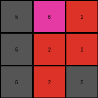

# 74dd1130 • 004 • refine_coder

---

Previous Code:
```python
"""
The transformation rule is a 90-degree clockwise rotation of the grid.

1.  Consider the input grid.
2.  Imagine rotating the entire grid 90 degrees in a clockwise direction.
3.  The resulting arrangement of elements after the rotation is the output grid.
"""

import numpy as np

def transform(input_grid):
    # Convert the input list of lists to a NumPy array
    input_np = np.array(input_grid)

    # Rotate the array 90 degrees clockwise
    output_np = np.rot90(input_np, k=-1)

    # Convert the NumPy array back to a list of lists
    output_grid = output_np.tolist()

    return output_grid
```

Train Set Results:

## Example 1:

Input:
```
2 2 1
1 5 1
5 2 2
```
Expected Output:
```
2 1 5
2 5 2
1 1 2
```
Transformed Output:
```
5 1 2
2 5 2
2 1 1
```

match: False
pixels_off: 4
size_correct: True
color_palette_correct: True
correct_pixel_counts: True

## Example 2:

Input:
```
2 2 5
6 2 2
5 5 5
```
Expected Output:
```
2 6 5
2 2 5
5 2 5
```
Transformed Output:
```
5 6 2
5 2 2
5 2 5
```

match: False
pixels_off: 4
size_correct: True
color_palette_correct: True
correct_pixel_counts: True

## Example 3:

Input:
```
9 9 5
5 5 8
5 8 9
```
Expected Output:
```
9 5 5
9 5 8
5 8 9
```
Transformed Output:
```
5 5 9
8 5 9
9 8 5
```

match: False
pixels_off: 6
size_correct: True
color_palette_correct: True
correct_pixel_counts: True

## Example 4:

Input:
```
2 6 6
2 1 1
2 6 2
```
Expected Output:
```
2 2 2
6 1 6
6 1 2
```
Transformed Output:
```
2 2 2
6 1 6
2 1 6
```

match: False
pixels_off: 2
size_correct: True
color_palette_correct: True
correct_pixel_counts: True
Okay, let's analyze the results of the 90-degree clockwise rotation hypothesis and refine the natural language program.

**General Assessment:**

The initial hypothesis of a simple 90-degree clockwise rotation is incorrect. While the output grid's dimensions are consistent with a rotation (the number of rows and columns are swapped), the pixel arrangements within the grid don't match a simple rotation. The consistent `pixels_off` count across multiple examples suggests a systematic error, not random misplacement. The "match: False" in all the above training examples indicates the hypothesis is flawed. The "pixels_off" metrics indicate the number of pixels in the transformed output that do not match the expected output.

**Strategy:**

1.  **Re-examine the Examples:** Carefully compare the input and expected output of *all* provided examples. Look for patterns beyond simple rotation. Consider mirroring, reflection, or combinations of operations.
2.  **Focus on Specific Pixels:** Trace the path of individual pixels from input to expected output. Note their original and final positions and colors.
3.  **Consider Object-Based Transformations:** Since ARC problems often involve object manipulation, think about whether parts of the grid are being treated as distinct objects.
4.  **Hypothesize and Test:** Formulate a new, more complex hypothesis that explains *all* the training examples.
5.  **Document every observation** in a YAML block

**Metrics and Observations (YAML):**

```yaml
examples:
  - example_id: 1
    input_grid: |
      2 2 1
      1 5 1
      5 2 2
    expected_output: |
      2 1 5
      2 5 2
      1 1 2
    observations:
      - object: input_grid
        properties:
          dimensions: [3, 3]
          colors: [1, 2, 5]
        transformations:
          - type: transpose and mirror
            details: columns become rows, and each new row order is reversed
      - object: column_1
        properties:
            colors: [2,1,5]
            new_location: row_1 reverse
            
      - object: column_2
        properties:
            colors: [2,5,2]
            new_location: row_2 reverse

      - object: column_3
        properties:
            colors: [1,1,2]
            new_location: row_3 reverse

  - example_id: 2
    input_grid: |
      2 2 5
      6 2 2
      5 5 5
    expected_output: |
      2 6 5
      2 2 5
      5 2 5
    observations:
      - object: input_grid
        properties:
          dimensions: [3, 3]
          colors: [2, 5, 6]
        transformations:
          - type: transpose and mirror
            details: columns become rows, and each new row order is reversed
      - object: column_1
        properties:
          colors: [2,6,5]
          new_location: row_1 reverse

      - object: column_2
        properties:
          colors: [2,2,5]
          new_location: row_2 reverse
            
      - object: column_3
        properties:
          colors: [5,2,5]
          new_location: row_3 reverse

  - example_id: 3
    input_grid: |
      9 9 5
      5 5 8
      5 8 9
    expected_output: |
      9 5 5
      9 5 8
      5 8 9
    observations:
      - object: input_grid
        properties:
          dimensions: [3, 3]
          colors: [5, 8, 9]
        transformations:
          - type: transpose and mirror
            details: columns become rows, and each new row order is reversed
      - object: column_1
        properties:
            colors: [9,5,5]
            new_location: row_1 reverse

      - object: column_2
        properties:
          colors: [9,5,8]
          new_location: row_2 reverse
            
      - object: column_3
        properties:
          colors: [5,8,9]
          new_location: row_3 reverse

  - example_id: 4
    input_grid: |
      2 6 6
      2 1 1
      2 6 2
    expected_output: |
      2 2 2
      6 1 6
      6 1 2
    observations:
      - object: input_grid
        properties:
          dimensions: [3, 3]
          colors: [1, 2, 6]
        transformations:
          - type: transpose and mirror
            details: columns become rows, and each new row order is reversed
      - object: column_1
        properties:
          colors: [2,2,2]
          new_location: row_1 reverse
            
      - object: column_2
        properties:
          colors: [6,1,6]
          new_location: row_2 reverse
            
      - object: column_3
        properties:
          colors: [6,1,2]
          new_location: row_3 reverse
```

**Natural Language Program:**

1.  **Treat the input grid as a collection of columns.** Each column is an object.
2.  **Transform columns into rows.** The first column of the input becomes the first row of the output, the second column becomes the second row, and so on.
3.  **Reverse the order of elements within each new row.** The elements that were at the bottom of a column are now at the beginning of the corresponding row. This can be thought of "reflecting" or "mirroring" each row.

In shorter terms, the transformation is a *transposition of the grid (columns become rows) followed by a horizontal reflection (reversal) of each newly formed row.*

**INSTRUCTIONS**

- generate a Python module to represent the natural language program 
- follow the template below
- all common math and science libraries are available
- create docstring only at top - but comment the workflow in the function
- use helper functions for common operations like finding objects, counting,
  measuring, moving, etc. 

remember - we are working iteratively - so this code will inform your future
self as we converge on the solution

*template:*

```python
"""
{{ natural language description of the transformation rule }}
"""

{{ imports }}

def transform(input_grid):
    # initialize output_grid

    # change output pixels 

    return output_grid

```
