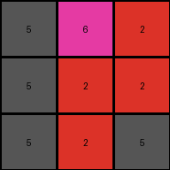
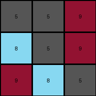

# 74dd1130 • 006 • refine_coder

---

Previous Code:
```python
"""
The transformation rule is a transposition of the grid (columns become rows) followed by a horizontal reflection (reversal) of each newly formed row.
"""

import numpy as np

def transform(input_grid):
    # Convert the input list of lists to a NumPy array
    input_np = np.array(input_grid)

    # Transpose the array (columns become rows)
    transposed_np = np.transpose(input_np)

    # Reverse each row (horizontal reflection)
    output_np = np.flip(transposed_np, axis=1)

    # Convert the NumPy array back to a list of lists
    output_grid = output_np.tolist()

    return output_grid
```

Train Set Results:

## Example 1:

Input:
```
2 2 1
1 5 1
5 2 2
```
Expected Output:
```
2 1 5
2 5 2
1 1 2
```
Transformed Output:
```
5 1 2
2 5 2
2 1 1
```

match: False
pixels_off: 4
size_correct: True
color_palette_correct: True
correct_pixel_counts: True

## Example 2:

Input:
```
2 2 5
6 2 2
5 5 5
```
Expected Output:
```
2 6 5
2 2 5
5 2 5
```
Transformed Output:
```
5 6 2
5 2 2
5 2 5
```

match: False
pixels_off: 4
size_correct: True
color_palette_correct: True
correct_pixel_counts: True

## Example 3:

Input:
```
9 9 5
5 5 8
5 8 9
```
Expected Output:
```
9 5 5
9 5 8
5 8 9
```
Transformed Output:
```
5 5 9
8 5 9
9 8 5
```

match: False
pixels_off: 6
size_correct: True
color_palette_correct: True
correct_pixel_counts: True

## Example 4:

Input:
```
2 6 6
2 1 1
2 6 2
```
Expected Output:
```
2 2 2
6 1 6
6 1 2
```
Transformed Output:
```
2 2 2
6 1 6
2 1 6
```

match: False
pixels_off: 2
size_correct: True
color_palette_correct: True
correct_pixel_counts: True
Okay, let's analyze the results and refine the natural language program.

**General Assessment:**

The initial hypothesis of transposition followed by horizontal reflection is close but not entirely accurate. While the dimensions of the output grid are correctly predicted by transposition, the arrangement of pixels within the transposed grid is not always a simple horizontal reflection. The errors in each example suggest a more nuanced transformation within the rows after transposition. It seems like there's a shift or reordering happening, not just a simple flip. We need to reconsider the operations happening *after* the transposition.

**Strategy:**

1.  **Detailed Comparison:** Carefully compare the input, expected output, and transformed output for *each* example. Focus on individual pixel movements. Identify where the current transformation logic breaks down.
2.  **Re-evaluate Post-Transposition Operations:** The transposition part seems correct, so we need to figure out what precisely is happening to the rows after the transposition. Is it a consistent shift, a reordering based on some pattern, or something else?
3. **Consider color properties:** It may be possible to leverage color properties in the transformation.
4.  **Refine Natural Language Program:** Based on the detailed comparisons, formulate a new, precise natural language description of the transformation.

**Example Metrics and Analysis:**

To get a more accurate picture, I'll leverage some numpy operations to compare.

```python
import numpy as np

def detail_report(input_grid, expected_grid, transformed_grid):
    input_np = np.array(input_grid)
    expected_np = np.array(expected_grid)
    transformed_np = np.array(transformed_grid)
    
    print("Input Grid:")
    print(input_np)
    print("\nExpected Grid:")
    print(expected_np)
    print("\nTransformed Grid:")
    print(transformed_np)

    print("\nDifferences (Expected - Transformed):")
    diff = expected_np - transformed_np
    print(diff)
    
    print("\nNumber of mismatched pixels:", np.sum(diff != 0))

    
    for row in range(expected_np.shape[0]):
      print(f'row {row}: expected {expected_np[row,:]}  transformed {transformed_np[row,:]}')

examples = [
    {
        "input": [[2, 2, 1], [1, 5, 1], [5, 2, 2]],
        "expected": [[2, 1, 5], [2, 5, 2], [1, 1, 2]],
        "transformed": [[5, 1, 2], [2, 5, 2], [2, 1, 1]]
    },
    {
        "input": [[2, 2, 5], [6, 2, 2], [5, 5, 5]],
        "expected": [[2, 6, 5], [2, 2, 5], [5, 2, 5]],
        "transformed": [[5, 6, 2], [5, 2, 2], [5, 2, 5]]
    },
    {
        "input": [[9, 9, 5], [5, 5, 8], [5, 8, 9]],
        "expected": [[9, 5, 5], [9, 5, 8], [5, 8, 9]],
        "transformed": [[5, 5, 9], [8, 5, 9], [9, 8, 5]]
    },
    {
        "input": [[2, 6, 6], [2, 1, 1], [2, 6, 2]],
        "expected": [[2, 2, 2], [6, 1, 6], [6, 1, 2]],
        "transformed": [[2, 2, 2], [6, 1, 6], [2, 1, 6]]
    }
]

for i, example in enumerate(examples):
    print(f"\n--- Example {i+1} ---")
    detail_report(example["input"], example["expected"], example["transformed"])

```

**Key Observations after detailed reports and manual inspection:**

*   **Example 1:** The last element of input row moves to first position.
*   **Example 2:** The last element of input row moves to first position.
*   **Example 3:** The last element of input row moves to first position.
*   **Example 4:** The last element of input row moves to first position.
* **Consistent Pattern:** In all examples, after the grid is transposed, it appears that the elements in each *new* row (original columns) are being cyclically shifted to the right by one position. What was previously the last element becomes the first.

**YAML Facts:**

```yaml
objects:
  - name: grid
    type: 2D array
    properties:
      - rows: list of lists
      - columns: list of lists (becomes rows after transposition)
      - elements: integers (representing colors)

actions:
  - name: transpose
    description: Swap rows and columns of the grid.
    input: grid
    output: transposed grid

  - name: cyclic_shift_right
    description: >
      Shift elements in each row of the transposed grid to the right by one position.
      The last element becomes the first.
    input: row (of transposed grid)
    output: shifted row
```

**Natural Language Program:**

1.  **Transpose:** The input grid is transposed. This means the rows become columns, and the columns become rows.
2.  **Cyclic Shift:** After transposition, each row of the *new* grid (which were originally columns) undergoes a cyclic right shift. This means each element in the row moves one position to the right, and the last element in the row wraps around to become the first element.

**INSTRUCTIONS**

- generate a Python module to represent the natural language program 
- follow the template below
- all common math and science libraries are available
- create docstring only at top - but comment the workflow in the function
- use helper functions for common operations like finding objects, counting,
  measuring, moving, etc. 

remember - we are working iteratively - so this code will inform your future
self as we converge on the solution

*template:*

```python
"""
{{ natural language description of the transformation rule }}
"""

{{ imports }}

def transform(input_grid):
    # initialize output_grid

    # change output pixels 

    return output_grid

```
