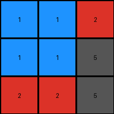
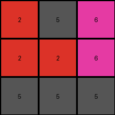
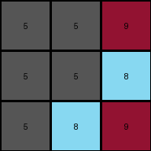
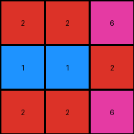

# 74dd1130 • 011 • refine_dreamer

---


Previous Code:
```python
"""
1. Sort Rows: For each row in the input grid, sort the elements (pixel values) in ascending order.
2. Transpose: Transpose the original input grid – that is, swap its rows and columns. The element at `input[i][j]` moves to `input[j][i]`.
3. Apply Sorted Rows: Construct the output by using the values obtained from sorted rows of the input grid, and arrange the sorted rows using the layout structure of the *transposed* input grid.
"""

import numpy as np

def _sort_rows(grid):
    """Sorts each row of a grid in ascending order."""
    return [sorted(row) for row in grid]

def _transpose(grid):
    """Transposes a grid (swaps rows and columns)."""
    return [list(row) for row in zip(*grid)]


def transform(input_grid):
    """
    Transforms the input grid according to the specified rule:
    Sorts rows, transposes the original grid, and applies the sorted rows to the transposed structure.
    """
    # Sort each row of the input grid.
    sorted_rows = _sort_rows(input_grid)

    # Transpose the original input grid.
    transposed_grid = _transpose(input_grid)

    # Initialize the output grid with zeros - using numpy for easier handling.
    output_grid = np.zeros_like(transposed_grid)

    # Apply sorted rows to the transposed grid structure.
    for i in range(len(transposed_grid)):
        for j in range(len(transposed_grid[0])):
            output_grid[i][j] = sorted_rows[i][j]
    
    return output_grid.tolist() # convert back to list of lists
```

Train Set Results:

## Example 1:

Input:
```
2 1 1
1 5 1
5 2 2
```
Expected Output:
```
2 1 5
2 5 2
1 1 2
```
Transformed Output:
```
1 1 2
1 1 5
2 2 5
```

match: False
pixels_off: 8
size_correct: True
color_palette_correct: True
correct_pixel_counts: False

## Example 2:

Input:
```
2 6 5
6 2 2
5 5 5
```
Expected Output:
```
2 6 5
2 2 5
5 2 5
```
Transformed Output:
```
2 5 6
2 2 6
5 5 5
```

match: False
pixels_off: 4
size_correct: True
color_palette_correct: True
correct_pixel_counts: False

## Example 3:

Input:
```
9 5 5
5 5 8
5 8 9
```
Expected Output:
```
9 5 5
9 5 8
5 8 9
```
Transformed Output:
```
5 5 9
5 5 8
5 8 9
```

match: False
pixels_off: 3
size_correct: True
color_palette_correct: True
correct_pixel_counts: False

## Example 4:

Input:
```
2 2 6
2 1 1
2 6 2
```
Expected Output:
```
2 2 2
6 1 6
6 1 2
```
Transformed Output:
```
2 2 6
1 1 2
2 2 6
```

match: False
pixels_off: 6
size_correct: True
color_palette_correct: True
correct_pixel_counts: False

**INSTRUCTIONS**

The code above was generated based on observations from the first training
example

we have tested the transform function on each of the task example inputs and
compared with the expected output

review each of the examples provided and the results and consider how the
natural language program should be updated to accommodate this new knowledge

respond with the following deliverables:

- general assessment of the information provided and strategy for resolving the
  errors
- gather metrics about each of the examples and results - use code_execution to
  develop accurate reports on your assumptions
- a YAML block documenting facts - Focus on identifying objects, their properties, and the actions performed on them.
- a natural language program - Be as clear and concise as possible, providing a complete description of the transformation rule.


your responses should be considered as information in a report - not a
conversation
