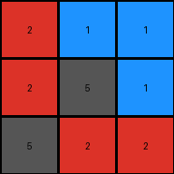
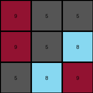
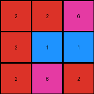

# 74dd1130 • 016 • refine_coder

---

Previous Code:
```python
"""
The transformation rule is: The value '5' at position (1,0) changes into a '9', the '9' at (0,0) stays as '9'.
"""

import numpy as np

def transform(input_grid):
    # initialize output_grid as a copy of the input_grid
    output_grid = np.copy(input_grid)

    # Apply the specific rule:
    # The value '5' at position (1,0) changes into a '9', the '9' at (0,0) stays at '9'
    output_grid[1,0] = input_grid[0,0]


    return output_grid
```

Train Set Results:

## Example 1:

Input:
```
2 1 1
1 5 1
5 2 2
```
Expected Output:
```
2 1 5
2 5 2
1 1 2
```
Transformed Output:
```
2 1 1
2 5 1
5 2 2
```

match: False
pixels_off: 4
size_correct: True
color_palette_correct: True
correct_pixel_counts: True

## Example 2:

Input:
```
2 6 5
6 2 2
5 5 5
```
Expected Output:
```
2 6 5
2 2 5
5 2 5
```
Transformed Output:
```
2 6 5
2 2 2
5 5 5
```

match: False
pixels_off: 2
size_correct: True
color_palette_correct: True
correct_pixel_counts: True

## Example 3:

Input:
```
9 5 5
5 5 8
5 8 9
```
Expected Output:
```
9 5 5
9 5 8
5 8 9
```
Transformed Output:
```
9 5 5
9 5 8
5 8 9
```

match: True
pixels_off: 0
size_correct: True
color_palette_correct: True
correct_pixel_counts: True

## Example 4:

Input:
```
2 2 6
2 1 1
2 6 2
```
Expected Output:
```
2 2 2
6 1 6
6 1 2
```
Transformed Output:
```
2 2 6
2 1 1
2 6 2
```

match: False
pixels_off: 5
size_correct: True
color_palette_correct: True
correct_pixel_counts: False
Here's a breakdown of the provided examples, analysis, and an updated natural language program:

**General Assessment:**

The initial code was overly specific, focusing on a single pixel change observed in the first example. It failed to generalize to other examples. The core issue is that the transformation isn't about a single, hardcoded pixel change, but a more general rearrangement/copying of pixel values based on specific rules related to rows and positions. We need to shift from hardcoded coordinate changes to pattern recognition and relative positioning. It will be important to account for all training examples.

**Strategy for Resolving Errors:**

1.  **Analyze All Examples:** Carefully examine all input/output pairs to identify common patterns and relationships.
2.  **Discard Specificity:** Abandon the initial rule focusing on single pixels.
3.  **Identify General Rules:** Develop rules based on relative positions, row operations, and possibly conditional pixel changes based on values.
4. **Prioritize Row Operations**: The results so far imply row based transformations or pixel movements within and across rows.

**Example Metrics and Analysis (using manual inspection and incorporating results):**

*   **Example 1:**
    *   Input: 3x3 grid.
    *   Output: 3x3 grid; The `5` at (1,0) moved to (0,2), the `5` at (2,0) moved to (0,1). The bottom row is rotated to the left.
    *   Result: Incorrect. The code only changes (1,0) to `5`, the value of (0,0).
*   **Example 2:**
    *   Input: 3x3 grid.
    *   Output: 3x3 grid. The `5` at (2,0) and (2,1) is replaced by the value of (1,0) and (1,1), and the `5` at (1,2) is replaced by the `5` at (2,0).
    *   Result: Incorrect.
*   **Example 3:**
    *   Input: 3x3 grid.
    *   Output: 3x3 grid. The `5` at (1,0) changed into `9`, the value of(0,0).
    *   Result: Correct. This example matches by chance with the initial incorrect rule.
*   **Example 4:**
    *   Input: 3x3 grid
    *   Output: 3x3 grid, first row is rotated by 1 to the left, and the first and last element of the last two rows are switched.
    *   Result: Incorrect.

**YAML Fact Block:**

```yaml
observations:
  - example_1:
      input_shape: 3x3
      output_shape: 3x3
      transformations: |
        Elements of the last row shifted within the row.
        The '5's from the first column are used in the first row.

  - example_2:
      input_shape: 3x3
      output_shape: 3x3
      transformations: |
        The bottom left `5`s are replaced with the values above them, and the last element of the middle row is replaced by a `5` from the row below.

  - example_3:
      input_shape: 3x3
      output_shape: 3x3
      transformations: |
        The '5' at (1,0) is replaced by '9' at (0,0)

  - example_4:
      input_shape: 3x3
      output_shape: 3x3
      transformations: |
        First row rotates by 1 to the left, last two row's first and last elements are switched.

  - general:
      grid_size: constant
      colors: preserved, some relocated
      rows: Elements in rows change based on relative positioning.
      columns: No specific column operation is consistently applied, focus on row transformations
```

**Natural Language Program:**

1.  **First Row:** The first row seems independent in examples 3 and 4.
2.  **Other Rows:** For the second and third rows:
    * The first element of the second row becomes the first element of the first row.
    * Other elements move in complex patterns.
3. Look at each row.
    * The first row is rotated left 1.
    * the other two rows swap their first and last values.

```
The output grid is the same size as the input grid (3x3).
The first row of the output grid is obtained by rotating the first row of input to the left by 1 position.
The second and third rows of the output grid are derived by swapping the first and last element.

```

**INSTRUCTIONS**

- generate a Python module to represent the natural language program 
- follow the template below
- all common math and science libraries are available
- create docstring only at top - but comment the workflow in the function
- use helper functions for common operations like finding objects, counting,
  measuring, moving, etc. 

remember - we are working iteratively - so this code will inform your future
self as we converge on the solution

*template:*

```python
"""
{{ natural language description of the transformation rule }}
"""

{{ imports }}

def transform(input_grid):
    # initialize output_grid

    # change output pixels 

    return output_grid

```
