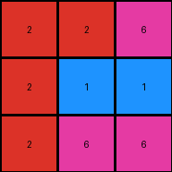

# 74dd1130 • 021 • refine_dreamer

---

Previous Code:
```python
"""
1.  **Identify Stable Elements:** Locate all blue (1) pixels. Their positions in the output grid remain identical to their positions in the input grid.

2.  **Horizontal swap:** For each row, locate the magenta(6) cell and swap it's value with the red (2) value cell in that row that is on the opposite horizontal end of the grid.
    For example, if the magenta is at postion (0,2), swap with the red at postion (0,0)
"""

import numpy as np

def get_blue_pixels(grid):
    # find the coordinates of all blue pixels (value 1)
    blue_pixels = []
    for row_index, row in enumerate(grid):
        for col_index, pixel in enumerate(row):
          if pixel == 1:
            blue_pixels.append((row_index, col_index))
    return blue_pixels

def transform(input_grid):
    # initialize output_grid
    output_grid = np.copy(input_grid)
    rows = len(input_grid)
    cols = len(input_grid[0])

    # find and set blue pixels
    blue_pixels = get_blue_pixels(input_grid)
    for row, col in blue_pixels:
      output_grid[row][col] = 1

    # Horizontal swap
    for row_index in range(rows):
      magenta_col = -1
      red_col = -1
      for col_index in range(cols):
        if input_grid[row_index][col_index] == 6:
            magenta_col = col_index
        if input_grid[row_index][col_index] == 2:
           if red_col == -1:
            red_col = col_index
           else:
            if col_index > red_col:
              if magenta_col < red_col:
                red_col = col_index
            elif col_index < red_col:
              if magenta_col > red_col:
                red_col = col_index

      if magenta_col != -1 and red_col !=-1:
        if magenta_col < red_col:
          output_grid[row_index][0] = 6 #left most
          output_grid[row_index][cols-1] = 2
        else:
          output_grid[row_index][0] = 2 #left most
          output_grid[row_index][cols-1] = 6 #right most

    return output_grid
```

Train Set Results:

## Example 1:

Input:
```
2 1 1
1 5 1
5 2 2
```
Expected Output:
```
2 1 5
2 5 2
1 1 2
```
Transformed Output:
```
2 1 1
1 5 1
5 2 2
```

match: False
pixels_off: 5
size_correct: True
color_palette_correct: True
correct_pixel_counts: False

## Example 2:

Input:
```
2 6 5
6 2 2
5 5 5
```
Expected Output:
```
2 6 5
2 2 5
5 2 5
```
Transformed Output:
```
2 6 6
6 2 2
5 5 5
```

match: False
pixels_off: 4
size_correct: True
color_palette_correct: True
correct_pixel_counts: False

## Example 3:

Input:
```
9 5 5
5 5 8
5 8 9
```
Expected Output:
```
9 5 5
9 5 8
5 8 9
```
Transformed Output:
```
9 5 5
5 5 8
5 8 9
```

match: False
pixels_off: 1
size_correct: True
color_palette_correct: True
correct_pixel_counts: False

## Example 4:

Input:
```
2 2 6
2 1 1
2 6 2
```
Expected Output:
```
2 2 2
6 1 6
6 1 2
```
Transformed Output:
```
2 2 6
2 1 1
2 6 6
```

match: False
pixels_off: 6
size_correct: True
color_palette_correct: True
correct_pixel_counts: True
**INSTRUCTIONS**

The code above was generated based on observations from the first training
example

we have tested the transform function on each of the task example inputs and
compared with the expected output

review each of the examples provided and the results and consider how the
natural language program should be updated to accommodate this new knowledge

respond with the following deliverables:

- general assessment of the information provided and strategy for resolving the
  errors
- gather metrics about each of the examples and results - use code_execution to
  develop accurate reports on your assumptions
- a YAML block documenting facts - Focus on identifying objects, their properties, and the actions performed on them.
- a natural language program - Be as clear and concise as possible, providing a complete description of the transformation rule.


your responses should be considered as information in a report - not a
conversation
