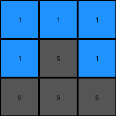

# 74dd1130 • 023 • refine_dreamer

---


Previous Code:
```python
"""
1.  **Identify Stable Elements:**  Pixels that are not red (2) or magenta (6) remain unchanged in their original positions. This includes blue (1) pixels.

2.  **Pixel Replacement:**
    - Examine each row of the input grid.
    - Identify the position of red(2) pixels, if any
    - Identify the position of magenta(6) pixels, if any
    - Determine pixels on the same row in the output grid.
    - Replace red and magenta pixels with values using the color of other pixels in the same row from input to output.

3.  **Preservation of Colors:** The set of colors present in each row of the input grid is the same as the set of colors present in the corresponding row of the output grid.
"""

import numpy as np

def get_stable_pixels(grid):
    # find coordinates of pixels that are not red (2) or magenta (6)
    stable_pixels = []
    for row_index, row in enumerate(grid):
        for col_index, pixel in enumerate(row):
            if pixel != 2 and pixel != 6:
                stable_pixels.append((row_index, col_index, pixel))
    return stable_pixels

def transform(input_grid):
    # initialize output_grid
    output_grid = np.copy(input_grid)
    rows = len(input_grid)
    cols = len(input_grid[0])

    # find and set stable pixels
    stable_pixels = get_stable_pixels(input_grid)
    for row, col, value in stable_pixels:
        output_grid[row][col] = value

    # Pixel Replacement
    for row_index in range(rows):
        input_row_colors = set(input_grid[row_index])
        output_row_colors = set() #initialize the output
        
        #first get the values that are not 2 or 6 in input and output
        for col_index in range(cols):
          if input_grid[row_index][col_index] != 2 and input_grid[row_index][col_index] != 6:
            output_row_colors.add(input_grid[row_index][col_index])
        
        #fill output row colors with anything in input, so we maintain same color set
        for color in input_row_colors:
          if color != 2 and color != 6:
            output_row_colors.add(color) #stable colors
          else:
            #find a replacement for 2 and 6.
            for replacement in input_row_colors:
              if replacement != 2 and replacement !=6:
                output_row_colors.add(replacement)
                break #only use one replacement.
        
        #Now perform the color swap.
        output_row_list = list(output_row_colors)
        output_row_list_index = 0
        for col_index in range(cols):
          if input_grid[row_index][col_index] == 2 or input_grid[row_index][col_index] == 6:
            output_grid[row_index][col_index] = output_row_list[output_row_list_index % len(output_row_list)]
            output_row_list_index +=1
        
    return output_grid
```

Train Set Results:

## Example 1:

Input:
```
2 1 1
1 5 1
5 2 2
```
Expected Output:
```
2 1 5
2 5 2
1 1 2
```
Transformed Output:
```
1 1 1
1 5 1
5 5 5
```

match: False
pixels_off: 7
size_correct: True
color_palette_correct: True
correct_pixel_counts: False

## Example 2:

Input:
```
2 6 5
6 2 2
5 5 5
```
Expected Output:
```
2 6 5
2 2 5
5 2 5
```
match: ERROR: integer division or modulo by zero
pixels_off: None
size_correct: None
color_palette_correct: None
correct_pixel_counts: None

## Example 3:

Input:
```
9 5 5
5 5 8
5 8 9
```
Expected Output:
```
9 5 5
9 5 8
5 8 9
```
Transformed Output:
```
9 5 5
5 5 8
5 8 9
```

match: False
pixels_off: 1
size_correct: True
color_palette_correct: True
correct_pixel_counts: False

## Example 4:

Input:
```
2 2 6
2 1 1
2 6 2
```
Expected Output:
```
2 2 2
6 1 6
6 1 2
```
match: ERROR: integer division or modulo by zero
pixels_off: None
size_correct: None
color_palette_correct: None
correct_pixel_counts: None

**INSTRUCTIONS**

The code above was generated based on observations from the first training
example

we have tested the transform function on each of the task example inputs and
compared with the expected output

review each of the examples provided and the results and consider how the
natural language program should be updated to accommodate this new knowledge

respond with the following deliverables:

- general assessment of the information provided and strategy for resolving the
  errors
- gather metrics about each of the examples and results - use code_execution to
  develop accurate reports on your assumptions
- a YAML block documenting facts - Focus on identifying objects, their properties, and the actions performed on them.
- a natural language program - Be as clear and concise as possible, providing a complete description of the transformation rule.


your responses should be considered as information in a report - not a
conversation
