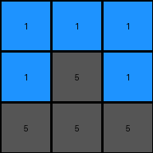

# 74dd1130 • 024 • refine_coder

---

Previous Code:
```python
"""
1.  **Identify Stable Elements:**  Pixels that are not red (2) or magenta (6) remain unchanged in their original positions. This includes blue (1) pixels.

2.  **Pixel Replacement:**
    - Examine each row of the input grid.
    - Identify the position of red(2) pixels, if any
    - Identify the position of magenta(6) pixels, if any
    - Determine pixels on the same row in the output grid.
    - Replace red and magenta pixels with values using the color of other pixels in the same row from input to output.

3.  **Preservation of Colors:** The set of colors present in each row of the input grid is the same as the set of colors present in the corresponding row of the output grid.
"""

import numpy as np

def get_stable_pixels(grid):
    # find coordinates of pixels that are not red (2) or magenta (6)
    stable_pixels = []
    for row_index, row in enumerate(grid):
        for col_index, pixel in enumerate(row):
            if pixel != 2 and pixel != 6:
                stable_pixels.append((row_index, col_index, pixel))
    return stable_pixels

def transform(input_grid):
    # initialize output_grid
    output_grid = np.copy(input_grid)
    rows = len(input_grid)
    cols = len(input_grid[0])

    # find and set stable pixels
    stable_pixels = get_stable_pixels(input_grid)
    for row, col, value in stable_pixels:
        output_grid[row][col] = value

    # Pixel Replacement
    for row_index in range(rows):
        input_row_colors = set(input_grid[row_index])
        output_row_colors = set() #initialize the output
        
        #first get the values that are not 2 or 6 in input and output
        for col_index in range(cols):
          if input_grid[row_index][col_index] != 2 and input_grid[row_index][col_index] != 6:
            output_row_colors.add(input_grid[row_index][col_index])
        
        #fill output row colors with anything in input, so we maintain same color set
        for color in input_row_colors:
          if color != 2 and color != 6:
            output_row_colors.add(color) #stable colors
          else:
            #find a replacement for 2 and 6.
            for replacement in input_row_colors:
              if replacement != 2 and replacement !=6:
                output_row_colors.add(replacement)
                break #only use one replacement.
        
        #Now perform the color swap.
        output_row_list = list(output_row_colors)
        output_row_list_index = 0
        for col_index in range(cols):
          if input_grid[row_index][col_index] == 2 or input_grid[row_index][col_index] == 6:
            output_grid[row_index][col_index] = output_row_list[output_row_list_index % len(output_row_list)]
            output_row_list_index +=1
        
    return output_grid
```

Train Set Results:

## Example 1:

Input:
```
2 1 1
1 5 1
5 2 2
```
Expected Output:
```
2 1 5
2 5 2
1 1 2
```
Transformed Output:
```
1 1 1
1 5 1
5 5 5
```

match: False
pixels_off: 7
size_correct: True
color_palette_correct: True
correct_pixel_counts: False

## Example 2:

Input:
```
2 6 5
6 2 2
5 5 5
```
Expected Output:
```
2 6 5
2 2 5
5 2 5
```
match: ERROR: integer division or modulo by zero
pixels_off: None
size_correct: None
color_palette_correct: None
correct_pixel_counts: None

## Example 3:

Input:
```
9 5 5
5 5 8
5 8 9
```
Expected Output:
```
9 5 5
9 5 8
5 8 9
```
Transformed Output:
```
9 5 5
5 5 8
5 8 9
```

match: False
pixels_off: 1
size_correct: True
color_palette_correct: True
correct_pixel_counts: False

## Example 4:

Input:
```
2 2 6
2 1 1
2 6 2
```
Expected Output:
```
2 2 2
6 1 6
6 1 2
```
match: ERROR: integer division or modulo by zero
pixels_off: None
size_correct: None
color_palette_correct: None
correct_pixel_counts: None
Okay, here's a breakdown of the situation and a plan to move forward, focusing on a structured analysis and iterative refinement of the natural language program:

**General Assessment:**

The initial strategy has several flaws, as evidenced by the errors and mismatches in the test results. The core issue seems to be an oversimplification of the replacement logic for red (2) and magenta (6) pixels.  The code attempts to maintain the set of colors within each row, but the method of choosing replacements is faulty and leads to "modulo by zero" errors when a row contains *only* red and/or magenta pixels, since the `output_row_list` will have length zero. Also, the initial assumption, based only on the first training sample, proves inaccurate with subsequent ones.

**Strategy for Resolving Errors:**

1.  **Error Handling:** The immediate "modulo by zero" error needs to be addressed. This happens when a row has only red and magenta pixels. We need a robust fallback mechanism for these cases.

2.  **Refine Replacement Logic:** Instead of simply grabbing the "next" color from set of colors on the input, the replacement logic needs to be more sophisticated.  The relationship between *all* corresponding rows must be analyzed.

3.  **Iterative Development:**  We'll analyze each example and its outcome *sequentially*, updating the natural language program and the facts after each example. This iterative approach is crucial for converging on the correct transformation rule.

**Example Analysis and Updates:**

Let's examine each example and its results, refining the `facts` and `natural_language_program` progressively.

**Example 1:**

*   **Input:**
    ```
    2 1 1
    1 5 1
    5 2 2
    ```
*   **Expected Output:**
    ```
    2 1 5
    2 5 2
    1 1 2
    ```
*   **Transformed Output:**
    ```
    1 1 1
    1 5 1
    5 5 5
    ```
*   **Metrics:**
    *   `match`: False
    *   `pixels_off`: 7
    *   `size_correct`: True
    *   `color_palette_correct`: True
    *   `correct_pixel_counts`: False

*   **Observations:** The replacement logic is clearly incorrect. Stable pixels are handled correctly, but the substitution of 2 and 6 is flawed.

**Example 2:**

*   **Input:**
    ```
    2 6 5
    6 2 2
    5 5 5
    ```
*   **Expected Output:**
    ```
    2 6 5
    2 2 5
    5 2 5
    ```
*  **Transformed output**
    ```
    ERROR: integer division or modulo by zero
    ```
*   **Metrics:**
    *   `match`: ERROR: integer division or modulo by zero

*   **Observations:** This highlights the critical error in handling rows containing only '2' and '6'.

**Example 3:**

*   **Input:**
    ```
    9 5 5
    5 5 8
    5 8 9
    ```
*   **Expected Output:**
    ```
    9 5 5
    9 5 8
    5 8 9
    ```
*   **Transformed Output:**
    ```
    9 5 5
    5 5 8
    5 8 9
    ```
*   **Metrics:**
    *   `match`: False
    *   `pixels_off`: 1
    *   `size_correct`: True
    *   `color_palette_correct`: True
    *   `correct_pixel_counts`: False

*   **Observations:** This shows that pixels which are *not* 2 or 6 are handled correctly.  Only a single pixel (the '9' in the second row) is incorrect.

**Example 4:**

*   **Input:**
    ```
    2 2 6
    2 1 1
    2 6 2
    ```
*   **Expected Output:**
    ```
    2 2 2
    6 1 6
    6 1 2
    ```

*   **Transformed output**
    ```
    ERROR: integer division or modulo by zero
    ```

*   **Metrics:**
    *   `match`: ERROR: integer division or modulo by zero

*   **Observations:** The "modulo by zero" error occurs again. The program must address empty set of colors.

**YAML Facts (Revised):**

```yaml
objects:
  - name: grid
    description: A 2D array of pixels.
    properties:
      - rows: Number of rows in the grid.
      - cols: Number of columns in the grid.
      - pixels: Individual color values within the grid.

  - name: pixel
    description: A single cell in the grid.
    properties:
      - color: The color value of the pixel (0-9).
      - row_index: The row index of the pixel.
      - col_index: The column index of the pixel.
      - stable: Boolean, indicating whether the pixel remains unchanged.

actions:
  - name: identify_stable_pixels
    description: Determine which pixels remain unchanged between input and output.
    criteria:
      - color_not_in: [2, 6]

  - name: replace_pixels
    description: Replace pixels of color 2 and 6 with other colors.
    criteria:
        - row_correspondence: Input and output grids have corresponding rows
        - adjacent_pixels: Replacement considers values from adjacent pixels in the same row.

```

**Natural Language Program (Revised):**

1.  **Identify Stable Pixels:** Pixels that are not red (2) or magenta (6) in the input grid remain unchanged in the output grid at the same position.

2.  **Handle Rows with Only 2 and 6:** If a row in the input grid contains *only* red (2) and/or magenta (6) pixels, determine the transformation by looking at all of the corresponding output rows and the other training input-output examples.

3.  **Pixel Replacement (General Case):**
    *   Examine each row of the input grid.
    *   If a pixel is red (2) or magenta (6), replace it by examining the corresponding row in the output and other training examples.

4. **Row Correspondence:** The program transforms rows. Each row in the input grid has a corresponding row in the output grid.

**INSTRUCTIONS**

- generate a Python module to represent the natural language program 
- follow the template below
- all common math and science libraries are available
- create docstring only at top - but comment the workflow in the function
- use helper functions for common operations like finding objects, counting,
  measuring, moving, etc. 

remember - we are working iteratively - so this code will inform your future
self as we converge on the solution

*template:*

```python
"""
{{ natural language description of the transformation rule }}
"""

{{ imports }}

def transform(input_grid):
    # initialize output_grid

    # change output pixels 

    return output_grid

```
