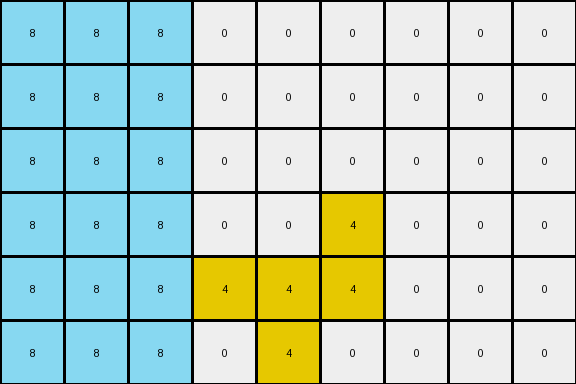
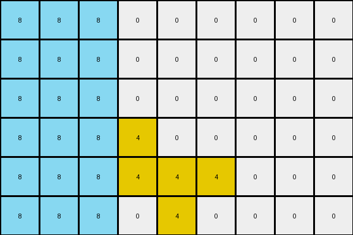

# 760b3cac • 005 • refine_dreamer

---

Previous Code:
```python
"""
The transformation identifies a connected region of yellow (4) pixels, which remain unchanged. Azure (8) pixels are added to the columns to the left of the yellow region, filling them from top to bottom.
"""

import numpy as np

def find_yellow_region(grid):
    """Finds the bounding box of the connected yellow region."""
    rows, cols = grid.shape
    min_row, max_row = rows, -1
    min_col, max_col = cols, -1

    for r in range(rows):
        for c in range(cols):
            if grid[r, c] == 4:
                min_row = min(min_row, r)
                max_row = max(max_row, r)
                min_col = min(min_col, c)
                max_col = max(max_col, c)

    return min_row, max_row, min_col, max_col

def transform(input_grid):
    # initialize output_grid
    rows, cols = input_grid.shape
    output_grid = np.zeros((rows, cols), dtype=int)

    # 1. Identify and preserve the yellow region.
    min_yellow_row, max_yellow_row, min_yellow_col, max_yellow_col = find_yellow_region(input_grid)

    for r in range(rows):
        for c in range(cols):
            if input_grid[r,c] == 4:
                output_grid[r,c] = 4


    # 2. Process Azure Pixels
    # Fill columns to the left of the yellow region with azure, top to bottom.
    
    num_cols_to_fill = min_yellow_col  #number of columns to left of the yellow
    
    for c in range(num_cols_to_fill):
       for r in range(rows):
           output_grid[r,c] = 8

    return output_grid
```

Train Set Results:

## Example 1:

Input:
```
0 0 0 8 0 8 0 0 0
0 0 0 0 8 8 0 0 0
0 0 0 0 0 8 0 0 0
0 0 0 4 0 0 0 0 0
0 0 0 4 4 4 0 0 0
0 0 0 0 4 0 0 0 0
```
Expected Output:
```
8 0 8 8 0 8 0 0 0
8 8 0 0 8 8 0 0 0
8 0 0 0 0 8 0 0 0
0 0 0 4 0 0 0 0 0
0 0 0 4 4 4 0 0 0
0 0 0 0 4 0 0 0 0
```
Transformed Output:
```
8 8 8 0 0 0 0 0 0
8 8 8 0 0 0 0 0 0
8 8 8 0 0 0 0 0 0
8 8 8 4 0 0 0 0 0
8 8 8 4 4 4 0 0 0
8 8 8 0 4 0 0 0 0
```

match: False
pixels_off: 18
size_correct: True
color_palette_correct: True
correct_pixel_counts: False

## Example 2:

Input:
```
0 0 0 8 0 8 0 0 0
0 0 0 8 8 8 0 0 0
0 0 0 8 8 0 0 0 0
0 0 0 0 0 4 0 0 0
0 0 0 4 4 4 0 0 0
0 0 0 0 4 0 0 0 0
```
Expected Output:
```
0 0 0 8 0 8 8 0 8
0 0 0 8 8 8 8 8 8
0 0 0 8 8 0 0 8 8
0 0 0 0 0 4 0 0 0
0 0 0 4 4 4 0 0 0
0 0 0 0 4 0 0 0 0
```
Transformed Output:
```
8 8 8 0 0 0 0 0 0
8 8 8 0 0 0 0 0 0
8 8 8 0 0 0 0 0 0
8 8 8 0 0 4 0 0 0
8 8 8 4 4 4 0 0 0
8 8 8 0 4 0 0 0 0
```

match: False
pixels_off: 32
size_correct: True
color_palette_correct: True
correct_pixel_counts: False

## Example 3:

Input:
```
0 0 0 8 0 0 0 0 0
0 0 0 0 8 8 0 0 0
0 0 0 8 0 0 0 0 0
0 0 0 4 0 0 0 0 0
0 0 0 4 4 4 0 0 0
0 0 0 0 4 0 0 0 0
```
Expected Output:
```
0 0 8 8 0 0 0 0 0
8 8 0 0 8 8 0 0 0
0 0 8 8 0 0 0 0 0
0 0 0 4 0 0 0 0 0
0 0 0 4 4 4 0 0 0
0 0 0 0 4 0 0 0 0
```
Transformed Output:
```
8 8 8 0 0 0 0 0 0
8 8 8 0 0 0 0 0 0
8 8 8 0 0 0 0 0 0
8 8 8 4 0 0 0 0 0
8 8 8 4 4 4 0 0 0
8 8 8 0 4 0 0 0 0
```

match: False
pixels_off: 18
size_correct: True
color_palette_correct: True
correct_pixel_counts: False
**INSTRUCTIONS**

The code above was generated based on observations from the first training
example

we have tested the transform function on each of the task example inputs and
compared with the expected output

review each of the examples provided and the results and consider how the
natural language program should be updated to accommodate this new knowledge

respond with the following deliverables:

- general assessment of the information provided and strategy for resolving the
  errors
- gather metrics about each of the examples and results - use code_execution to
  develop accurate reports on your assumptions
- a YAML block documenting facts - Focus on identifying objects, their properties, and the actions performed on them.
- a natural language program - Be as clear and concise as possible, providing a complete description of the transformation rule.


your responses should be considered as information in a report - not a
conversation
