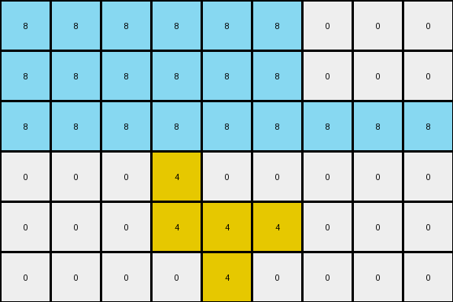
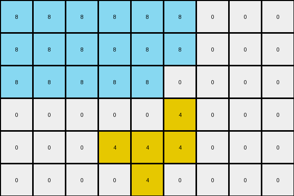
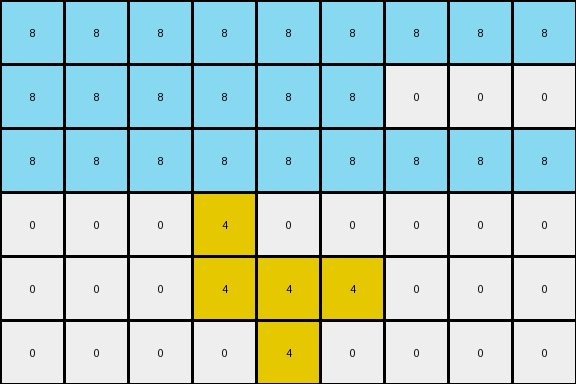

# 760b3cac • 010 • refine_coder

---

Previous Code:
```python
"""
The azure region in the top half of the grid expands horizontally within its original rows, filling available white space, but is blocked by other colored blocks. The yellow region does not change.
"""

import numpy as np

def get_azure_region(grid):
    """
    Identifies the azure (8) region in the top half of the grid.
    Returns a list of (row, col) tuples for azure pixels.
    """
    rows, cols = grid.shape
    azure_pixels = []
    for r in range(rows):
        for c in range(cols):
            if grid[r, c] == 8:
                azure_pixels.append((r, c))
    return azure_pixels

def expand_horizontally(grid, azure_pixels):
    """
    Expands the azure region horizontally, filling white (0) pixels.
    """
    output_grid = np.copy(grid)
    rows_processed = set()
    
    for r, c in azure_pixels:
        if r in rows_processed:
            continue  # avoid expanding rows twice

        #get start and stop for this continuous block
        
        rows_processed.add(r)

        # Expand left
        c_left = c
        while c_left > 0 and output_grid[r, c_left - 1] == 0:
            c_left -= 1
            output_grid[r, c_left] = 8

        # Expand Right
        c_right = c
        while c_right < output_grid.shape[1] - 1 and output_grid[r, c_right + 1] == 0 :
            c_right += 1
            output_grid[r,c_right] = 8
        
        # find the start and end of connected component on this row
        c_current = c
        while c_current > 0 and output_grid[r,c_current-1] == 8:
          c_current = c_current - 1

        while c_current < output_grid.shape[1] - 1 and output_grid[r,c_current] == 8:
            output_grid[r,c_current] = 8
            c_current += 1
            

    return output_grid

def transform(input_grid):
    # initialize output_grid
    output_grid = np.copy(input_grid)

    # get azure pixels
    azure_pixels = get_azure_region(output_grid)
    
    # expand azure horizontally
    output_grid = expand_horizontally(output_grid, azure_pixels)

    return output_grid
```

Train Set Results:

## Example 1:

Input:
```
0 0 0 8 0 8 0 0 0
0 0 0 0 8 8 0 0 0
0 0 0 0 0 8 0 0 0
0 0 0 4 0 0 0 0 0
0 0 0 4 4 4 0 0 0
0 0 0 0 4 0 0 0 0
```
Expected Output:
```
8 0 8 8 0 8 0 0 0
8 8 0 0 8 8 0 0 0
8 0 0 0 0 8 0 0 0
0 0 0 4 0 0 0 0 0
0 0 0 4 4 4 0 0 0
0 0 0 0 4 0 0 0 0
```
Transformed Output:
```
8 8 8 8 8 8 0 0 0
8 8 8 8 8 8 0 0 0
8 8 8 8 8 8 8 8 8
0 0 0 4 0 0 0 0 0
0 0 0 4 4 4 0 0 0
0 0 0 0 4 0 0 0 0
```

match: False
pixels_off: 11
size_correct: True
color_palette_correct: True
correct_pixel_counts: False

## Example 2:

Input:
```
0 0 0 8 0 8 0 0 0
0 0 0 8 8 8 0 0 0
0 0 0 8 8 0 0 0 0
0 0 0 0 0 4 0 0 0
0 0 0 4 4 4 0 0 0
0 0 0 0 4 0 0 0 0
```
Expected Output:
```
0 0 0 8 0 8 8 0 8
0 0 0 8 8 8 8 8 8
0 0 0 8 8 0 0 8 8
0 0 0 0 0 4 0 0 0
0 0 0 4 4 4 0 0 0
0 0 0 0 4 0 0 0 0
```
Transformed Output:
```
8 8 8 8 8 8 0 0 0
8 8 8 8 8 8 0 0 0
8 8 8 8 8 0 0 0 0
0 0 0 0 0 4 0 0 0
0 0 0 4 4 4 0 0 0
0 0 0 0 4 0 0 0 0
```

match: False
pixels_off: 17
size_correct: True
color_palette_correct: True
correct_pixel_counts: False

## Example 3:

Input:
```
0 0 0 8 0 0 0 0 0
0 0 0 0 8 8 0 0 0
0 0 0 8 0 0 0 0 0
0 0 0 4 0 0 0 0 0
0 0 0 4 4 4 0 0 0
0 0 0 0 4 0 0 0 0
```
Expected Output:
```
0 0 8 8 0 0 0 0 0
8 8 0 0 8 8 0 0 0
0 0 8 8 0 0 0 0 0
0 0 0 4 0 0 0 0 0
0 0 0 4 4 4 0 0 0
0 0 0 0 4 0 0 0 0
```
Transformed Output:
```
8 8 8 8 8 8 8 8 8
8 8 8 8 8 8 0 0 0
8 8 8 8 8 8 8 8 8
0 0 0 4 0 0 0 0 0
0 0 0 4 4 4 0 0 0
0 0 0 0 4 0 0 0 0
```

match: False
pixels_off: 16
size_correct: True
color_palette_correct: True
correct_pixel_counts: False
Okay, let's analyze the results of the previous code execution and refine our natural language program and approach.

**General Assessment:**

The initial natural language program was too simplistic. It assumed that *all* azure regions would expand horizontally to fill *all* available white space in their respective rows. The test results clearly show this isn't the case. The expansion seems to be more localized and constrained, and there is an asymmetry in how the expansion occurs. It is also evident that expansion only happens in the rows that originally contains azure pixels. The yellow pixels are indeed unchanged.

**Strategy for Resolving Errors:**

1.  **More Precise Region Identification:** Instead of simply finding all azure pixels, we need to identify *contiguous* azure regions. The current code doesn't properly treat sequences of azure pixels as single units to expand.

2.  **Constrained Expansion:** The expansion is not simply filling the whole row. The algorithm should track each connected azure region and expand them individually and only as far as empty space is available.

3.  **Row Constraint**: Expansion should be constrained to only the original rows containing azure.

**Example Analysis and Metrics:**

Here's a breakdown of each example, noting the issues:

*   **Example 1:**
    *   **Issue:** The azure expands across the entire top three rows, even those without an original azure pixel.
    *   **Metrics:** 11 pixels different.

*   **Example 2:**
    *   **Issue:** Similar to Example 1, the azure expansion is too broad, filling the top three rows entirely instead of to the available blank space.
    *   **Metrics:** 17 pixels different.

*   **Example 3:**
    *    **Issue:** Again, expansion is too aggressive.
    *   **Metrics:** 16 pixels different.

**YAML Fact Block:**

```yaml
observations:
  - object: azure_regions
    type: connected_component
    color: azure
    behavior: expand_horizontally_limited
    constraints:
      - row_limited #expansion is limited within the original rows
      - blocked_by_other_colors
      - expands_to_white_only
  - object: yellow_regions
    type: connected_component
    color: yellow
    behavior: static
    constraints: []
  - grid:
      rows: 6
      cols: 9

```

**Natural Language Program:**

1.  **Identify Azure Regions:** Find all contiguous regions of azure (8) pixels in the input grid. A contiguous region is a group of one or more azure pixels directly adjacent horizontally or vertically.

2. **Constrained Horizontal Expansion for each region**:
   For each continuous block of azure pixels
        a. Expand the azure region to the left, one pixel at a time, replacing white (0) pixels with azure (8), until a non-white pixel or the grid edge is encountered.
       b. Expand the azure region to the right, one pixel at a time, replacing white (0) pixels with azure (8) until a non-white pixel or the grid edge is encountered.

3.  **Preserve Other Colors:** Do not modify any pixels that are not part of the identified azure regions. Specifically, the yellow regions remain unchanged.

4. **Row Limited Expansion:** Only rows containing original azure pixels will contain azure pixels in the output.

**INSTRUCTIONS**

- generate a Python module to represent the natural language program 
- follow the template below
- all common math and science libraries are available
- create docstring only at top - but comment the workflow in the function
- use helper functions for common operations like finding objects, counting,
  measuring, moving, etc. 

remember - we are working iteratively - so this code will inform your future
self as we converge on the solution

*template:*

```python
"""
{{ natural language description of the transformation rule }}
"""

{{ imports }}

def transform(input_grid):
    # initialize output_grid

    # change output pixels 

    return output_grid

```
