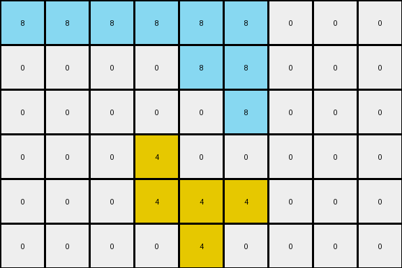
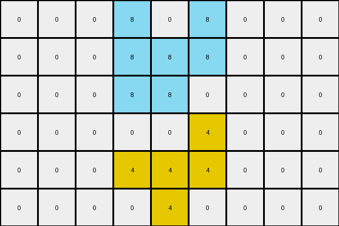
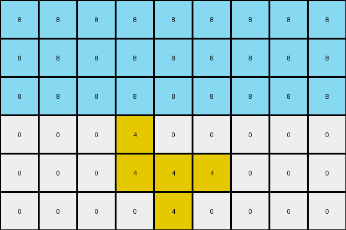

# 760b3cac • 011 • refine_dreamer

---


Previous Code:
```python
"""
1. Identify Azure Regions: Find all contiguous regions of azure (8) pixels in the input grid. A contiguous region is a group of one or more azure pixels directly adjacent horizontally or vertically.

2. Constrained Horizontal Expansion for each region:
   For each continuous block of azure pixels
        a. Expand the azure region to the left, one pixel at a time, replacing white (0) pixels with azure (8), until a non-white pixel or the grid edge is encountered.
       b. Expand the azure region to the right, one pixel at a time, replacing white (0) pixels with azure (8), until a non-white pixel or the grid edge is encountered.

3. Preserve Other Colors: Do not modify any pixels that are not part of the identified azure regions. Specifically, the yellow regions remain unchanged.

4. Row Limited Expansion: Only rows containing original azure pixels will contain azure pixels in the output.
"""

import numpy as np

def get_azure_regions(grid):
    """
    Identifies contiguous azure (8) regions in the grid.
    Returns a list of lists, where each inner list contains (row, col) tuples
    for a single contiguous azure region.
    """
    rows, cols = grid.shape
    visited = np.zeros((rows, cols), dtype=bool)
    azure_regions = []

    def dfs(r, c, current_region):
        if (
            r < 0
            or r >= rows
            or c < 0
            or c >= cols
            or visited[r, c]
            or grid[r, c] != 8
        ):
            return
        visited[r, c] = True
        current_region.append((r, c))
        # Check adjacent cells (up, down, left, right)
        dfs(r + 1, c, current_region)
        dfs(r - 1, c, current_region)
        dfs(r, c + 1, current_region)
        dfs(r, c - 1, current_region)

    for r in range(rows):
        for c in range(cols):
            if grid[r, c] == 8 and not visited[r, c]:
                current_region = []
                dfs(r, c, current_region)
                azure_regions.append(current_region)
    return azure_regions

def expand_region_horizontally(grid, region):
    """
    Expands a single contiguous azure region horizontally, filling white (0)
    pixels, until blocked by other colors or grid edges.
    """
    output_grid = np.copy(grid)
    # find min and max row
    min_row = min(r for r, c in region)
    max_row = max(r for r,c in region)
    if min_row != max_row:
      print("Error region spans multiple rows")
      return output_grid
    row = min_row # region is only in 1 row

    # Get the horizontal bounds for expansion
    min_col = min(c for r, c in region)
    max_col = max(c for r, c in region)

    # Expand left
    c = min_col - 1
    while c >= 0 and output_grid[row, c] == 0:
        output_grid[row, c] = 8
        c -= 1

    # Expand Right
    c = max_col + 1
    while c < output_grid.shape[1] and output_grid[row, c] == 0:
        output_grid[row, c] = 8
        c += 1

    return output_grid
  

def transform(input_grid):
    # initialize output_grid
    output_grid = np.copy(input_grid)

    # get azure regions
    azure_regions = get_azure_regions(output_grid)

    # expand each region horizontally,
    for region in azure_regions:
        output_grid = expand_region_horizontally(output_grid, region)
    return output_grid
```

Train Set Results:

## Example 1:

Input:
```
0 0 0 8 0 8 0 0 0
0 0 0 0 8 8 0 0 0
0 0 0 0 0 8 0 0 0
0 0 0 4 0 0 0 0 0
0 0 0 4 4 4 0 0 0
0 0 0 0 4 0 0 0 0
```
Expected Output:
```
8 0 8 8 0 8 0 0 0
8 8 0 0 8 8 0 0 0
8 0 0 0 0 8 0 0 0
0 0 0 4 0 0 0 0 0
0 0 0 4 4 4 0 0 0
0 0 0 0 4 0 0 0 0
```
Transformed Output:
```
8 8 8 8 8 8 0 0 0
0 0 0 0 8 8 0 0 0
0 0 0 0 0 8 0 0 0
0 0 0 4 0 0 0 0 0
0 0 0 4 4 4 0 0 0
0 0 0 0 4 0 0 0 0
```

match: False
pixels_off: 5
size_correct: True
color_palette_correct: True
correct_pixel_counts: False

## Example 2:

Input:
```
0 0 0 8 0 8 0 0 0
0 0 0 8 8 8 0 0 0
0 0 0 8 8 0 0 0 0
0 0 0 0 0 4 0 0 0
0 0 0 4 4 4 0 0 0
0 0 0 0 4 0 0 0 0
```
Expected Output:
```
0 0 0 8 0 8 8 0 8
0 0 0 8 8 8 8 8 8
0 0 0 8 8 0 0 8 8
0 0 0 0 0 4 0 0 0
0 0 0 4 4 4 0 0 0
0 0 0 0 4 0 0 0 0
```
Transformed Output:
```
0 0 0 8 0 8 0 0 0
0 0 0 8 8 8 0 0 0
0 0 0 8 8 0 0 0 0
0 0 0 0 0 4 0 0 0
0 0 0 4 4 4 0 0 0
0 0 0 0 4 0 0 0 0
```

match: False
pixels_off: 7
size_correct: True
color_palette_correct: True
correct_pixel_counts: False

## Example 3:

Input:
```
0 0 0 8 0 0 0 0 0
0 0 0 0 8 8 0 0 0
0 0 0 8 0 0 0 0 0
0 0 0 4 0 0 0 0 0
0 0 0 4 4 4 0 0 0
0 0 0 0 4 0 0 0 0
```
Expected Output:
```
0 0 8 8 0 0 0 0 0
8 8 0 0 8 8 0 0 0
0 0 8 8 0 0 0 0 0
0 0 0 4 0 0 0 0 0
0 0 0 4 4 4 0 0 0
0 0 0 0 4 0 0 0 0
```
Transformed Output:
```
8 8 8 8 8 8 8 8 8
8 8 8 8 8 8 8 8 8
8 8 8 8 8 8 8 8 8
0 0 0 4 0 0 0 0 0
0 0 0 4 4 4 0 0 0
0 0 0 0 4 0 0 0 0
```

match: False
pixels_off: 19
size_correct: True
color_palette_correct: True
correct_pixel_counts: False

**INSTRUCTIONS**

The code above was generated based on observations from the first training
example

we have tested the transform function on each of the task example inputs and
compared with the expected output

review each of the examples provided and the results and consider how the
natural language program should be updated to accommodate this new knowledge

respond with the following deliverables:

- general assessment of the information provided and strategy for resolving the
  errors
- gather metrics about each of the examples and results - use code_execution to
  develop accurate reports on your assumptions
- a YAML block documenting facts - Focus on identifying objects, their properties, and the actions performed on them.
- a natural language program - Be as clear and concise as possible, providing a complete description of the transformation rule.


your responses should be considered as information in a report - not a
conversation
