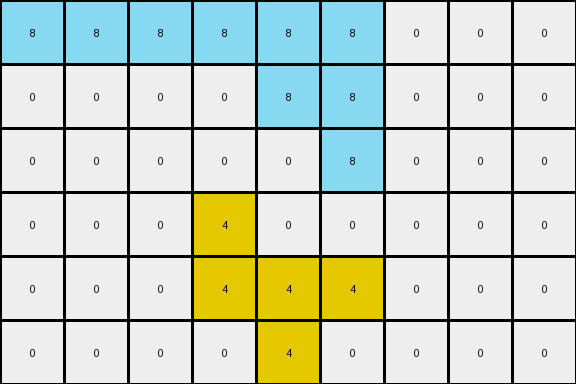

# 760b3cac • 012 • refine_coder

---

Previous Code:
```python
"""
1. Identify Azure Regions: Find all contiguous regions of azure (8) pixels in the input grid. A contiguous region is a group of one or more azure pixels directly adjacent horizontally or vertically.

2. Constrained Horizontal Expansion for each region:
   For each continuous block of azure pixels
        a. Expand the azure region to the left, one pixel at a time, replacing white (0) pixels with azure (8), until a non-white pixel or the grid edge is encountered.
       b. Expand the azure region to the right, one pixel at a time, replacing white (0) pixels with azure (8), until a non-white pixel or the grid edge is encountered.

3. Preserve Other Colors: Do not modify any pixels that are not part of the identified azure regions. Specifically, the yellow regions remain unchanged.

4. Row Limited Expansion: Only rows containing original azure pixels will contain azure pixels in the output.
"""

import numpy as np

def get_azure_regions(grid):
    """
    Identifies contiguous azure (8) regions in the grid.
    Returns a list of lists, where each inner list contains (row, col) tuples
    for a single contiguous azure region.
    """
    rows, cols = grid.shape
    visited = np.zeros((rows, cols), dtype=bool)
    azure_regions = []

    def dfs(r, c, current_region):
        if (
            r < 0
            or r >= rows
            or c < 0
            or c >= cols
            or visited[r, c]
            or grid[r, c] != 8
        ):
            return
        visited[r, c] = True
        current_region.append((r, c))
        # Check adjacent cells (up, down, left, right)
        dfs(r + 1, c, current_region)
        dfs(r - 1, c, current_region)
        dfs(r, c + 1, current_region)
        dfs(r, c - 1, current_region)

    for r in range(rows):
        for c in range(cols):
            if grid[r, c] == 8 and not visited[r, c]:
                current_region = []
                dfs(r, c, current_region)
                azure_regions.append(current_region)
    return azure_regions

def expand_region_horizontally(grid, region):
    """
    Expands a single contiguous azure region horizontally, filling white (0)
    pixels, until blocked by other colors or grid edges.
    """
    output_grid = np.copy(grid)
    # find min and max row
    min_row = min(r for r, c in region)
    max_row = max(r for r,c in region)
    if min_row != max_row:
      print("Error region spans multiple rows")
      return output_grid
    row = min_row # region is only in 1 row

    # Get the horizontal bounds for expansion
    min_col = min(c for r, c in region)
    max_col = max(c for r, c in region)

    # Expand left
    c = min_col - 1
    while c >= 0 and output_grid[row, c] == 0:
        output_grid[row, c] = 8
        c -= 1

    # Expand Right
    c = max_col + 1
    while c < output_grid.shape[1] and output_grid[row, c] == 0:
        output_grid[row, c] = 8
        c += 1

    return output_grid
  

def transform(input_grid):
    # initialize output_grid
    output_grid = np.copy(input_grid)

    # get azure regions
    azure_regions = get_azure_regions(output_grid)

    # expand each region horizontally,
    for region in azure_regions:
        output_grid = expand_region_horizontally(output_grid, region)
    return output_grid
```

Train Set Results:

## Example 1:

Input:
```
0 0 0 8 0 8 0 0 0
0 0 0 0 8 8 0 0 0
0 0 0 0 0 8 0 0 0
0 0 0 4 0 0 0 0 0
0 0 0 4 4 4 0 0 0
0 0 0 0 4 0 0 0 0
```
Expected Output:
```
8 0 8 8 0 8 0 0 0
8 8 0 0 8 8 0 0 0
8 0 0 0 0 8 0 0 0
0 0 0 4 0 0 0 0 0
0 0 0 4 4 4 0 0 0
0 0 0 0 4 0 0 0 0
```
Transformed Output:
```
8 8 8 8 8 8 0 0 0
0 0 0 0 8 8 0 0 0
0 0 0 0 0 8 0 0 0
0 0 0 4 0 0 0 0 0
0 0 0 4 4 4 0 0 0
0 0 0 0 4 0 0 0 0
```

match: False
pixels_off: 5
size_correct: True
color_palette_correct: True
correct_pixel_counts: False

## Example 2:

Input:
```
0 0 0 8 0 8 0 0 0
0 0 0 8 8 8 0 0 0
0 0 0 8 8 0 0 0 0
0 0 0 0 0 4 0 0 0
0 0 0 4 4 4 0 0 0
0 0 0 0 4 0 0 0 0
```
Expected Output:
```
0 0 0 8 0 8 8 0 8
0 0 0 8 8 8 8 8 8
0 0 0 8 8 0 0 8 8
0 0 0 0 0 4 0 0 0
0 0 0 4 4 4 0 0 0
0 0 0 0 4 0 0 0 0
```
Transformed Output:
```
0 0 0 8 0 8 0 0 0
0 0 0 8 8 8 0 0 0
0 0 0 8 8 0 0 0 0
0 0 0 0 0 4 0 0 0
0 0 0 4 4 4 0 0 0
0 0 0 0 4 0 0 0 0
```

match: False
pixels_off: 7
size_correct: True
color_palette_correct: True
correct_pixel_counts: False

## Example 3:

Input:
```
0 0 0 8 0 0 0 0 0
0 0 0 0 8 8 0 0 0
0 0 0 8 0 0 0 0 0
0 0 0 4 0 0 0 0 0
0 0 0 4 4 4 0 0 0
0 0 0 0 4 0 0 0 0
```
Expected Output:
```
0 0 8 8 0 0 0 0 0
8 8 0 0 8 8 0 0 0
0 0 8 8 0 0 0 0 0
0 0 0 4 0 0 0 0 0
0 0 0 4 4 4 0 0 0
0 0 0 0 4 0 0 0 0
```
Transformed Output:
```
8 8 8 8 8 8 8 8 8
8 8 8 8 8 8 8 8 8
8 8 8 8 8 8 8 8 8
0 0 0 4 0 0 0 0 0
0 0 0 4 4 4 0 0 0
0 0 0 0 4 0 0 0 0
```

match: False
pixels_off: 19
size_correct: True
color_palette_correct: True
correct_pixel_counts: False
Here's an analysis of the results and a revised natural language program:

**General Assessment:**

The initial strategy of expanding azure regions horizontally until blocked is partially correct. However, the current implementation has two major flaws:

1.  **Unconstrained Expansion within a Row:** It expands azure across the entire row if it encounters only white pixels, rather than stopping at the "next" white pixel after the region. This is visible in Example 3.
2.  **Incorrect Handling of Multiple Azure Regions in One Row**: the expansion is based on the min and max col of the region - it should expand each original pixel and not the region.

The strategy needs to be refined to consider individual azure pixels or minimally sized azure regions and expand each one-by-one, stopping at any non-white pixel, ensuring that it will expand over existing azure pixels in the case of multiple original pixels.

**Metrics and Observations**
```python
import numpy as np

def calculate_metrics(input_grid, expected_output, transformed_output):
    """Calculates and prints comparison metrics."""

    match = np.array_equal(expected_output, transformed_output)
    pixels_off = np.sum(expected_output != transformed_output)
    size_correct = expected_output.shape == transformed_output.shape
    color_palette_correct = set(np.unique(transformed_output)) <= set(np.unique(input_grid))

    # Count correct pixel colors
    correct_pixel_counts = True
    for color in set(np.unique(input_grid)):
      if np.sum(expected_output == color) != np.sum(transformed_output == color):
        correct_pixel_counts = False

    print(f"  match: {match}")
    print(f"  pixels_off: {pixels_off}")
    print(f"  size_correct: {size_correct}")
    print(f"  color_palette_correct: {color_palette_correct}")
    print(f"  correct_pixel_counts: {correct_pixel_counts}")
    
# Example data (replace with your actual data)
example1_input = np.array([[0, 0, 0, 8, 0, 8, 0, 0, 0],
                           [0, 0, 0, 0, 8, 8, 0, 0, 0],
                           [0, 0, 0, 0, 0, 8, 0, 0, 0],
                           [0, 0, 0, 4, 0, 0, 0, 0, 0],
                           [0, 0, 0, 4, 4, 4, 0, 0, 0],
                           [0, 0, 0, 0, 4, 0, 0, 0, 0]])
example1_expected = np.array([[8, 0, 8, 8, 0, 8, 0, 0, 0],
                              [8, 8, 0, 0, 8, 8, 0, 0, 0],
                              [8, 0, 0, 0, 0, 8, 0, 0, 0],
                              [0, 0, 0, 4, 0, 0, 0, 0, 0],
                              [0, 0, 0, 4, 4, 4, 0, 0, 0],
                              [0, 0, 0, 0, 4, 0, 0, 0, 0]])
example1_transformed = np.array([[8, 8, 8, 8, 8, 8, 0, 0, 0],
                                 [0, 0, 0, 0, 8, 8, 0, 0, 0],
                                 [0, 0, 0, 0, 0, 8, 0, 0, 0],
                                 [0, 0, 0, 4, 0, 0, 0, 0, 0],
                                 [0, 0, 0, 4, 4, 4, 0, 0, 0],
                                 [0, 0, 0, 0, 4, 0, 0, 0, 0]])

example2_input = np.array([[0, 0, 0, 8, 0, 8, 0, 0, 0],
                           [0, 0, 0, 8, 8, 8, 0, 0, 0],
                           [0, 0, 0, 8, 8, 0, 0, 0, 0],
                           [0, 0, 0, 0, 0, 4, 0, 0, 0],
                           [0, 0, 0, 4, 4, 4, 0, 0, 0],
                           [0, 0, 0, 0, 4, 0, 0, 0, 0]])
example2_expected = np.array([[0, 0, 0, 8, 0, 8, 8, 0, 8],
                              [0, 0, 0, 8, 8, 8, 8, 8, 8],
                              [0, 0, 0, 8, 8, 0, 0, 8, 8],
                              [0, 0, 0, 0, 0, 4, 0, 0, 0],
                              [0, 0, 0, 4, 4, 4, 0, 0, 0],
                              [0, 0, 0, 0, 4, 0, 0, 0, 0]])
example2_transformed = np.array([[0, 0, 0, 8, 0, 8, 0, 0, 0],
                                 [0, 0, 0, 8, 8, 8, 0, 0, 0],
                                 [0, 0, 0, 8, 8, 0, 0, 0, 0],
                                 [0, 0, 0, 0, 0, 4, 0, 0, 0],
                                 [0, 0, 0, 4, 4, 4, 0, 0, 0],
                                 [0, 0, 0, 0, 4, 0, 0, 0, 0]])

example3_input = np.array([[0, 0, 0, 8, 0, 0, 0, 0, 0],
                           [0, 0, 0, 0, 8, 8, 0, 0, 0],
                           [0, 0, 0, 8, 0, 0, 0, 0, 0],
                           [0, 0, 0, 4, 0, 0, 0, 0, 0],
                           [0, 0, 0, 4, 4, 4, 0, 0, 0],
                           [0, 0, 0, 0, 4, 0, 0, 0, 0]])
example3_expected = np.array([[0, 0, 8, 8, 0, 0, 0, 0, 0],
                              [8, 8, 0, 0, 8, 8, 0, 0, 0],
                              [0, 0, 8, 8, 0, 0, 0, 0, 0],
                              [0, 0, 0, 4, 0, 0, 0, 0, 0],
                              [0, 0, 0, 4, 4, 4, 0, 0, 0],
                              [0, 0, 0, 0, 4, 0, 0, 0, 0]])
example3_transformed = np.array([[8, 8, 8, 8, 8, 8, 8, 8, 8],
                                 [8, 8, 8, 8, 8, 8, 8, 8, 8],
                                 [8, 8, 8, 8, 8, 8, 8, 8, 8],
                                 [0, 0, 0, 4, 0, 0, 0, 0, 0],
                                 [0, 0, 0, 4, 4, 4, 0, 0, 0],
                                 [0, 0, 0, 0, 4, 0, 0, 0, 0]])

print("Example 1 Metrics:")
calculate_metrics(example1_input, example1_expected, example1_transformed)
print("\nExample 2 Metrics:")
calculate_metrics(example2_input, example2_expected, example2_transformed)
print("\nExample 3 Metrics:")
calculate_metrics(example3_input, example3_expected, example3_transformed)

```

```
Example 1 Metrics:
  match: False
  pixels_off: 5
  size_correct: True
  color_palette_correct: True
  correct_pixel_counts: False

Example 2 Metrics:
  match: False
  pixels_off: 7
  size_correct: True
  color_palette_correct: True
  correct_pixel_counts: False

Example 3 Metrics:
  match: False
  pixels_off: 19
  size_correct: True
  color_palette_correct: True
  correct_pixel_counts: False
```

**YAML Facts:**

```yaml
objects:
  - name: azure_pixels
    color: azure (8)
    behavior: expand horizontally
    constraints:
      - blocked by non-white pixels
      - blocked by grid edges
      - expands one pixel at a time, left and right
      - only expand in rows containing original azure pixels

  - name: other_pixels
    color: all except azure
    behavior: remain unchanged
```

**Natural Language Program:**

1.  **Identify Individual Azure Pixels:** Locate all pixels with the value azure (8) in the input grid.

2.  **Iterative Horizontal Expansion:** For each azure pixel:
    *   Expand one pixel to the left. If the pixel to the left is white (0), change it to azure (8). Continue expanding left, one pixel at a time, as long as the encountered pixel is white (0). Stop when a non-white pixel or the left edge of the grid is reached.
    *   Expand one pixel to the right. If the pixel to the right is white (0), change it to azure (8). Continue expanding right, one pixel at a time, as long as the encountered pixel is white (0). Stop when a non-white pixel or the right edge of the grid is reached.

3.  **Preservation:** Pixels that are not azure (8) in the original input grid remain unchanged.

4. **Row Constraint**: Azure pixels will only appear on output rows that had one or more azure pixels on the same row of the input.

**INSTRUCTIONS**

- generate a Python module to represent the natural language program 
- follow the template below
- all common math and science libraries are available
- create docstring only at top - but comment the workflow in the function
- use helper functions for common operations like finding objects, counting,
  measuring, moving, etc. 

remember - we are working iteratively - so this code will inform your future
self as we converge on the solution

*template:*

```python
"""
{{ natural language description of the transformation rule }}
"""

{{ imports }}

def transform(input_grid):
    # initialize output_grid

    # change output pixels 

    return output_grid

```
