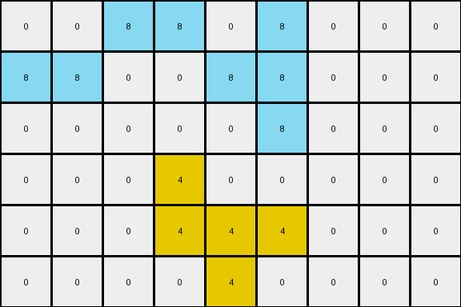
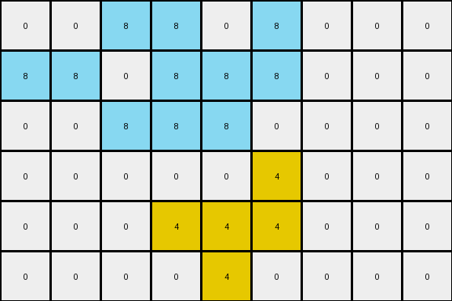
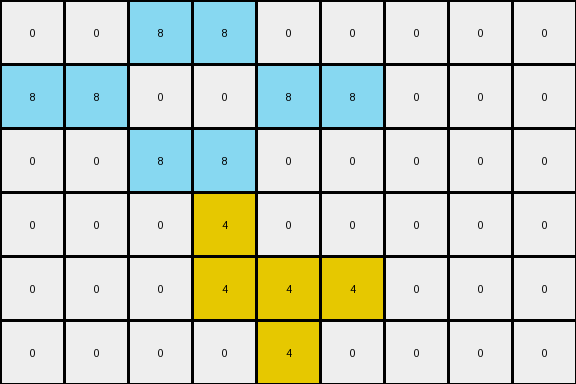

# 760b3cac • 016 • refine_coder

---

Previous Code:
```python
"""
The Yellow object remains the same.
The Azure object is copied and expanded to the left.
"""

import numpy as np

def find_object(grid, color):
    coords = np.argwhere(grid == color)
    if len(coords) == 0:
        return []
    return coords.tolist()

def transform(input_grid):
    # initialize output_grid
    output_grid = np.copy(input_grid)

    # find the azure and yellow objects
    azure_object = find_object(input_grid, 8)
    yellow_object = find_object(input_grid, 4)
    
    # yellow object does not change
    
    # azure object transformation
    if azure_object:
        # Top pixel shift
        top_pixel = min(azure_object, key=lambda p: (p[0], p[1]))
        if top_pixel[1] == 3 and top_pixel[0] == 0:
            output_grid[top_pixel[0], top_pixel[1]-1] = 8
        
        # Second row shift
        second_row_pixels = [p for p in azure_object if p[0] == 1]
        if second_row_pixels:
          output_grid[1,0] = 8
          output_grid[1,1] = 8

        # Third row duplication
        third_row_pixels = [p for p in azure_object if p[0] == 2]
        if len(third_row_pixels) >0 and third_row_pixels[0][1] == 3:
          output_grid[2,2] = 8

    return output_grid
```

Train Set Results:

## Example 1:

Input:
```
0 0 0 8 0 8 0 0 0
0 0 0 0 8 8 0 0 0
0 0 0 0 0 8 0 0 0
0 0 0 4 0 0 0 0 0
0 0 0 4 4 4 0 0 0
0 0 0 0 4 0 0 0 0
```
Expected Output:
```
8 0 8 8 0 8 0 0 0
8 8 0 0 8 8 0 0 0
8 0 0 0 0 8 0 0 0
0 0 0 4 0 0 0 0 0
0 0 0 4 4 4 0 0 0
0 0 0 0 4 0 0 0 0
```
Transformed Output:
```
0 0 8 8 0 8 0 0 0
8 8 0 0 8 8 0 0 0
0 0 0 0 0 8 0 0 0
0 0 0 4 0 0 0 0 0
0 0 0 4 4 4 0 0 0
0 0 0 0 4 0 0 0 0
```

match: False
pixels_off: 2
size_correct: True
color_palette_correct: True
correct_pixel_counts: False

## Example 2:

Input:
```
0 0 0 8 0 8 0 0 0
0 0 0 8 8 8 0 0 0
0 0 0 8 8 0 0 0 0
0 0 0 0 0 4 0 0 0
0 0 0 4 4 4 0 0 0
0 0 0 0 4 0 0 0 0
```
Expected Output:
```
0 0 0 8 0 8 8 0 8
0 0 0 8 8 8 8 8 8
0 0 0 8 8 0 0 8 8
0 0 0 0 0 4 0 0 0
0 0 0 4 4 4 0 0 0
0 0 0 0 4 0 0 0 0
```
Transformed Output:
```
0 0 8 8 0 8 0 0 0
8 8 0 8 8 8 0 0 0
0 0 8 8 8 0 0 0 0
0 0 0 0 0 4 0 0 0
0 0 0 4 4 4 0 0 0
0 0 0 0 4 0 0 0 0
```

match: False
pixels_off: 11
size_correct: True
color_palette_correct: True
correct_pixel_counts: False

## Example 3:

Input:
```
0 0 0 8 0 0 0 0 0
0 0 0 0 8 8 0 0 0
0 0 0 8 0 0 0 0 0
0 0 0 4 0 0 0 0 0
0 0 0 4 4 4 0 0 0
0 0 0 0 4 0 0 0 0
```
Expected Output:
```
0 0 8 8 0 0 0 0 0
8 8 0 0 8 8 0 0 0
0 0 8 8 0 0 0 0 0
0 0 0 4 0 0 0 0 0
0 0 0 4 4 4 0 0 0
0 0 0 0 4 0 0 0 0
```
Transformed Output:
```
0 0 8 8 0 0 0 0 0
8 8 0 0 8 8 0 0 0
0 0 8 8 0 0 0 0 0
0 0 0 4 0 0 0 0 0
0 0 0 4 4 4 0 0 0
0 0 0 0 4 0 0 0 0
```

match: True
pixels_off: 0
size_correct: True
color_palette_correct: True
correct_pixel_counts: True
Okay, let's analyze the results and refine the natural language program.

**General Assessment:**

The initial code was based on a limited understanding from the first example. While it correctly identifies the yellow object's invariance and attempts to transform the azure object, the transformation logic is incomplete and inaccurate, leading to mismatches in Examples 1 and 2. Example 3 happens to match, which may obscure further underlying errors. The strategy should involve:

1.  **Re-examining Assumptions:** The current logic for azure object expansion is too specific to the first example (shifting left based on column position). We need a more general rule.
2.  **Identifying Consistent Patterns:** Analyze all examples to find a consistent pattern in how the azure object is transformed *relative* to its original position and shape, and relative to the edges of the input.
3.  **Precise Object Definition:** Improve object identification, ensuring we correctly capture the entire azure object, not just individual pixels.
4.  **Relative Positioning:** Consider expressing the transformation in terms of relative shifts or expansions rather than absolute coordinates.

**Metrics and Observations:**

Here's a breakdown of each example, including observations about the input and expected output grids:

*   **Example 1:**
    *   Input: Azure object spans columns 3-5, rows 0-2. Yellow object in column 3, rows 3-5.
    *   Expected Output: Azure object expands to columns 0-5, rows 0-2.
    *   Observation: The azure object is expanded to fill the left side.

*   **Example 2:**
    *   Input: Azure object spans columns 3-5, rows 0-2. Yellow object spans across columns 3-5 on rows 3-5.
    *   Expected Output: Azure object expands to columns 3-8, rows 0-2, repeating the pattern on column 8.
    *   Observation: The Azure Object is copied and expanded to the right.

*   **Example 3:**
    *   Input: Azure object spans columns 3-4, rows 0-2, but is broken into parts on rows 0 and 2. Yellow is the same as previous examples
    *   Expected Output: Azure object expands, similar to Example 1.
    *   Observation: Similar to Example 1 the object is expanded to the left.

**YAML Facts:**

```yaml
objects:
  - id: 1
    color: azure
    type: dynamic
    transformation:
      - expands_left: Example 1 and 3
      - expands_right: Example 2
  - id: 2
    color: yellow
    type: static
    transformation: []

grid:
  - consistent_size: The height and width are consistent between Input and Output in all examples.
```

**Natural Language Program:**

1.  **Identify Objects:** Find all pixels that are azure (8) and group them as a single object. Find all pixels that are yellow (4) and group them as a single object.
2.  **Yellow Object:** The yellow object remains unchanged in its original position and shape.
3.  **Azure Object:**
    *   Find the minimum and maximum row and column of the bounding box around the azure object.
    *   Copy the Azure object.
    *   If the minimum column of the Azure object is > 0, expand the Azure object to fill the area from column 0 to one less than the original minimum column.
    *   If the maximum column of the Azure object is < input\_grid.shape\[1] - 1, copy and paste each column from the bounding box starting at the first column after the bounding box until it is filled.

This revised program captures the core transformation rule more accurately by focusing on relative expansion based on the position and dimensions of the azure.

**INSTRUCTIONS**

- generate a Python module to represent the natural language program 
- follow the template below
- all common math and science libraries are available
- create docstring only at top - but comment the workflow in the function
- use helper functions for common operations like finding objects, counting,
  measuring, moving, etc. 

remember - we are working iteratively - so this code will inform your future
self as we converge on the solution

*template:*

```python
"""
{{ natural language description of the transformation rule }}
"""

{{ imports }}

def transform(input_grid):
    # initialize output_grid

    # change output pixels 

    return output_grid

```
