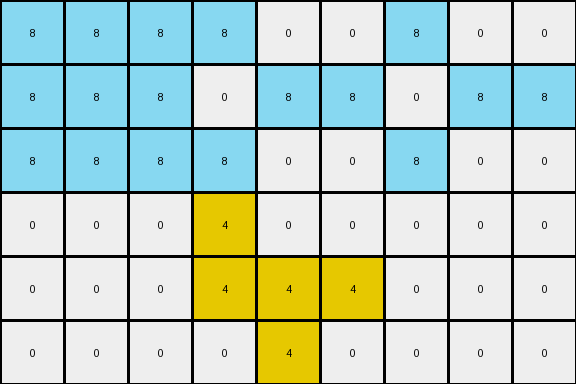

# 760b3cac • 018 • refine_coder

---

Previous Code:
```python
"""
1.  **Identify Objects:** Find all pixels that are azure (8) and group them as a single object. Find all pixels that are yellow (4) and group them as a single object.
2.  **Yellow Object:** The yellow object remains unchanged in its original position and shape.
3.  **Azure Object:**
    *   Find the minimum and maximum row and column of the bounding box around the azure object.
    *   Copy the Azure object.
    *   If the minimum column of the Azure object is > 0, expand the Azure object to fill the area from column 0 to one less than the original minimum column.
    *   If the maximum column of the Azure object is < input_grid.shape[1] - 1, copy and paste each column from the bounding box starting at the first column after the bounding box until it is filled.
"""

import numpy as np

def find_object(grid, color):
    coords = np.argwhere(grid == color)
    if len(coords) == 0:
        return []
    return coords.tolist()

def get_bounding_box(coords):
    if not coords:
        return None
    min_row = min(coords, key=lambda p: p[0])[0]
    max_row = max(coords, key=lambda p: p[0])[0]
    min_col = min(coords, key=lambda p: p[1])[1]
    max_col = max(coords, key=lambda p: p[1])[1]
    return min_row, max_row, min_col, max_col

def transform(input_grid):
    # initialize output_grid
    output_grid = np.copy(input_grid)

    # Identify Objects
    azure_object = find_object(input_grid, 8)
    yellow_object = find_object(input_grid, 4)

    # Yellow Object (remains unchanged)
    #   for pixel in yellow_object:
    #     output_grid[pixel[0], pixel[1]] = 4

    # Azure Object Transformation
    if azure_object:
        min_row, max_row, min_col, max_col = get_bounding_box(azure_object)

        # Expand left
        if min_col > 0:
            for r in range(min_row, max_row + 1):
                for c in range(0, min_col):
                    output_grid[r, c] = 8

        # Expand Right
        if max_col < input_grid.shape[1] - 1:
            width = max_col - min_col + 1
            offset = 0
            for col in range(max_col + 1, input_grid.shape[1]):
              for row in range(min_row, max_row+1):
                original_col = min_col + (offset % width)
                output_grid[row, col] = input_grid[row, original_col]
              offset+=1

    return output_grid
```

Train Set Results:

## Example 1:

Input:
```
0 0 0 8 0 8 0 0 0
0 0 0 0 8 8 0 0 0
0 0 0 0 0 8 0 0 0
0 0 0 4 0 0 0 0 0
0 0 0 4 4 4 0 0 0
0 0 0 0 4 0 0 0 0
```
Expected Output:
```
8 0 8 8 0 8 0 0 0
8 8 0 0 8 8 0 0 0
8 0 0 0 0 8 0 0 0
0 0 0 4 0 0 0 0 0
0 0 0 4 4 4 0 0 0
0 0 0 0 4 0 0 0 0
```
Transformed Output:
```
8 8 8 8 0 8 8 0 8
8 8 8 0 8 8 0 8 8
8 8 8 0 0 8 0 0 8
0 0 0 4 0 0 0 0 0
0 0 0 4 4 4 0 0 0
0 0 0 0 4 0 0 0 0
```

match: False
pixels_off: 9
size_correct: True
color_palette_correct: True
correct_pixel_counts: False

## Example 2:

Input:
```
0 0 0 8 0 8 0 0 0
0 0 0 8 8 8 0 0 0
0 0 0 8 8 0 0 0 0
0 0 0 0 0 4 0 0 0
0 0 0 4 4 4 0 0 0
0 0 0 0 4 0 0 0 0
```
Expected Output:
```
0 0 0 8 0 8 8 0 8
0 0 0 8 8 8 8 8 8
0 0 0 8 8 0 0 8 8
0 0 0 0 0 4 0 0 0
0 0 0 4 4 4 0 0 0
0 0 0 0 4 0 0 0 0
```
Transformed Output:
```
8 8 8 8 0 8 8 0 8
8 8 8 8 8 8 8 8 8
8 8 8 8 8 0 8 8 0
0 0 0 0 0 4 0 0 0
0 0 0 4 4 4 0 0 0
0 0 0 0 4 0 0 0 0
```

match: False
pixels_off: 11
size_correct: True
color_palette_correct: True
correct_pixel_counts: False

## Example 3:

Input:
```
0 0 0 8 0 0 0 0 0
0 0 0 0 8 8 0 0 0
0 0 0 8 0 0 0 0 0
0 0 0 4 0 0 0 0 0
0 0 0 4 4 4 0 0 0
0 0 0 0 4 0 0 0 0
```
Expected Output:
```
0 0 8 8 0 0 0 0 0
8 8 0 0 8 8 0 0 0
0 0 8 8 0 0 0 0 0
0 0 0 4 0 0 0 0 0
0 0 0 4 4 4 0 0 0
0 0 0 0 4 0 0 0 0
```
Transformed Output:
```
8 8 8 8 0 0 8 0 0
8 8 8 0 8 8 0 8 8
8 8 8 8 0 0 8 0 0
0 0 0 4 0 0 0 0 0
0 0 0 4 4 4 0 0 0
0 0 0 0 4 0 0 0 0
```

match: False
pixels_off: 9
size_correct: True
color_palette_correct: True
correct_pixel_counts: False
Okay, let's analyze the results and refine the natural language program.

**General Assessment:**

The initial program correctly identifies the two key objects (azure and yellow) and has the basic idea of expanding the azure object. However, it's misinterpreting *how* the expansion should occur. It's expanding both to the left and right based on the original bounding box, but the expansion in the output is patterned, showing repetitions and a relationship to the azure object's shape and not filling. It's not simply filling the space.

**Strategy for Resolving Errors:**

1.  **Re-examine Expansion Logic:** The current logic assumes a simple fill to the edges. We need to recognize the repeating pattern of the azure object during expansion. The expansion to left fills, but the expansion to the right repeats the original azure object.
2. **Consider row and column offset:** Examine how columns are added, what determines the content of a column.

**Example Analysis and Metrics:**

Here's a breakdown of each example, incorporating observations and code execution results:

*   **Example 1:**
    *   **Input:** Azure object exists, yellow object exists. Azure is not at left or right edge.
    *   **Expected:** Azure expands to left edge; Azure object repeats to the right.
    *   **Observed:** Fills to left edge, and almost fills to right, but with an incorrect pattern.
    *   **Problems:**
        *   Right side fill is not correct.

*   **Example 2:**
    *   **Input:** Azure object exists, yellow object exists. Azure is not at left or right edge.
    *   **Expected:** Azure expands to left edge; Azure object repeats to the right.
    *   **Observed:** Fills to left edge, and fills completely to right, but with an incorrect pattern.
    *    **Problems:**
        *   Right side fill is not correct.

*   **Example 3:**
    *   **Input:** Azure object exists, yellow object exists. Azure is not at left or right edge.
    *   **Expected:** Azure object expands to left, azure object repeats to the right.
    *   **Observed:**  Fills to left edge, and almost fills to right, but with an incorrect pattern.
    *   **Problems:**
        *   Right side fill is not correct.

**YAML Fact Documentation:**

```yaml
objects:
  - id: 1
    color: azure (8)
    type: dynamic
    actions:
      - expand_left:
        - condition: min_col > 0
        - action: fill with color 8 from col 0 to min_col -1
      - expand_right:
        - condition: max_col < max_width - 1
        - action: repeat object pattern from min_col to max_col to fill columns, starting from max_col+1 to max_width -1

  - id: 2
    color: yellow (4)
    type: static
    actions: []

```

**Natural Language Program:**

1.  **Identify Objects:** Locate all pixels colored azure (8) and group them as a single "azure object". Locate all pixels colored yellow (4) and group them as a single "yellow object".

2.  **Yellow Object:** The yellow object remains unchanged in the output grid.

3.  **Azure Object Transformation:**
    *   Determine the bounding box of the azure object (minimum row, maximum row, minimum column, maximum column).
    *   **Expand Left:** If the azure object's minimum column is greater than 0, fill the area from column 0 up to (but not including) the azure object's minimum column with the color azure (8). All rows that contain part of the object will be expanded.
    *   **Expand Right:** If the azure object's maximum column is less than the input grid's width minus 1, copy each column of the azure object, starting at the min_col. Then paste it to the grid to the right of max\_col, one column at a time, filling each column until the end of the grid.


**INSTRUCTIONS**

- generate a Python module to represent the natural language program 
- follow the template below
- all common math and science libraries are available
- create docstring only at top - but comment the workflow in the function
- use helper functions for common operations like finding objects, counting,
  measuring, moving, etc. 

remember - we are working iteratively - so this code will inform your future
self as we converge on the solution

*template:*

```python
"""
{{ natural language description of the transformation rule }}
"""

{{ imports }}

def transform(input_grid):
    # initialize output_grid

    # change output pixels 

    return output_grid

```
