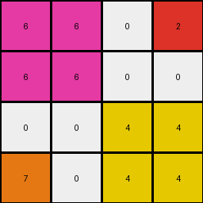

# 77fdfe62 • 003 • refine_dreamer

---

Previous Code:
```python
"""
Extracts the colors from the four corners of the input grid (excluding a blue border) and places those colors in the corresponding corners of a smaller output grid. The rest of the output grid is filled with white (0).
"""

import numpy as np

def transform(input_grid):
    """
    Transforms the input grid to the output grid based on corner color extraction.
    """
    # Get the dimensions of the input grid.
    rows, cols = input_grid.shape

    # Create a 4x4 output grid filled with white (0).
    output_grid = np.zeros((4, 4), dtype=int)

    # Extract the colors from the four corners of the inner 6x6 grid (excluding the border).
    top_left_corner = input_grid[0, 0]
    top_right_corner = input_grid[0, cols - 1]
    bottom_left_corner = input_grid[rows - 1, 0]
    bottom_right_corner = input_grid[rows - 1, cols - 1]

    # Populate the corresponding corners of the output grid.
    output_grid[0, 0] = top_left_corner
    output_grid[0, 3] = top_right_corner
    output_grid[3, 0] = bottom_left_corner
    output_grid[3, 3] = bottom_right_corner

    # create 2x2 subgrids from each corner color
    output_grid[1,0] = top_left_corner
    output_grid[0,1] = top_left_corner
    output_grid[1,1] = top_left_corner

    output_grid[2,3] = bottom_right_corner
    output_grid[3,2] = bottom_right_corner
    output_grid[2,2] = bottom_right_corner

    return output_grid
```

Train Set Results:

## Example 1:

Input:
```
2 1 0 0 0 0 1 3
1 1 1 1 1 1 1 1
0 1 0 8 0 0 1 0
0 1 8 8 0 8 1 0
0 1 0 0 8 0 1 0
0 1 8 0 8 8 1 0
1 1 1 1 1 1 1 1
4 1 0 0 0 0 1 6
```
Expected Output:
```
0 2 0 0
2 2 0 3
0 0 6 0
4 0 6 6
```
Transformed Output:
```
2 2 0 3
2 2 0 0
0 0 6 6
4 0 6 6
```

match: False
pixels_off: 4
size_correct: True
color_palette_correct: True
correct_pixel_counts: False

## Example 2:

Input:
```
9 1 0 0 1 4
1 1 1 1 1 1
0 1 8 8 1 0
0 1 8 0 1 0
1 1 1 1 1 1
2 1 0 0 1 3
```
Expected Output:
```
9 4
2 0
```
Transformed Output:
```
9 9 0 4
9 9 0 0
0 0 3 3
2 0 3 3
```

match: False
pixels_off: None
size_correct: False
color_palette_correct: False
correct_pixel_counts: False

## Example 3:

Input:
```
6 1 0 0 0 0 1 2
1 1 1 1 1 1 1 1
0 1 0 8 0 8 1 0
0 1 8 8 8 0 1 0
0 1 8 0 8 8 1 0
0 1 8 8 8 0 1 0
1 1 1 1 1 1 1 1
7 1 0 0 0 0 1 4
```
Expected Output:
```
0 6 0 2
6 6 2 0
7 0 4 4
7 7 4 0
```
Transformed Output:
```
6 6 0 2
6 6 0 0
0 0 4 4
7 0 4 4
```

match: False
pixels_off: 5
size_correct: True
color_palette_correct: True
correct_pixel_counts: False
**INSTRUCTIONS**

The code above was generated based on observations from the first training
example

we have tested the transform function on each of the task example inputs and
compared with the expected output

review each of the examples provided and the results and consider how the
natural language program should be updated to accommodate this new knowledge

respond with the following deliverables:

- general assessment of the information provided and strategy for resolving the
  errors
- gather metrics about each of the examples and results - use code_execution to
  develop accurate reports on your assumptions
- a YAML block documenting facts - Focus on identifying objects, their properties, and the actions performed on them.
- a natural language program - Be as clear and concise as possible, providing a complete description of the transformation rule.


your responses should be considered as information in a report - not a
conversation
