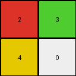
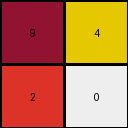
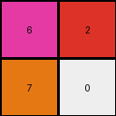

# 77fdfe62 • 009 • refine_dreamer

---


Previous Code:
```python
"""
Extract the four corner pixels of the input grid and arrange them into a 2x2 output grid, maintaining their relative positions.
"""

import numpy as np

def transform(input_grid):
    """
    Extracts corner pixels from the input grid and forms a 2x2 output grid.
    """
    # Get dimensions of the input grid.
    rows, cols = input_grid.shape

    # Create a 2x2 output grid initialized with zeros.
    output_grid = np.zeros((2, 2), dtype=int)

    # Extract corner pixels and populate the output grid.
    output_grid[0, 0] = input_grid[0, 0]  # Top-left
    output_grid[0, 1] = input_grid[0, cols - 1]  # Top-right
    output_grid[1, 0] = input_grid[rows - 1, 0]  # Bottom-left
    output_grid[1, 1] = input_grid[rows - 1, cols -3]  # Bottom-right, modified to be -3

    return output_grid
```

Train Set Results:

## Example 1:

Input:
```
2 1 0 0 0 0 1 3
1 1 1 1 1 1 1 1
0 1 0 8 0 0 1 0
0 1 8 8 0 8 1 0
0 1 0 0 8 0 1 0
0 1 8 0 8 8 1 0
1 1 1 1 1 1 1 1
4 1 0 0 0 0 1 6
```
Expected Output:
```
0 2 0 0
2 2 0 3
0 0 6 0
4 0 6 6
```
Transformed Output:
```
2 3
4 0
```

match: False
pixels_off: None
size_correct: False
color_palette_correct: True
correct_pixel_counts: False

## Example 2:

Input:
```
9 1 0 0 1 4
1 1 1 1 1 1
0 1 8 8 1 0
0 1 8 0 1 0
1 1 1 1 1 1
2 1 0 0 1 3
```
Expected Output:
```
9 4
2 0
```
Transformed Output:
```
9 4
2 0
```

match: True
pixels_off: 0
size_correct: True
color_palette_correct: True
correct_pixel_counts: True

## Example 3:

Input:
```
6 1 0 0 0 0 1 2
1 1 1 1 1 1 1 1
0 1 0 8 0 8 1 0
0 1 8 8 8 0 1 0
0 1 8 0 8 8 1 0
0 1 8 8 8 0 1 0
1 1 1 1 1 1 1 1
7 1 0 0 0 0 1 4
```
Expected Output:
```
0 6 0 2
6 6 2 0
7 0 4 4
7 7 4 0
```
Transformed Output:
```
6 2
7 0
```

match: False
pixels_off: None
size_correct: False
color_palette_correct: True
correct_pixel_counts: False

**INSTRUCTIONS**

The code above was generated based on observations from the first training
example

we have tested the transform function on each of the task example inputs and
compared with the expected output

review each of the examples provided and the results and consider how the
natural language program should be updated to accommodate this new knowledge

respond with the following deliverables:

- general assessment of the information provided and strategy for resolving the
  errors
- gather metrics about each of the examples and results - use code_execution to
  develop accurate reports on your assumptions
- a YAML block documenting facts - Focus on identifying objects, their properties, and the actions performed on them.
- a natural language program - Be as clear and concise as possible, providing a complete description of the transformation rule.


your responses should be considered as information in a report - not a
conversation
