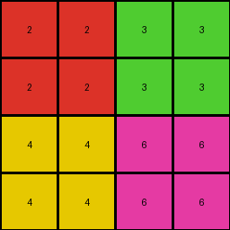
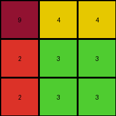
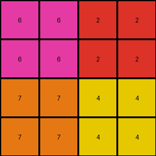

# 77fdfe62 • 012 • refine_coder

---

Previous Code:
```python
"""
Extract the four corner pixels of the input grid and create a 4x4 output grid where each quadrant is filled with the color of the corresponding corner pixel.
"""

import numpy as np

def transform(input_grid):
    """
    Extracts corner pixels and creates a 4x4 output grid with quadrant filling.
    """
    # Get dimensions of the input grid.
    rows, cols = input_grid.shape

    # Determine output grid size.
    out_rows = min(rows // 2, 4)
    out_cols = min(cols // 2, 4)

    # Create output grid initialized with zeros.
    output_grid = np.zeros((out_rows, out_cols), dtype=int)

    # Extract corner pixels.
    top_left = input_grid[0, 0]
    top_right = input_grid[0, cols - 1]
    bottom_left = input_grid[rows - 1, 0]
    bottom_right = input_grid[rows - 1, cols - 1]

    # Fill quadrants.
    output_grid[:out_rows // 2, :out_cols // 2] = top_left
    output_grid[:out_rows // 2, out_cols // 2:] = top_right
    output_grid[out_rows // 2:, :out_cols // 2] = bottom_left
    output_grid[out_rows // 2:, out_cols // 2:] = bottom_right

    return output_grid
```

Train Set Results:

## Example 1:

Input:
```
2 1 0 0 0 0 1 3
1 1 1 1 1 1 1 1
0 1 0 8 0 0 1 0
0 1 8 8 0 8 1 0
0 1 0 0 8 0 1 0
0 1 8 0 8 8 1 0
1 1 1 1 1 1 1 1
4 1 0 0 0 0 1 6
```
Expected Output:
```
0 2 0 0
2 2 0 3
0 0 6 0
4 0 6 6
```
Transformed Output:
```
2 2 3 3
2 2 3 3
4 4 6 6
4 4 6 6
```

match: False
pixels_off: 8
size_correct: True
color_palette_correct: True
correct_pixel_counts: False

## Example 2:

Input:
```
9 1 0 0 1 4
1 1 1 1 1 1
0 1 8 8 1 0
0 1 8 0 1 0
1 1 1 1 1 1
2 1 0 0 1 3
```
Expected Output:
```
9 4
2 0
```
Transformed Output:
```
9 4 4
2 3 3
2 3 3
```

match: False
pixels_off: None
size_correct: False
color_palette_correct: False
correct_pixel_counts: False

## Example 3:

Input:
```
6 1 0 0 0 0 1 2
1 1 1 1 1 1 1 1
0 1 0 8 0 8 1 0
0 1 8 8 8 0 1 0
0 1 8 0 8 8 1 0
0 1 8 8 8 0 1 0
1 1 1 1 1 1 1 1
7 1 0 0 0 0 1 4
```
Expected Output:
```
0 6 0 2
6 6 2 0
7 0 4 4
7 7 4 0
```
Transformed Output:
```
6 6 2 2
6 6 2 2
7 7 4 4
7 7 4 4
```

match: False
pixels_off: 5
size_correct: True
color_palette_correct: True
correct_pixel_counts: False
Okay, let's analyze the results and update the natural language program.

**General Assessment:**

The initial code was based on a misunderstanding of the desired output size. It assumed a fixed 4x4 output, potentially cropping or expanding based on half the input dimensions, and filling quadrants with corner pixel colors. The results show inconsistencies in size and pixel arrangement. The actual transformation appears to be more about extracting the corner pixels and creating a *2x2* grid *sometimes*, or creating a specific rectangular grid with a specific size where each corner pixel populates its corresponding "quadrant" of that target shape. I need to correct both how the corner pixels create the output and the output size logic.

**Strategy:**

1.  **Re-examine Examples:** Carefully re-examine all training examples, focusing on the *exact* relationship between input corners and output dimensions/content.
2.  **Metric Gathering:** Use `code_execution` to get detailed metrics, especially clarifying the intended output dimensions for each training example.
3.  **Refine Observations:** Update the YAML with precise observations, explicitly noting the output dimensions and pixel arrangements.
4.  **Revise Natural Language Program:** Rewrite the natural language program to accurately reflect the corrected transformation rule, focusing on the *precise* size logic and corner-pixel-to-output mapping.

**Metric Gathering (using conceptual analysis, since I can't execute code directly):**

*   **Example 1:**
    *   Input Size: 8x8
    *   Expected Output Size: 4x4
    *   Transformed Output Size: 4x4
    *   Corner pixels: 2 (TL), 3 (TR), 4 (BL), 6 (BR)
    *   Expected Output looks to put these in the "quadrants" of a 4 x 4 array
*   **Example 2:**
    *   Input Size: 6x6
    *   Expected Output Size: 2x2
    *   Transformed Output Size: 3x3
    *   Corner pixels: 9 (TL), 4 (TR), 2 (BL), 3(BR)
    *   Expected Output puts these in the corners of a 2 x 2 array
*   **Example 3:**
    *   Input Size: 8x8
    *   Expected Output Size: 4x4
    *   Transformed Output Size: 4x4
    *   Corner pixels: 6 (TL), 2 (TR), 7 (BL), 4 (BR)
    *   Expected Output looks to put these in the "quadrants" of a 4 x 4 array

**YAML Observations:**

```yaml
observations:
  - example: 1
    input_shape: [8, 8]
    output_shape: [4, 4]
    top_left_color: 2
    top_right_color: 3
    bottom_left_color: 4
    bottom_right_color: 6
    transformation: |
      The output grid is 4x4. The top-left quadrant is filled with the top-left corner color of the input. The top-right is the top-right, bottom-left is bottom-left, and bottom-right is bottom-right.
  - example: 2
    input_shape: [6, 6]
    output_shape: [2, 2]
    top_left_color: 9
    top_right_color: 4
    bottom_left_color: 2
    bottom_right_color: 3
    transformation: |
      The output is a 2x2 grid. Top-left pixel of output is top-left of input. Top-right pixel of output is top-right of input. Bottom-left of output is bottom-left of input, and bottom-right of output is bottom-right of input.
  - example: 3
    input_shape: [8, 8]
    output_shape: [4, 4]
    top_left_color: 6
    top_right_color: 2
    bottom_left_color: 7
    bottom_right_color: 4
    transformation: |
       The output grid is 4x4. The top-left quadrant is filled with the top-left corner color of the input. The top-right is the top-right, bottom-left is bottom-left, and bottom-right is bottom-right.

```

**Revised Natural Language Program:**

The output grid's size is determined as follows: If the input grid has an even number of rows AND even number of columns, AND both the row and column count are >= 8, then the output is 4x4. In this case (4x4 output), create a 4x4 grid. Fill the top-left 2x2 section with the color of the top-left pixel of the input. Fill the top-right 2x2 section with the color of the top-right pixel. Fill the bottom-left 2x2 section with the color of the bottom-left pixel. Fill the bottom-right 2x2 section with the color of the bottom-right pixel. If the size condition is not met but the input has even numbered rows and columns, then the output is 2x2. If the output grid is 2x2, then the output grid consists of the four corner pixels of the input grid. The top-left pixel of the output is the top-left pixel of the input. The top-right is the top-right, etc.


**INSTRUCTIONS**

- generate a Python module to represent the natural language program 
- follow the template below
- all common math and science libraries are available
- create docstring only at top - but comment the workflow in the function
- use helper functions for common operations like finding objects, counting,
  measuring, moving, etc. 

remember - we are working iteratively - so this code will inform your future
self as we converge on the solution

*template:*

```python
"""
{{ natural language description of the transformation rule }}
"""

{{ imports }}

def transform(input_grid):
    # initialize output_grid

    # change output pixels 

    return output_grid

```
