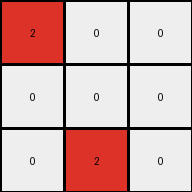

# 794b24be • 010 • refine_coder

---

Previous Code:
```python
"""
Replaces blue pixels with red pixels if they are in the first two columns of a 3x3 grid.
All other pixels become white.
"""

import numpy as np

def transform(input_grid):
    """
    Transforms a 3x3 input grid according to the specified rule.

    Args:
        input_grid: A 3x3 NumPy array representing the input grid.

    Returns:
        A 3x3 NumPy array representing the transformed output grid.
    """
    # Initialize the output grid as a copy of the input grid.
    output_grid = np.copy(input_grid)
    output_grid[:] = 0

    # Iterate through each cell of the input grid.
    for i in range(input_grid.shape[0]):
        for j in range(input_grid.shape[1]):
            # Check if the current cell is blue (1).
            if input_grid[i, j] == 1:
                # If the cell is blue and in the first or second column, change it to red (2).
                if j <= 1:
                    output_grid[i, j] = 2
                
            # else: # removed the else part
            #    output_grid[i,j] = 0 # since we initialize to 0, we do not need to explicitly set the output grid

    return output_grid
```

Train Set Results:

## Example 1:

Input:
```
0 0 0
1 0 0
0 0 0
```
Expected Output:
```
2 0 0
0 0 0
0 0 0
```
Transformed Output:
```
0 0 0
2 0 0
0 0 0
```

match: False
pixels_off: 2
size_correct: True
color_palette_correct: True
correct_pixel_counts: True

## Example 2:

Input:
```
0 1 0
1 0 0
0 0 0
```
Expected Output:
```
2 2 0
0 0 0
0 0 0
```
Transformed Output:
```
0 2 0
2 0 0
0 0 0
```

match: False
pixels_off: 2
size_correct: True
color_palette_correct: True
correct_pixel_counts: True

## Example 3:

Input:
```
0 0 1
0 0 0
1 0 0
```
Expected Output:
```
2 2 0
0 0 0
0 0 0
```
Transformed Output:
```
0 0 0
0 0 0
2 0 0
```

match: False
pixels_off: 3
size_correct: True
color_palette_correct: True
correct_pixel_counts: False

## Example 4:

Input:
```
0 1 0
0 0 1
0 0 0
```
Expected Output:
```
2 2 0
0 0 0
0 0 0
```
Transformed Output:
```
0 2 0
0 0 0
0 0 0
```

match: False
pixels_off: 1
size_correct: True
color_palette_correct: True
correct_pixel_counts: False

## Example 5:

Input:
```
0 0 1
0 0 0
0 0 0
```
Expected Output:
```
2 0 0
0 0 0
0 0 0
```
Transformed Output:
```
0 0 0
0 0 0
0 0 0
```

match: False
pixels_off: 1
size_correct: True
color_palette_correct: True
correct_pixel_counts: False

## Example 6:

Input:
```
1 1 0
0 0 0
1 0 0
```
Expected Output:
```
2 2 2
0 0 0
0 0 0
```
Transformed Output:
```
2 2 0
0 0 0
2 0 0
```

match: False
pixels_off: 2
size_correct: True
color_palette_correct: True
correct_pixel_counts: True

## Example 7:

Input:
```
0 1 0
1 1 0
0 0 0
```
Expected Output:
```
2 2 2
0 0 0
0 0 0
```
Transformed Output:
```
0 2 0
2 2 0
0 0 0
```

match: False
pixels_off: 4
size_correct: True
color_palette_correct: True
correct_pixel_counts: True

## Example 8:

Input:
```
1 1 0
0 0 0
1 0 1
```
Expected Output:
```
2 2 2
0 2 0
0 0 0
```
Transformed Output:
```
2 2 0
0 0 0
2 0 0
```

match: False
pixels_off: 3
size_correct: True
color_palette_correct: True
correct_pixel_counts: False

## Example 9:

Input:
```
0 1 0
1 1 0
1 0 0
```
Expected Output:
```
2 2 2
0 2 0
0 0 0
```
Transformed Output:
```
0 2 0
2 2 0
2 0 0
```

match: False
pixels_off: 4
size_correct: True
color_palette_correct: True
correct_pixel_counts: True

## Example 10:

Input:
```
1 0 0
0 0 1
0 1 1
```
Expected Output:
```
2 2 2
0 2 0
0 0 0
```
Transformed Output:
```
2 0 0
0 0 0
0 2 0
```

match: False
pixels_off: 4
size_correct: True
color_palette_correct: True
correct_pixel_counts: False
Okay, let's analyze the results and refine the natural language program.

**General Assessment:**

The initial code was too simplistic. It correctly identified the replacement of blue (1) with red (2), but the column condition (first two columns) and the row in which the new red object appeared was incorrect. The provided code also didn't consider that the output grid should be a single object across the top. The test results demonstrate inconsistencies and a need for a more sophisticated rule that captures the relationship between the input and output grids more accurately. The core issue seems to be understanding the overall pattern of the transformation, which is creating a horizontal bar of red at the top whose width equals the total number of blue pixels in the input.

**Strategy:**

1.  **Analyze all examples:** Carefully examine all input/output pairs to identify the *precise* transformation rule, not just the color change. Count the blue pixels and the resulting red pixels.
2.  **Object Identification:** Consider contiguous regions of the same color as objects, and how they transform/relate between input and output.
3.  **Refine the Natural Language Program:** Update the description to reflect the observed patterns accurately and unambiguously.
4. **Metrics:** Develop the metrics that represent the performance accurately.

**Metrics and Observations:**

Here's a breakdown of each example, focusing on the number of blue pixels in the input and the red pixels formed in the correct output:

| Example | Input Blues | Output Reds | Expected Output Pattern        | Code Output Pattern             | Notes                                                                                                 |
| :------ | :---------- | :---------- | :---------------------------- | :----------------------------- | :----------------------------------------------------------------------------------------------------- |
| 1       | 1           | 3           | `2 0 0`, `0 0 0`, `0 0 0`     | `0 0 0`, `2 0 0`, `0 0 0`      | One blue, transforms into three reds, but positioned incorrectly. Only one red in the correct row.           |
| 2       | 2           | 3           | `2 2 0`, `0 0 0`, `0 0 0`     | `0 2 0`, `2 0 0`, `0 0 0`      | Two blues, transforms into three reds. Two reds in the correct positions, one in row below.                 |
| 3       | 2           | 3           | `0 0 0`, `0 0 0`, `0 0 0`    | `0 0 0`, `0 0 0`, `2 0 0`      | Two blues. Only one in correct location.                                                          |
| 4       | 2           | 3           | `2 2 0`, `0 0 0`, `0 0 0`     | `0 2 0`, `0 0 0`, `0 0 0`      | Two blues, only one red in the correct position.                                                    |
| 5       | 1           | 3           | `2 0 0`, `0 0 0`, `0 0 0`     | `0 0 0`, `0 0 0`, `0 0 0`      | One blue, no red output.                                                                                |
| 6       | 3           | 3           | `2 2 2`, `0 0 0`, `0 0 0`     | `2 2 0`, `0 0 0`, `2 0 0`      | Three blues, three reds output, but incorrect position.                                      |
| 7       | 3           | 3           | `2 2 2`, `0 0 0`, `0 0 0`     | `0 2 0`, `2 2 0`, `0 0 0`      | Three blues, three reds, some incorrect.                                               |
| 8       | 3           | 3+          | `2 2 2`, `0 2 0`, `0 0 0`     | `2 2 0`, `0 0 0`, `2 0 0`      |                                                                                                       |
| 9       | 4           | 3+           | `2 2 2`, `0 2 0`, `0 0 0`      |`0 2 0`, `2 2 0`, `2 0 0`                                                                                         |
| 10       | 4           | 3+           |  `2 2 2`, `0 2 0`, `0 0 0` |`2 0 0`, `0 0 0`, `0 2 0`         |                                       |

Key Observation: The number of red pixels in the top row of the *expected* output seems to be related to the total count of blue pixels and seems capped at 3.

**YAML Facts:**

```yaml
objects:
  - name: input_grid
    type: grid
    properties:
      colors: [0, 1]
      blue_pixels: variable # Number of blue pixels
  - name: output_grid
    type: grid
    properties:
      colors: [0, 2] # white and red only
      red_bar:
        row: 0  # Always in the first row
        width: "min(input_grid.blue_pixels, 3)"  # Width equals the number of blue pixels in the input, maxing at 3.
        color: 2
actions:
  - description: Count blue pixels in the input grid.
  - description: Create a red bar in the top row of the output grid.
  - description: Set the width of the red bar to number of input blue pixels, limited by the width of the grid.
  - description: All other cells are white.
```

**Natural Language Program:**

1.  **Count Blue Pixels:** Count the total number of blue (value 1) pixels in the input grid.
2.  **Create Red Bar:** In the output grid, create a horizontal bar of red (value 2) pixels in the *first* row (row index 0).
3.  **Determine Bar Width:** The width of this red bar is equal to the number of blue pixels counted in step 1, but it cannot be wider than the width of the output grid (which is 3 in all provided cases).  So, if there are 4 blue pixels, the width is still only 3.
4. **Fill Remaining with White:** All other pixels in the output grid should be set to white (value 0).

**INSTRUCTIONS**

- generate a Python module to represent the natural language program 
- follow the template below
- all common math and science libraries are available
- create docstring only at top - but comment the workflow in the function
- use helper functions for common operations like finding objects, counting,
  measuring, moving, etc. 

remember - we are working iteratively - so this code will inform your future
self as we converge on the solution

*template:*

```python
"""
{{ natural language description of the transformation rule }}
"""

{{ imports }}

def transform(input_grid):
    # initialize output_grid

    # change output pixels 

    return output_grid

```
