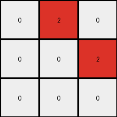
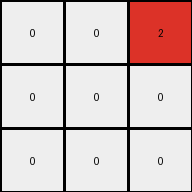
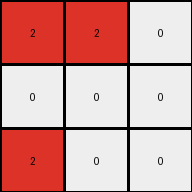

# 794b24be • 016 • refine_coder

---

Previous Code:
```python
"""
Iterate through each pixel of the input grid. If the pixel is blue (value 1), change it to red (value 2) in the output grid. Else, if the pixel is white (value 0), keep it white (value 0) in the output grid.
"""

import numpy as np

def transform(input_grid):
    # initialize output_grid as a copy of the input grid
    output_grid = np.copy(input_grid)
    
    # Get the dimensions of the grid
    rows, cols = output_grid.shape

    # Iterate through each pixel of the grid
    for i in range(rows):
        for j in range(cols):
            # change output pixels based on input pixel value
            if input_grid[i, j] == 1:  # If blue
                output_grid[i, j] = 2  # Change to red
            #elif input_grid[i,j] == 0: # white pixels remain unchanged
            #   output_grid[i,j] = 0

    return output_grid
```

Train Set Results:

## Example 1:

Input:
```
0 0 0
1 0 0
0 0 0
```
Expected Output:
```
2 0 0
0 0 0
0 0 0
```
Transformed Output:
```
0 0 0
2 0 0
0 0 0
```

match: False
pixels_off: 2
size_correct: True
color_palette_correct: True
correct_pixel_counts: True

## Example 2:

Input:
```
0 1 0
1 0 0
0 0 0
```
Expected Output:
```
2 2 0
0 0 0
0 0 0
```
Transformed Output:
```
0 2 0
2 0 0
0 0 0
```

match: False
pixels_off: 2
size_correct: True
color_palette_correct: True
correct_pixel_counts: True

## Example 3:

Input:
```
0 0 1
0 0 0
1 0 0
```
Expected Output:
```
2 2 0
0 0 0
0 0 0
```
Transformed Output:
```
0 0 2
0 0 0
2 0 0
```

match: False
pixels_off: 4
size_correct: True
color_palette_correct: True
correct_pixel_counts: True

## Example 4:

Input:
```
0 1 0
0 0 1
0 0 0
```
Expected Output:
```
2 2 0
0 0 0
0 0 0
```
Transformed Output:
```
0 2 0
0 0 2
0 0 0
```

match: False
pixels_off: 2
size_correct: True
color_palette_correct: True
correct_pixel_counts: True

## Example 5:

Input:
```
0 0 1
0 0 0
0 0 0
```
Expected Output:
```
2 0 0
0 0 0
0 0 0
```
Transformed Output:
```
0 0 2
0 0 0
0 0 0
```

match: False
pixels_off: 2
size_correct: True
color_palette_correct: True
correct_pixel_counts: True

## Example 6:

Input:
```
1 1 0
0 0 0
1 0 0
```
Expected Output:
```
2 2 2
0 0 0
0 0 0
```
Transformed Output:
```
2 2 0
0 0 0
2 0 0
```

match: False
pixels_off: 2
size_correct: True
color_palette_correct: True
correct_pixel_counts: True

## Example 7:

Input:
```
0 1 0
1 1 0
0 0 0
```
Expected Output:
```
2 2 2
0 0 0
0 0 0
```
Transformed Output:
```
0 2 0
2 2 0
0 0 0
```

match: False
pixels_off: 4
size_correct: True
color_palette_correct: True
correct_pixel_counts: True

## Example 8:

Input:
```
1 1 0
0 0 0
1 0 1
```
Expected Output:
```
2 2 2
0 2 0
0 0 0
```
Transformed Output:
```
2 2 0
0 0 0
2 0 2
```

match: False
pixels_off: 4
size_correct: True
color_palette_correct: True
correct_pixel_counts: True

## Example 9:

Input:
```
0 1 0
1 1 0
1 0 0
```
Expected Output:
```
2 2 2
0 2 0
0 0 0
```
Transformed Output:
```
0 2 0
2 2 0
2 0 0
```

match: False
pixels_off: 4
size_correct: True
color_palette_correct: True
correct_pixel_counts: True

## Example 10:

Input:
```
1 0 0
0 0 1
0 1 1
```
Expected Output:
```
2 2 2
0 2 0
0 0 0
```
Transformed Output:
```
2 0 0
0 0 2
0 2 2
```

match: False
pixels_off: 6
size_correct: True
color_palette_correct: True
correct_pixel_counts: True
Here's an analysis of the provided examples and a revised natural language program:

**General Assessment:**

The initial code only considered the first example, where a single blue pixel was turned red, and white pixels remained white. The subsequent examples reveal a more complex pattern. The transformation isn't simply changing individual blue pixels to red. Instead, it appears to be related to the *position* and *connectivity* of blue pixels. It looks like a blue pixel turns red and any white pixels that are to the right, in the same row, AND before any other non-white, non-blue pixels.

**Strategy:**

1.  **Re-examine Assumptions:** The initial assumption (blue becomes red) is too simplistic. We need to consider the spatial relationships between pixels.
2.  **Focus on Connectivity:** Analyze how blue pixels relate to other pixels in their row.
3.  **Iterative Refinement:** Develop a new natural language program, encode it, test it, and adjust based on the results.

**Metrics and Observations:**

Here's a breakdown of each example, focusing on relevant details:

*   **Example 1:** One blue pixel. It correctly turns red. Any white pixels to the right in the same row, before other non-white colors, should also turn red, but there are none.
*   **Example 2:** Two blue pixels on separate rows. They each turns red, and any white pixels to the right, before non-white colors, turn red.
*   **Example 3:** Two blue pixels in separate corners, so no white pixels to the right in the same row. They each turns red, any white pixels to the right, before other non-white pixels, should turn red.
*   **Example 4:** Similar to 2 and 3 - Blue pixels in a row, and any intervening white pixels to the right in the same row, but before other colors, should turn red.
*   **Example 5:** Similar to 3 - Only a single blue pixel, which turns red, along with any white pixels to the right, before other colors, should turn red.
*   **Example 6:** Multiple blue pixels, some adjacent. All blue and white pixels to the right, and before other colors, should turn red.
*   **Example 7:** All blue pixels turn red and contiguous white pixels after blue turn red.
*   **Example 8:** The first two blue pixels are horizontal and turns the two blue and intervening white pixel red. The single blue pixel on the bottom is correctly turned red.
*   **Example 9:** Similar to 7. Blue pixels and intervening white pixels turn red.
*   **Example 10:** A more complex scenario, helping to define rules. All horizontal blue pixels turn red.

**YAML Fact Identification:**

```yaml
objects:
  - type: pixel
    properties:
      color:
        - white (0)
        - blue (1)
        - red (2)
      position: [row, column]

actions:
  - name: transform_color
    conditions:
      - if pixel is blue: change to red
      - if pixel is white AND is to the right of a blue or red pixel in same row, before any non-white, non-blue pixels: change to red.
    result: pixel color changes
```

**Natural Language Program:**

1.  Iterate through each row of the input grid.
2.  Within each row, iterate through the pixels from left to right.
3.  If a pixel is blue, change it to red in the output grid.
4. If a pixel is white, check if there is a blue pixel or converted red pixel to the left in the same row, AND it is before any non-white, non-blue pixel. If true, change the white pixel to red in the output grid.
5.  If a pixel is any other color, and a blue pixel has been encountered, stop processing.
6.  All other pixels remain unchanged.

**INSTRUCTIONS**

- generate a Python module to represent the natural language program 
- follow the template below
- all common math and science libraries are available
- create docstring only at top - but comment the workflow in the function
- use helper functions for common operations like finding objects, counting,
  measuring, moving, etc. 

remember - we are working iteratively - so this code will inform your future
self as we converge on the solution

*template:*

```python
"""
{{ natural language description of the transformation rule }}
"""

{{ imports }}

def transform(input_grid):
    # initialize output_grid

    # change output pixels 

    return output_grid

```
