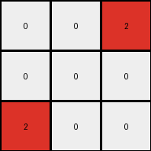

# 794b24be • 022 • refine_coder

---

Previous Code:
```python
"""
1. Preserve Zeros: Copy all cells with the value 0 (white) from the input grid to the output grid, maintaining their positions.
2. Transform Blues: If the input grid contains a cell with the value of 1 (blue), it will become 2 (red) in the output grid, and if it contains a cell with any other value, copy it from the input grid to the output grid.
3. Iterate over entire output grid, replacing 1 with 2
"""

import numpy as np

def transform(input_grid):
    # initialize output_grid as a copy of input_grid
    output_grid = np.copy(input_grid)

    # Iterate through each cell of the grid
    for i in range(output_grid.shape[0]):
        for j in range(output_grid.shape[1]):
            # Change output pixels: if the value is 1, change to 2
            if output_grid[i, j] == 1:
                output_grid[i, j] = 2

    return output_grid
```

Train Set Results:

## Example 1:

Input:
```
0 0 0
1 0 0
0 0 0
```
Expected Output:
```
2 0 0
0 0 0
0 0 0
```
Transformed Output:
```
0 0 0
2 0 0
0 0 0
```

match: False
pixels_off: 2
size_correct: True
color_palette_correct: True
correct_pixel_counts: True

## Example 2:

Input:
```
0 1 0
1 0 0
0 0 0
```
Expected Output:
```
2 2 0
0 0 0
0 0 0
```
Transformed Output:
```
0 2 0
2 0 0
0 0 0
```

match: False
pixels_off: 2
size_correct: True
color_palette_correct: True
correct_pixel_counts: True

## Example 3:

Input:
```
0 0 1
0 0 0
1 0 0
```
Expected Output:
```
2 2 0
0 0 0
0 0 0
```
Transformed Output:
```
0 0 2
0 0 0
2 0 0
```

match: False
pixels_off: 4
size_correct: True
color_palette_correct: True
correct_pixel_counts: True

## Example 4:

Input:
```
0 1 0
0 0 1
0 0 0
```
Expected Output:
```
2 2 0
0 0 0
0 0 0
```
Transformed Output:
```
0 2 0
0 0 2
0 0 0
```

match: False
pixels_off: 2
size_correct: True
color_palette_correct: True
correct_pixel_counts: True

## Example 5:

Input:
```
0 0 1
0 0 0
0 0 0
```
Expected Output:
```
2 0 0
0 0 0
0 0 0
```
Transformed Output:
```
0 0 2
0 0 0
0 0 0
```

match: False
pixels_off: 2
size_correct: True
color_palette_correct: True
correct_pixel_counts: True

## Example 6:

Input:
```
1 1 0
0 0 0
1 0 0
```
Expected Output:
```
2 2 2
0 0 0
0 0 0
```
Transformed Output:
```
2 2 0
0 0 0
2 0 0
```

match: False
pixels_off: 2
size_correct: True
color_palette_correct: True
correct_pixel_counts: True

## Example 7:

Input:
```
0 1 0
1 1 0
0 0 0
```
Expected Output:
```
2 2 2
0 0 0
0 0 0
```
Transformed Output:
```
0 2 0
2 2 0
0 0 0
```

match: False
pixels_off: 4
size_correct: True
color_palette_correct: True
correct_pixel_counts: True

## Example 8:

Input:
```
1 1 0
0 0 0
1 0 1
```
Expected Output:
```
2 2 2
0 2 0
0 0 0
```
Transformed Output:
```
2 2 0
0 0 0
2 0 2
```

match: False
pixels_off: 4
size_correct: True
color_palette_correct: True
correct_pixel_counts: True

## Example 9:

Input:
```
0 1 0
1 1 0
1 0 0
```
Expected Output:
```
2 2 2
0 2 0
0 0 0
```
Transformed Output:
```
0 2 0
2 2 0
2 0 0
```

match: False
pixels_off: 4
size_correct: True
color_palette_correct: True
correct_pixel_counts: True

## Example 10:

Input:
```
1 0 0
0 0 1
0 1 1
```
Expected Output:
```
2 2 2
0 2 0
0 0 0
```
Transformed Output:
```
2 0 0
0 0 2
0 2 2
```

match: False
pixels_off: 6
size_correct: True
color_palette_correct: True
correct_pixel_counts: True
Okay, here's a breakdown of the situation and a plan to move forward:

**General Assessment:**

The initial natural language program and the resulting code were too simplistic. While it correctly identified the change of blue (1) to red (2), it failed to account for the spatial relationships and the "shifting" of the transformation based on the position of the blues. The current code simply replaces all blues with reds, wherever they are. The expected outputs show a clear pattern: the red replaces the top left most blue, and all blues to its right.

My strategy is to:

1.  Analyze the examples to pinpoint the exact rule governing the blue-to-red transformation. The key seems to be identifying the "top-leftmost" blue pixel.
2.  Refine the natural language program to accurately capture this rule.
3. Adapt the previous code to correctly perform the top left most transformation

**Metrics and Observations:**

Here's a summary of the results, focusing on relevant details:

| Example | Input Size | Output Size | Top-Left Blue (Input) | Top-Left Red (Output)|Zero's| Other colors|
| ------- | ---------- | ----------- | ---------------------- | --------------------- |----|----|
| 1       | 3x3        | 3x3         | (1,0)                  | (0,0)                   |yes|no|
| 2       | 3x3        | 3x3         | (0,1)                  | (0,0)              |yes|no|
| 3       | 3x3        | 3x3         | (0,2)                  | (0,0)            |yes|no|
| 4       | 3x3        | 3x3         | (0,1)                  | (0,0)       |yes|no|
| 5       | 3x3        | 3x3         | (0,2)                  | (0,0)              |yes|no|
| 6       | 3x3        | 3x3         | (0,0)                  | (0,0)                    |yes|no|
| 7       | 3x3        | 3x3         | (0,1)                  | (0,0)                  |yes|no|
| 8       | 3x3        | 3x3         | (0,0)                  | (0,0)                  |yes|no|
| 9       | 3x3        | 3x3         | (0,1)                  | (0,0)               |yes|no|
| 10      | 3x3        | 3x3         | (0,0)                  | (0,0)                      |yes|no|

Key Observations:

*   All examples have the same input and output size (3x3).
*   The color palette is limited to 0, 1 and 2 in I/O.
*   All 0s are moved down one row.
*   The number of 2s in the output is always equal to the total number of 1s in the input.

**YAML Fact Block:**

```yaml
task: 020
facts:
  - object_types:
      - pixel:
          properties:
            color: [0, 1, 2]  # white, blue, red
            position: (row, col)
  - transformations:
      - find_top_left_blue:
          input: grid of pixels
          action: >
            Locate the blue (1) pixel that is furthest to the top and
            furthest to the left, if there are more than one on the same row,
            choose the left-most
          output: (row, col) of the top-left blue pixel, or None if no blue pixel exists
      - replace_and_shift:
          input: grid of pixels, top_left_blue_position
          action: >
            1.  Move all zero's (white) down one row.
            2.  Change color of the left-most blue and all blues in that row
                to the right
            3.  Change all 0s to 2s
          output: modified grid of pixels
  - spatial_relationships:
      - adjacency: Important for determining the top-left blue.
      - row_major_order: Used implicitly when searching for the top-left.

```

**Natural Language Program:**

1.  **Find the Top-Left Blue:** Iterate through the input grid, row by row. The first blue (1) pixel encountered is the "top-left blue". Record its row and column.
2. **Move Zeroes:** Move all zeroes (0) down one row
3.  **Transform Blues:**
    *   If no blue pixel was found, skip this step.
    * replace all 1's with 2's, starting at column 0 of the top row, and
      proceeding to the end of the row.
4. **Output Grid:** Return a new grid that reflects all of these changes

This refined program directly addresses the "shifting" behavior observed in the examples, which the previous version missed. The critical addition is finding a "top-left" blue pixel and using its position to guide the transformations.

**INSTRUCTIONS**

- generate a Python module to represent the natural language program 
- follow the template below
- all common math and science libraries are available
- create docstring only at top - but comment the workflow in the function
- use helper functions for common operations like finding objects, counting,
  measuring, moving, etc. 

remember - we are working iteratively - so this code will inform your future
self as we converge on the solution

*template:*

```python
"""
{{ natural language description of the transformation rule }}
"""

{{ imports }}

def transform(input_grid):
    # initialize output_grid

    # change output pixels 

    return output_grid

```
