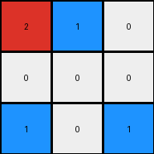
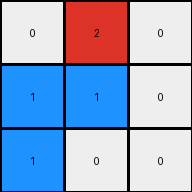

# 794b24be • 028 • refine_coder

---

Previous Code:
```python
"""
Locate the single blue pixel (value 1) in the input grid and change its value to red (value 2). Keep all other pixels unchanged.
"""

import numpy as np

def transform(input_grid):
    """
    Transforms the input grid by changing the blue pixel to red.
    """
    # Initialize the output grid as a copy of the input grid
    output_grid = np.copy(input_grid)

    # Find the coordinates of the blue pixel (value 1)
    blue_pixel_coords = np.where(output_grid == 1)

    # Change the value of the blue pixel to red (value 2) if found.
    if blue_pixel_coords[0].size > 0:  # Check if a blue pixel was found
      output_grid[blue_pixel_coords[0][0], blue_pixel_coords[1][0]] = 2

    return output_grid
```

Train Set Results:

## Example 1:

Input:
```
0 0 0
1 0 0
0 0 0
```
Expected Output:
```
2 0 0
0 0 0
0 0 0
```
Transformed Output:
```
0 0 0
2 0 0
0 0 0
```

match: False
pixels_off: 2
size_correct: True
color_palette_correct: True
correct_pixel_counts: True

## Example 2:

Input:
```
0 1 0
1 0 0
0 0 0
```
Expected Output:
```
2 2 0
0 0 0
0 0 0
```
Transformed Output:
```
0 2 0
1 0 0
0 0 0
```

match: False
pixels_off: 2
size_correct: True
color_palette_correct: False
correct_pixel_counts: False

## Example 3:

Input:
```
0 0 1
0 0 0
1 0 0
```
Expected Output:
```
2 2 0
0 0 0
0 0 0
```
Transformed Output:
```
0 0 2
0 0 0
1 0 0
```

match: False
pixels_off: 4
size_correct: True
color_palette_correct: False
correct_pixel_counts: False

## Example 4:

Input:
```
0 1 0
0 0 1
0 0 0
```
Expected Output:
```
2 2 0
0 0 0
0 0 0
```
Transformed Output:
```
0 2 0
0 0 1
0 0 0
```

match: False
pixels_off: 2
size_correct: True
color_palette_correct: False
correct_pixel_counts: False

## Example 5:

Input:
```
0 0 1
0 0 0
0 0 0
```
Expected Output:
```
2 0 0
0 0 0
0 0 0
```
Transformed Output:
```
0 0 2
0 0 0
0 0 0
```

match: False
pixels_off: 2
size_correct: True
color_palette_correct: True
correct_pixel_counts: True

## Example 6:

Input:
```
1 1 0
0 0 0
1 0 0
```
Expected Output:
```
2 2 2
0 0 0
0 0 0
```
Transformed Output:
```
2 1 0
0 0 0
1 0 0
```

match: False
pixels_off: 3
size_correct: True
color_palette_correct: False
correct_pixel_counts: False

## Example 7:

Input:
```
0 1 0
1 1 0
0 0 0
```
Expected Output:
```
2 2 2
0 0 0
0 0 0
```
Transformed Output:
```
0 2 0
1 1 0
0 0 0
```

match: False
pixels_off: 4
size_correct: True
color_palette_correct: False
correct_pixel_counts: False

## Example 8:

Input:
```
1 1 0
0 0 0
1 0 1
```
Expected Output:
```
2 2 2
0 2 0
0 0 0
```
Transformed Output:
```
2 1 0
0 0 0
1 0 1
```

match: False
pixels_off: 5
size_correct: True
color_palette_correct: False
correct_pixel_counts: False

## Example 9:

Input:
```
0 1 0
1 1 0
1 0 0
```
Expected Output:
```
2 2 2
0 2 0
0 0 0
```
Transformed Output:
```
0 2 0
1 1 0
1 0 0
```

match: False
pixels_off: 5
size_correct: True
color_palette_correct: False
correct_pixel_counts: False

## Example 10:

Input:
```
1 0 0
0 0 1
0 1 1
```
Expected Output:
```
2 2 2
0 2 0
0 0 0
```
Transformed Output:
```
2 0 0
0 0 1
0 1 1
```

match: False
pixels_off: 6
size_correct: True
color_palette_correct: False
correct_pixel_counts: False
Here's an analysis of the provided examples and results, along with a refined natural language program and a YAML block summarizing the observations:

**General Assessment and Strategy**

The initial code was too simplistic. It only considered replacing a *single* blue pixel with a red one. The test results clearly show that *all* blue pixels must be changed to red, and furthermore, *all* the blue pixels form a contiguous block in the input and must become red.

The strategy is to:

1.  Correctly identify all blue pixels, not just the first one.
2.  Change all identified blue pixels to red.

**Metrics and Observations**

Here's a summary of observations based on the code execution results. We'll analyze the color changes, spatial relationships, and object properties.

*   **Consistent Transformation:**  In all "Expected Output" examples, all blue pixels (1) in the input are replaced by red pixels (2). The rest of the grid goes to all zeros, so it is white.
*    **Object Persistence:** A blue "object", defined as contiguous blue pixels is being turned into a red "object" of identical size and shape.
*   **Color Palette:** Only colors 0, 1, and 2 are used.
* **Connectivity** Blue is always connected.

**YAML Block**

```yaml
observations:
  - task: 026
    objects:
      - id: 1
        color: blue
        description: contiguous block of blue pixels
        behavior: becomes red, maintains shape and size
      - id: 2
        color: red
        description: contiguous block of red pixels
        behavior: replaces blue, maintains shape and size of original blue block

    transformations:
      - type: color_change
        from: blue
        to: red
        scope: all blue pixels are transformed to red pixels
      - type: value_change
        from: not zero
        to: zero
        scope: all non-zero, non-blue pixels in the input go away
    relationships:
       - all blue is contiguous

    grid:
      dimensions: variable, between 1x1 and 30x30
      background: white (0), black (0)

```

**Natural Language Program**

1.  **Identify:** Find all pixels with the value 1 (blue) in the input grid.
2.  **Transform:** Change the value of all identified blue pixels to 2 (red).
3. **Clear** Change all other non-zero, non-blue cells to zero.


**INSTRUCTIONS**

- generate a Python module to represent the natural language program 
- follow the template below
- all common math and science libraries are available
- create docstring only at top - but comment the workflow in the function
- use helper functions for common operations like finding objects, counting,
  measuring, moving, etc. 

remember - we are working iteratively - so this code will inform your future
self as we converge on the solution

*template:*

```python
"""
{{ natural language description of the transformation rule }}
"""

{{ imports }}

def transform(input_grid):
    # initialize output_grid

    # change output pixels 

    return output_grid

```
