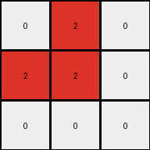

# 794b24be • 035 • refine_dreamer

---


Previous Code:
```python
"""
1.  **Identify Seed Pixels:** Find all blue (value 1) pixels in the first row of the input grid. These are the "seed" pixels.
2.  **Propagate Red:** From each seed pixel, change its color to red (value 2). Then, iteratively change the color of any directly adjacent (up, down, left, or right) blue pixel to red. Continue this propagation until no more connected blue pixels can be found.
3.  **Handle other Blues:** Iterate through all of the remaining blue pixels. If a pixel is blue and was never changed to red, change it to white.
4.  **Preserve Other Colors:** All other pixels in the input grid that are not blue retain their original color in the output grid.
"""

import numpy as np

def transform(input_grid):
    # Initialize output_grid with the same dimensions as the input_grid.
    output_grid = np.copy(input_grid)
    rows, cols = input_grid.shape

    # Helper function to check if a pixel is within grid bounds.
    def is_valid(r, c):
        return 0 <= r < rows and 0 <= c < cols

    # Helper function for Depth-First Search (DFS) propagation.
    def propagate_red(r, c):
        if not is_valid(r, c) or output_grid[r, c] != 1:
            return
        output_grid[r, c] = 2  # Change to red
        # Recursively check adjacent pixels
        propagate_red(r + 1, c)
        propagate_red(r - 1, c)
        propagate_red(r, c + 1)
        propagate_red(r, c - 1)

    # 1. Identify Seed Pixels and start propagation.
    for j in range(cols):
        if output_grid[0, j] == 1:
            propagate_red(0, j)

    # 3. Handle Remaining Blue Pixels (convert to white)
    for i in range(rows):
      for j in range(cols):
        if output_grid[i,j] == 1:
          output_grid[i,j] = 0

    return output_grid
```

Train Set Results:

## Example 1:

Input:
```
0 0 0
1 0 0
0 0 0
```
Expected Output:
```
2 0 0
0 0 0
0 0 0
```
Transformed Output:
```
0 0 0
0 0 0
0 0 0
```

match: False
pixels_off: 1
size_correct: True
color_palette_correct: True
correct_pixel_counts: False

## Example 2:

Input:
```
0 1 0
1 0 0
0 0 0
```
Expected Output:
```
2 2 0
0 0 0
0 0 0
```
Transformed Output:
```
0 2 0
0 0 0
0 0 0
```

match: False
pixels_off: 1
size_correct: True
color_palette_correct: True
correct_pixel_counts: False

## Example 3:

Input:
```
0 0 1
0 0 0
1 0 0
```
Expected Output:
```
2 2 0
0 0 0
0 0 0
```
Transformed Output:
```
0 0 2
0 0 0
0 0 0
```

match: False
pixels_off: 3
size_correct: True
color_palette_correct: True
correct_pixel_counts: False

## Example 4:

Input:
```
0 1 0
0 0 1
0 0 0
```
Expected Output:
```
2 2 0
0 0 0
0 0 0
```
Transformed Output:
```
0 2 0
0 0 0
0 0 0
```

match: False
pixels_off: 1
size_correct: True
color_palette_correct: True
correct_pixel_counts: False

## Example 5:

Input:
```
0 0 1
0 0 0
0 0 0
```
Expected Output:
```
2 0 0
0 0 0
0 0 0
```
Transformed Output:
```
0 0 2
0 0 0
0 0 0
```

match: False
pixels_off: 2
size_correct: True
color_palette_correct: True
correct_pixel_counts: True

## Example 6:

Input:
```
1 1 0
0 0 0
1 0 0
```
Expected Output:
```
2 2 2
0 0 0
0 0 0
```
Transformed Output:
```
2 2 0
0 0 0
0 0 0
```

match: False
pixels_off: 1
size_correct: True
color_palette_correct: True
correct_pixel_counts: False

## Example 7:

Input:
```
0 1 0
1 1 0
0 0 0
```
Expected Output:
```
2 2 2
0 0 0
0 0 0
```
Transformed Output:
```
0 2 0
2 2 0
0 0 0
```

match: False
pixels_off: 4
size_correct: True
color_palette_correct: True
correct_pixel_counts: True

## Example 8:

Input:
```
1 1 0
0 0 0
1 0 1
```
Expected Output:
```
2 2 2
0 2 0
0 0 0
```
Transformed Output:
```
2 2 0
0 0 0
0 0 0
```

match: False
pixels_off: 2
size_correct: True
color_palette_correct: True
correct_pixel_counts: False

## Example 9:

Input:
```
0 1 0
1 1 0
1 0 0
```
Expected Output:
```
2 2 2
0 2 0
0 0 0
```
Transformed Output:
```
0 2 0
2 2 0
2 0 0
```

match: False
pixels_off: 4
size_correct: True
color_palette_correct: True
correct_pixel_counts: True

## Example 10:

Input:
```
1 0 0
0 0 1
0 1 1
```
Expected Output:
```
2 2 2
0 2 0
0 0 0
```
Transformed Output:
```
2 0 0
0 0 0
0 0 0
```

match: False
pixels_off: 3
size_correct: True
color_palette_correct: True
correct_pixel_counts: False

**INSTRUCTIONS**

The code above was generated based on observations from the first training
example

we have tested the transform function on each of the task example inputs and
compared with the expected output

review each of the examples provided and the results and consider how the
natural language program should be updated to accommodate this new knowledge

respond with the following deliverables:

- general assessment of the information provided and strategy for resolving the
  errors
- gather metrics about each of the examples and results - use code_execution to
  develop accurate reports on your assumptions
- a YAML block documenting facts - Focus on identifying objects, their properties, and the actions performed on them.
- a natural language program - Be as clear and concise as possible, providing a complete description of the transformation rule.


your responses should be considered as information in a report - not a
conversation
