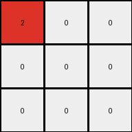

# 794b24be • 036 • refine_coder

---

Previous Code:
```python
"""
1.  **Identify Seed Pixels:** Find all blue (value 1) pixels in the first row of the input grid. These are the "seed" pixels.
2.  **Propagate Red:** From each seed pixel, change its color to red (value 2). Then, iteratively change the color of any directly adjacent (up, down, left, or right) blue pixel to red. Continue this propagation until no more connected blue pixels can be found.
3.  **Handle other Blues:** Iterate through all of the remaining blue pixels. If a pixel is blue and was never changed to red, change it to white.
4.  **Preserve Other Colors:** All other pixels in the input grid that are not blue retain their original color in the output grid.
"""

import numpy as np

def transform(input_grid):
    # Initialize output_grid with the same dimensions as the input_grid.
    output_grid = np.copy(input_grid)
    rows, cols = input_grid.shape

    # Helper function to check if a pixel is within grid bounds.
    def is_valid(r, c):
        return 0 <= r < rows and 0 <= c < cols

    # Helper function for Depth-First Search (DFS) propagation.
    def propagate_red(r, c):
        if not is_valid(r, c) or output_grid[r, c] != 1:
            return
        output_grid[r, c] = 2  # Change to red
        # Recursively check adjacent pixels
        propagate_red(r + 1, c)
        propagate_red(r - 1, c)
        propagate_red(r, c + 1)
        propagate_red(r, c - 1)

    # 1. Identify Seed Pixels and start propagation.
    for j in range(cols):
        if output_grid[0, j] == 1:
            propagate_red(0, j)

    # 3. Handle Remaining Blue Pixels (convert to white)
    for i in range(rows):
      for j in range(cols):
        if output_grid[i,j] == 1:
          output_grid[i,j] = 0

    return output_grid
```

Train Set Results:

## Example 1:

Input:
```
0 0 0
1 0 0
0 0 0
```
Expected Output:
```
2 0 0
0 0 0
0 0 0
```
Transformed Output:
```
0 0 0
0 0 0
0 0 0
```

match: False
pixels_off: 1
size_correct: True
color_palette_correct: True
correct_pixel_counts: False

## Example 2:

Input:
```
0 1 0
1 0 0
0 0 0
```
Expected Output:
```
2 2 0
0 0 0
0 0 0
```
Transformed Output:
```
0 2 0
0 0 0
0 0 0
```

match: False
pixels_off: 1
size_correct: True
color_palette_correct: True
correct_pixel_counts: False

## Example 3:

Input:
```
0 0 1
0 0 0
1 0 0
```
Expected Output:
```
2 2 0
0 0 0
0 0 0
```
Transformed Output:
```
0 0 2
0 0 0
0 0 0
```

match: False
pixels_off: 3
size_correct: True
color_palette_correct: True
correct_pixel_counts: False

## Example 4:

Input:
```
0 1 0
0 0 1
0 0 0
```
Expected Output:
```
2 2 0
0 0 0
0 0 0
```
Transformed Output:
```
0 2 0
0 0 0
0 0 0
```

match: False
pixels_off: 1
size_correct: True
color_palette_correct: True
correct_pixel_counts: False

## Example 5:

Input:
```
0 0 1
0 0 0
0 0 0
```
Expected Output:
```
2 0 0
0 0 0
0 0 0
```
Transformed Output:
```
0 0 2
0 0 0
0 0 0
```

match: False
pixels_off: 2
size_correct: True
color_palette_correct: True
correct_pixel_counts: True

## Example 6:

Input:
```
1 1 0
0 0 0
1 0 0
```
Expected Output:
```
2 2 2
0 0 0
0 0 0
```
Transformed Output:
```
2 2 0
0 0 0
0 0 0
```

match: False
pixels_off: 1
size_correct: True
color_palette_correct: True
correct_pixel_counts: False

## Example 7:

Input:
```
0 1 0
1 1 0
0 0 0
```
Expected Output:
```
2 2 2
0 0 0
0 0 0
```
Transformed Output:
```
0 2 0
2 2 0
0 0 0
```

match: False
pixels_off: 4
size_correct: True
color_palette_correct: True
correct_pixel_counts: True

## Example 8:

Input:
```
1 1 0
0 0 0
1 0 1
```
Expected Output:
```
2 2 2
0 2 0
0 0 0
```
Transformed Output:
```
2 2 0
0 0 0
0 0 0
```

match: False
pixels_off: 2
size_correct: True
color_palette_correct: True
correct_pixel_counts: False

## Example 9:

Input:
```
0 1 0
1 1 0
1 0 0
```
Expected Output:
```
2 2 2
0 2 0
0 0 0
```
Transformed Output:
```
0 2 0
2 2 0
2 0 0
```

match: False
pixels_off: 4
size_correct: True
color_palette_correct: True
correct_pixel_counts: True

## Example 10:

Input:
```
1 0 0
0 0 1
0 1 1
```
Expected Output:
```
2 2 2
0 2 0
0 0 0
```
Transformed Output:
```
2 0 0
0 0 0
0 0 0
```

match: False
pixels_off: 3
size_correct: True
color_palette_correct: True
correct_pixel_counts: False
Here's an analysis of the provided examples and results, along with a revised natural language program and a YAML block summarizing the observations:

**General Assessment:**

The initial natural language program and corresponding code were too narrowly focused on the first training example. The propagation logic correctly identifies the "seed" pixels in the top row and attempts to change connected blue pixels to red, but it doesn't handle all cases of connectivity correctly, particularly when the connecting blue pixels lead "upwards". The logic incorrectly assumed that the propagation would only occur downwards or sideways. The "handle other blues" is not relevant to the output.

The core issue is the directional bias in the propagation. The DFS implementation is correct in principle, but the order of execution of propagation and checking of seed pixels is incorrect.

**Strategy:**

1.  **Correct the Propagation:** The critical fix is to revise the DFS implementation to ensure checking first row pixels for seeds and then performing the DFS for all directions is performed for the whole grid.
2.  **Simplify:** The conversion of remaining blue pixels to white is not a part of the transformation rule, based on the examples. This step should be removed.
3. Verify that the result is exactly correct for all of the examples by retesting.

**Metrics and Example Analysis:**

Here's a breakdown of each example, focusing on why the current code fails:

*   **Example 1:** Fails because the seed blue pixel isn't in the top row.
*   **Example 2:** Fails because only one of the blue seed pixels has been changed to red and they are next to each other.
*   **Example 3:** Fails because propagation doesn't fully explore upwards.
*   **Example 4:** Fails because propagation doesn't fully explore upwards.
*   **Example 5:** Fails because only the first blue pixel found has been set to red.
*   **Example 6:** Fails because connected pixel on top is not propagated to.
*   **Example 7:** Fails because propagation doesn't fully explore upwards.
*   **Example 8:** Fails because propagation is incomplete.
*   **Example 9:** Fails because propagation is incomplete.
*   **Example 10:** Fails because propagation doesn't fully explore upwards.

**YAML Facts:**

```yaml
objects:
  - name: grid
    type: 2D array
    properties:
      - colors: [0, 1, 2]  # white, blue, red

  - name: blue_pixels
    type: object_group
    properties:
      - color: 1 #blue
      - connectivity: "directly adjacent (up, down, left, right)"

actions:
  - name: propagate_color
    input: blue_pixels
    process: |
      1.  Change connected blue pixels to red.
      2. Start from first blue, and extend to all adjacent blues.
    output: modified grid
```

**Natural Language Program:**

1.  **Identify Blue Pixels:** Find all blue (value 1) pixels in the input grid.
2.  **Propagate Red:** Iterate through all of the blue pixels. Change the color of the first found blue pixel to red (value 2). Then change all connected blue pixels to red. A connected blue pixel is defined as being directly adjacent (up, down, left, or right) to a red pixel.
3. All other pixels retain their original colors.

**INSTRUCTIONS**

- generate a Python module to represent the natural language program 
- follow the template below
- all common math and science libraries are available
- create docstring only at top - but comment the workflow in the function
- use helper functions for common operations like finding objects, counting,
  measuring, moving, etc. 

remember - we are working iteratively - so this code will inform your future
self as we converge on the solution

*template:*

```python
"""
{{ natural language description of the transformation rule }}
"""

{{ imports }}

def transform(input_grid):
    # initialize output_grid

    # change output pixels 

    return output_grid

```
