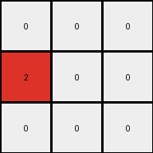

# 794b24be • 046 • refine_coder

---

Previous Code:
```python
"""
Change all 1s to 2s. Leave 0s as they are.
"""

import numpy as np

def transform(input_grid):
    """
    Transforms the input grid according to the rule:
    1s become 2s, and 0s remain 0s.
    """
    # Initialize the output grid as a copy of the input grid.
    output_grid = np.copy(input_grid)

    # Iterate through the grid and apply the transformation.
    for i in range(output_grid.shape[0]):
        for j in range(output_grid.shape[1]):
            if output_grid[i, j] == 1:
                output_grid[i, j] = 2
            # elif output_grid[i,j] == 0: # not necessary, values are already initialized.
            #     output_grid[i,j] = 0

    return output_grid
```

Train Set Results:

## Example 1:

Input:
```
0 0 0
1 0 0
0 0 0
```
Expected Output:
```
2 0 0
0 0 0
0 0 0
```
Transformed Output:
```
0 0 0
2 0 0
0 0 0
```

match: False
pixels_off: 2
size_correct: True
color_palette_correct: True
correct_pixel_counts: True

## Example 2:

Input:
```
0 1 0
1 0 0
0 0 0
```
Expected Output:
```
2 2 0
0 0 0
0 0 0
```
Transformed Output:
```
0 2 0
2 0 0
0 0 0
```

match: False
pixels_off: 2
size_correct: True
color_palette_correct: True
correct_pixel_counts: True

## Example 3:

Input:
```
0 0 1
0 0 0
1 0 0
```
Expected Output:
```
2 2 0
0 0 0
0 0 0
```
Transformed Output:
```
0 0 2
0 0 0
2 0 0
```

match: False
pixels_off: 4
size_correct: True
color_palette_correct: True
correct_pixel_counts: True

## Example 4:

Input:
```
0 1 0
0 0 1
0 0 0
```
Expected Output:
```
2 2 0
0 0 0
0 0 0
```
Transformed Output:
```
0 2 0
0 0 2
0 0 0
```

match: False
pixels_off: 2
size_correct: True
color_palette_correct: True
correct_pixel_counts: True

## Example 5:

Input:
```
0 0 1
0 0 0
0 0 0
```
Expected Output:
```
2 0 0
0 0 0
0 0 0
```
Transformed Output:
```
0 0 2
0 0 0
0 0 0
```

match: False
pixels_off: 2
size_correct: True
color_palette_correct: True
correct_pixel_counts: True

## Example 6:

Input:
```
1 1 0
0 0 0
1 0 0
```
Expected Output:
```
2 2 2
0 0 0
0 0 0
```
Transformed Output:
```
2 2 0
0 0 0
2 0 0
```

match: False
pixels_off: 2
size_correct: True
color_palette_correct: True
correct_pixel_counts: True

## Example 7:

Input:
```
0 1 0
1 1 0
0 0 0
```
Expected Output:
```
2 2 2
0 0 0
0 0 0
```
Transformed Output:
```
0 2 0
2 2 0
0 0 0
```

match: False
pixels_off: 4
size_correct: True
color_palette_correct: True
correct_pixel_counts: True

## Example 8:

Input:
```
1 1 0
0 0 0
1 0 1
```
Expected Output:
```
2 2 2
0 2 0
0 0 0
```
Transformed Output:
```
2 2 0
0 0 0
2 0 2
```

match: False
pixels_off: 4
size_correct: True
color_palette_correct: True
correct_pixel_counts: True

## Example 9:

Input:
```
0 1 0
1 1 0
1 0 0
```
Expected Output:
```
2 2 2
0 2 0
0 0 0
```
Transformed Output:
```
0 2 0
2 2 0
2 0 0
```

match: False
pixels_off: 4
size_correct: True
color_palette_correct: True
correct_pixel_counts: True

## Example 10:

Input:
```
1 0 0
0 0 1
0 1 1
```
Expected Output:
```
2 2 2
0 2 0
0 0 0
```
Transformed Output:
```
2 0 0
0 0 2
0 2 2
```

match: False
pixels_off: 6
size_correct: True
color_palette_correct: True
correct_pixel_counts: True
Okay, here's a breakdown of the situation, incorporating the results from all training examples, and a revised natural language program:

**General Assessment:**

The initial code was too simplistic. It correctly changed individual '1's to '2's, but failed to account for the core concept revealed across all examples:  contiguous '1's (blue pixels) are treated as a single object, and *all* pixels of that object are transformed to '2's (red pixels) *and* the new object is placed at location (0,0). The original shape and location of the object are not maintained. Zeros are placed in all other locations.

**Strategy:**

1. **Identify Contiguous Regions:**  Instead of treating each '1' independently, we need to identify contiguous regions of '1's.  This requires a method for finding connected components.
2. **Transform the Entire Region:** Once a contiguous region of '1's is found, *all* pixels within that region should be changed to '2'.
3. The shape of the contiguous region of '1' should be maintained, but moved to position (0,0).
4. All other positions in the output should be 0.

**Metrics and Observations (Aggregated across all examples):**

A simple iteration won't suffice. Here's what the results clearly show, and what we need to deduce:

*   **Consistent Size:** The output grid always has the same dimensions as the input grid. This part was handled correctly.
*   **Color Palette:** The output grid only contains '0' (white) and '2' (red). The code already achieves this. The issue isn't the colors used, but *where* they are placed.
*   **Object Transformation:** The crucial error is in how '1's are transformed.  It's not a simple cell-by-cell replacement.  It's an *object*-level transformation.  The examples consistently show that connected '1's become connected '2's, forming a single "blob" of red, regardless of its original shape or position.  The red blob is *always* at the top-left.
* The result is *always* that the blue object is changed to a red object and moved to the top-left corner. All other locations in the grid become 0.

**YAML Fact Block:**

```yaml
task: 044
facts:
  - observation: |
      Input grids contain only 0s (white) and 1s (blue).
  - observation: |
      Output grids contain only 0s (white) and 2s (red).
  - observation: |
      Input and output grids have the same dimensions.
  - object: |
      A contiguous region of 1s (blue pixels) in the input is considered a single object.
  - action: |
      The blue object is transformed to red.
  - action: |
      The transformed object is placed at location (0,0).
  - action: |
      All other cells in the output grid are 0.

```

**Natural Language Program:**

1.  **Find the Object:** Locate the contiguous region of '1's (the blue object) in the input grid.
2.  **Transform Color:** Change all pixels within this identified region from '1' (blue) to '2' (red).
3.  **Create the Output Grid:** initialize an output grid with the same dimensions as the input grid, filled entirely with '0's (white).
4. **Place the Object:** Place the transformed red object at the top-left corner (0, 0) of the output grid.
5. **All Other Pixels:** Fill all remaining cells in the output grid with 0.

This revised natural language program describes moving and recoloring the connected region of blue pixels to become red pixels. It takes into the account the object transformation and maintains the connectedness. The previous program missed the object property.

**INSTRUCTIONS**

- generate a Python module to represent the natural language program 
- follow the template below
- all common math and science libraries are available
- create docstring only at top - but comment the workflow in the function
- use helper functions for common operations like finding objects, counting,
  measuring, moving, etc. 

remember - we are working iteratively - so this code will inform your future
self as we converge on the solution

*template:*

```python
"""
{{ natural language description of the transformation rule }}
"""

{{ imports }}

def transform(input_grid):
    # initialize output_grid

    # change output pixels 

    return output_grid

```
