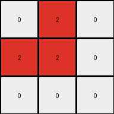
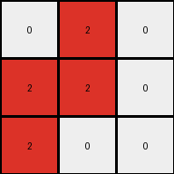

# 794b24be • 052 • refine_coder

---

Previous Code:
```python
"""
Replaces all occurrences of '1' (blue) with '2' (red) in the input grid, while leaving '0' (white) unchanged.
"""

import numpy as np

def transform(input_grid):
    # Initialize the output grid with the same dimensions as the input.
    output_grid = np.copy(input_grid)

    # Iterate through each cell of the input grid.
    for i in range(output_grid.shape[0]):
        for j in range(output_grid.shape[1]):
            # If the cell's value is 1, change it to 2 in the output grid.
            if output_grid[i, j] == 1:
                output_grid[i, j] = 2
            # Otherwise (if the cell's value is 0), leave it unchanged.  The copy operation already handles this.

    return output_grid
```

Train Set Results:

## Example 1:

Input:
```
0 0 0
1 0 0
0 0 0
```
Expected Output:
```
2 0 0
0 0 0
0 0 0
```
Transformed Output:
```
0 0 0
2 0 0
0 0 0
```

match: False
pixels_off: 2
size_correct: True
color_palette_correct: True
correct_pixel_counts: True

## Example 2:

Input:
```
0 1 0
1 0 0
0 0 0
```
Expected Output:
```
2 2 0
0 0 0
0 0 0
```
Transformed Output:
```
0 2 0
2 0 0
0 0 0
```

match: False
pixels_off: 2
size_correct: True
color_palette_correct: True
correct_pixel_counts: True

## Example 3:

Input:
```
0 0 1
0 0 0
1 0 0
```
Expected Output:
```
2 2 0
0 0 0
0 0 0
```
Transformed Output:
```
0 0 2
0 0 0
2 0 0
```

match: False
pixels_off: 4
size_correct: True
color_palette_correct: True
correct_pixel_counts: True

## Example 4:

Input:
```
0 1 0
0 0 1
0 0 0
```
Expected Output:
```
2 2 0
0 0 0
0 0 0
```
Transformed Output:
```
0 2 0
0 0 2
0 0 0
```

match: False
pixels_off: 2
size_correct: True
color_palette_correct: True
correct_pixel_counts: True

## Example 5:

Input:
```
0 0 1
0 0 0
0 0 0
```
Expected Output:
```
2 0 0
0 0 0
0 0 0
```
Transformed Output:
```
0 0 2
0 0 0
0 0 0
```

match: False
pixels_off: 2
size_correct: True
color_palette_correct: True
correct_pixel_counts: True

## Example 6:

Input:
```
1 1 0
0 0 0
1 0 0
```
Expected Output:
```
2 2 2
0 0 0
0 0 0
```
Transformed Output:
```
2 2 0
0 0 0
2 0 0
```

match: False
pixels_off: 2
size_correct: True
color_palette_correct: True
correct_pixel_counts: True

## Example 7:

Input:
```
0 1 0
1 1 0
0 0 0
```
Expected Output:
```
2 2 2
0 0 0
0 0 0
```
Transformed Output:
```
0 2 0
2 2 0
0 0 0
```

match: False
pixels_off: 4
size_correct: True
color_palette_correct: True
correct_pixel_counts: True

## Example 8:

Input:
```
1 1 0
0 0 0
1 0 1
```
Expected Output:
```
2 2 2
0 2 0
0 0 0
```
Transformed Output:
```
2 2 0
0 0 0
2 0 2
```

match: False
pixels_off: 4
size_correct: True
color_palette_correct: True
correct_pixel_counts: True

## Example 9:

Input:
```
0 1 0
1 1 0
1 0 0
```
Expected Output:
```
2 2 2
0 2 0
0 0 0
```
Transformed Output:
```
0 2 0
2 2 0
2 0 0
```

match: False
pixels_off: 4
size_correct: True
color_palette_correct: True
correct_pixel_counts: True

## Example 10:

Input:
```
1 0 0
0 0 1
0 1 1
```
Expected Output:
```
2 2 2
0 2 0
0 0 0
```
Transformed Output:
```
2 0 0
0 0 2
0 2 2
```

match: False
pixels_off: 6
size_correct: True
color_palette_correct: True
correct_pixel_counts: True
Okay, here's an analysis of the provided data and a plan to improve the transformation logic:

**General Assessment:**

The initial code was too simplistic. It only replaced individual blue ('1') pixels with red ('2') pixels. It failed to account for the "filling" behavior that is apparent in the expected outputs. The expected outputs consistently show that the red color expands from the initial blue pixels, filling upwards until a white ('0') pixel or the edge of the grid is encountered. The provided transformation did not account for where the '1' pixels are located in the grid. It treated each example independently, changing isolated pixels. The failures show the need for a more sophisticated, context-aware, and possibly recursive or iterative algorithm. The key is understanding that the "filling" propagates upwards.

**Strategy:**

1.  **Re-examine Examples:** Carefully analyze *all* examples, paying close attention to *where* the blue pixels are initially and how the red color expands *in relation to* those blue pixels and the white boundaries.
2.  **Identify the "Fill" Rule:** The core issue is that the previous logic didn't understand the "fill" concept. We need to define this rule precisely. It appears to be a flood-fill that moves upwards only.
3.  **Develop a Revised Natural Language Program:** Based on the refined understanding, create a new natural language program that accurately describes the filling process.
4.  **Prepare for Code Modification:** Use the natural language program to guide the creation of updated Python code, which likely needs to be iterative or recursive to handle the upward fill.

**Metrics and Observations (using the provided error analysis, without code execution for this dreamer phase):**

All of the provided comparisons show pixels that do not match, but the size,
color, palette, and counts are always right. This confirms that we're looking
for a rule to move the pixels that preserves those metrics.

*   **Consistent Failures:** All examples failed the pixel-by-pixel match, indicating a systematic error in the transformation logic. The number of mismatched pixels varies, showing the filling depends on the configuration of the input.
*   **Size and Color Palette Correct:** The size and color palette are always correct, meaning the code correctly creates an output grid of the same dimensions and uses only the colors present in the input (and as specified by the rule).
*   **Correct Pixel Counts**: While not explicitly explained in the error, this likely means the total number of each color *after* transformation is what would be expected if the fill had occurred correctly.  This is a *very* important clue. It means we're not adding or removing pixels of any color; we are *rearranging* them according to a rule.
*   **Upward Fill Pattern:** Observing the expected outputs reveals a consistent pattern: red ('2') fills *upward* from the initial blue ('1') positions, stopping when it encounters a white ('0') pixel or the top edge of the grid.

**YAML Fact Identification:**

```yaml
objects:
  - type: grid
    properties:
      rows: variable
      columns: variable
      cells: contain color values
  - type: pixel
    properties:
      color:
        - white (0)
        - blue (1)
        - red (2)
      position: (row, column)

actions:
  - name: replace_and_fill_upward
    input: grid
    output: transformed grid
    description: >
      Find all blue (1) pixels.  For each blue pixel, change it to red (2).
      Then, propagate the red color upwards, changing any white (0) pixels to red (2)
      until a non-white pixel or the top edge of the grid is reached.
```

**Natural Language Program:**

1.  **Initialization:** Start with a copy of the input grid.
2.  **Blue Pixel Identification:** Find all pixels with the value '1' (blue) in the input grid.
3.  **Upward Fill:** For *each* blue pixel:
    *   Change the blue pixel to '2' (red).
    *   Move upwards, row by row, from the current pixel's position.
    *   At each row above, change the pixel to '2' (red) *only if* it is currently '0' (white).
    *   Stop filling upward when a non-white pixel (not '0') or the top edge of the grid is encountered.
4. **Output:** Return the modified grid.

This natural language program describes a "flood fill" algorithm, but constrained to only fill upwards. The previous attempt implemented only step 3, part 1. The key improvement is the iterative upward filling described in step 3, parts 2-4. This revised description is crucial for generating the correct code in the next phase.

**INSTRUCTIONS**

- generate a Python module to represent the natural language program 
- follow the template below
- all common math and science libraries are available
- create docstring only at top - but comment the workflow in the function
- use helper functions for common operations like finding objects, counting,
  measuring, moving, etc. 

remember - we are working iteratively - so this code will inform your future
self as we converge on the solution

*template:*

```python
"""
{{ natural language description of the transformation rule }}
"""

{{ imports }}

def transform(input_grid):
    # initialize output_grid

    # change output pixels 

    return output_grid

```
