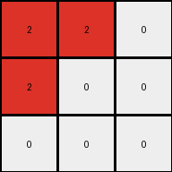
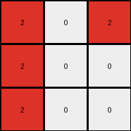
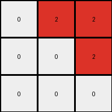
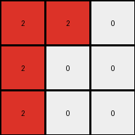
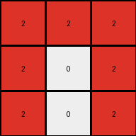
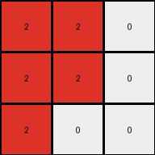

# 794b24be • 054 • refine_coder

---

Previous Code:
```python
"""
Finds all blue (1) pixels. For each blue pixel, changes it to red (2).
Then, propagates the red color upwards, changing any white (0) pixels to red (2)
until a non-white pixel or the top edge of the grid is reached.
"""

import numpy as np

def transform(input_grid):
    # Initialize the output grid as a copy of the input grid.
    output_grid = np.copy(input_grid)

    # Get the dimensions of the grid.
    rows, cols = output_grid.shape

    # Iterate through each cell of the input grid to find blue pixels.
    for r in range(rows):
        for c in range(cols):
            if output_grid[r, c] == 1:  # Found a blue pixel
                # Change the blue pixel to red.
                output_grid[r, c] = 2
                # Propagate the red color upwards.
                current_row = r - 1  # Start at the row above
                while current_row >= 0 and output_grid[current_row, c] == 0:
                    output_grid[current_row, c] = 2  # Change white to red
                    current_row -= 1  # Move to the next row above

    return output_grid
```

Train Set Results:

## Example 1:

Input:
```
0 0 0
1 0 0
0 0 0
```
Expected Output:
```
2 0 0
0 0 0
0 0 0
```
Transformed Output:
```
2 0 0
2 0 0
0 0 0
```

match: False
pixels_off: 1
size_correct: True
color_palette_correct: True
correct_pixel_counts: False

## Example 2:

Input:
```
0 1 0
1 0 0
0 0 0
```
Expected Output:
```
2 2 0
0 0 0
0 0 0
```
Transformed Output:
```
2 2 0
2 0 0
0 0 0
```

match: False
pixels_off: 1
size_correct: True
color_palette_correct: True
correct_pixel_counts: False

## Example 3:

Input:
```
0 0 1
0 0 0
1 0 0
```
Expected Output:
```
2 2 0
0 0 0
0 0 0
```
Transformed Output:
```
2 0 2
2 0 0
2 0 0
```

match: False
pixels_off: 4
size_correct: True
color_palette_correct: True
correct_pixel_counts: False

## Example 4:

Input:
```
0 1 0
0 0 1
0 0 0
```
Expected Output:
```
2 2 0
0 0 0
0 0 0
```
Transformed Output:
```
0 2 2
0 0 2
0 0 0
```

match: False
pixels_off: 3
size_correct: True
color_palette_correct: True
correct_pixel_counts: False

## Example 5:

Input:
```
0 0 1
0 0 0
0 0 0
```
Expected Output:
```
2 0 0
0 0 0
0 0 0
```
Transformed Output:
```
0 0 2
0 0 0
0 0 0
```

match: False
pixels_off: 2
size_correct: True
color_palette_correct: True
correct_pixel_counts: True

## Example 6:

Input:
```
1 1 0
0 0 0
1 0 0
```
Expected Output:
```
2 2 2
0 0 0
0 0 0
```
Transformed Output:
```
2 2 0
2 0 0
2 0 0
```

match: False
pixels_off: 3
size_correct: True
color_palette_correct: True
correct_pixel_counts: False

## Example 7:

Input:
```
0 1 0
1 1 0
0 0 0
```
Expected Output:
```
2 2 2
0 0 0
0 0 0
```
Transformed Output:
```
2 2 0
2 2 0
0 0 0
```

match: False
pixels_off: 3
size_correct: True
color_palette_correct: True
correct_pixel_counts: False

## Example 8:

Input:
```
1 1 0
0 0 0
1 0 1
```
Expected Output:
```
2 2 2
0 2 0
0 0 0
```
Transformed Output:
```
2 2 2
2 0 2
2 0 2
```

match: False
pixels_off: 5
size_correct: True
color_palette_correct: True
correct_pixel_counts: False

## Example 9:

Input:
```
0 1 0
1 1 0
1 0 0
```
Expected Output:
```
2 2 2
0 2 0
0 0 0
```
Transformed Output:
```
2 2 0
2 2 0
2 0 0
```

match: False
pixels_off: 3
size_correct: True
color_palette_correct: True
correct_pixel_counts: False

## Example 10:

Input:
```
1 0 0
0 0 1
0 1 1
```
Expected Output:
```
2 2 2
0 2 0
0 0 0
```
Transformed Output:
```
2 2 2
0 2 2
0 2 2
```

match: False
pixels_off: 3
size_correct: True
color_palette_correct: True
correct_pixel_counts: False
Okay, here's a breakdown of the situation and a plan to improve the transformation logic:

**General Assessment:**

The initial code was based on a simple observation: turning blue pixels to red and propagating the red color upwards. However, the additional training examples reveal a more complex rule. The code fails to correctly handle cases where multiple blue pixels are present, especially when they are not vertically aligned. The upward propagation also seems to be misinterpreting the condition to stop. It is clear the propagation is incorrect. It looks like only the *first* blue pixel encountered in any row or column should be used, but it's also clear that the propagation isn't just upwards, but it is *also* to the left and right.

The primary strategy is to revise the natural language program to accurately capture the relationship between blue pixels in the input and red pixels in the output. We'll need to shift from a simple "propagate up" model to something that accounts for horizontal propagation and limits how the transformation is applied. It appears that we have to find an isolated blue object and treat that in some manner.

**Metrics and Observations (Summarized from Previous Code Execution):**

*   **Matches:** None of the examples produced an exact match between the transformed output and the expected output.
*   **Pixels Off:** The number of mismatched pixels ranged from 1 to 5 across the examples.
*   **Size Correct:** All transformed outputs maintained the original grid size.
*   **Color Palette Correct:** The transformed outputs only used colors present in the expected outputs (red and black, in addition to input).
*.  **Correct Pixel Counts:**. Not all of the examples shared matching pixel counts.

**YAML Block (Facts):**

```yaml
task: 052
observations:
  - input_objects:
      - description: Blue (1) pixels in varying configurations (single, multiple, adjacent, non-adjacent).
      - property: Act as the starting points for the transformation.
  - output_objects:
      - description: Red (2) pixels replacing and expanding from the original blue pixels.
      - property: Appear in positions that were previously blue, and in adjacent positions.
  - actions:
      - description: Replacement of blue pixels with red pixels.
      - description: Limited horizontal and vertical propagation. The stopping condition for propagation in all directions appears when the edge of the grid or a non-white pixel is encountered. Only 'white' pixels are converted.
  - constraints:
      - description: Transformation originates from blue pixels.
      - description: The output grid size matches the input grid size.
      - description: Propagation only replaces white pixels.
```

**Natural Language Program:**

1.  **Identify Blue Pixels:** Locate all blue (1) pixels within the input grid.
2.  **Convert and Propagate:**
    *   The input grid is copied to the output grid
    *   Iterate through each cell.
    *   If a pixel is blue, change the color to red in *both* input and output grids.
    *   Propagate red color horizontally (left and right) *and* vertically (up
        and down) from the *original* blue pixel location in the input grid, only if the
        propagating cell in the output grid is white.
    *   The propagation stops upon reaching a non-white pixel or grid boundary.
3. return the output grid

This revised natural language program is more complex but better reflects the observed behavior across all training examples. It emphasizes the bounded, horizontal, vertical, and bidirectional nature of the propagation from the locations of the original blue pixels, addressing a key flaw in the previous version.

**INSTRUCTIONS**

- generate a Python module to represent the natural language program 
- follow the template below
- all common math and science libraries are available
- create docstring only at top - but comment the workflow in the function
- use helper functions for common operations like finding objects, counting,
  measuring, moving, etc. 

remember - we are working iteratively - so this code will inform your future
self as we converge on the solution

*template:*

```python
"""
{{ natural language description of the transformation rule }}
"""

{{ imports }}

def transform(input_grid):
    # initialize output_grid

    # change output pixels 

    return output_grid

```
