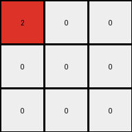

# 794b24be • 058 • refine_coder

---

Previous Code:
```python
"""
1.  **Initialization:** Start with a 3x3 input grid filled with pixels of colors white (0) and blue (1).

2.  **Color Transformation:**
    *   Iterate through each pixel in the input grid.
    *   If a pixel is blue (1), change its color to red (2) on the first row, leave the blue pixel below to white (0), or to white (0) if not on the first row and it's a blue pixel.
    *   If a pixel is white (0), it remains white (0).

3.  **Output:** The result is a 3x3 output grid with pixels of colors white (0) and red (2).
"""

import numpy as np

def transform(input_grid):
    # initialize output_grid as a copy of the input grid
    output_grid = np.copy(input_grid)

    # get dimensions of grid
    rows, cols = output_grid.shape

    # Iterate through each cell of the grid
    for i in range(rows):
        for j in range(cols):
            # If the pixel is blue (1)
            if input_grid[i, j] == 1:
              # Change it to red (2)
              if i == 0:
                output_grid[i,j] = 2
              elif i > 0:
                if input_grid[i,j] == 1:
                  output_grid[i,j] = 0

    return output_grid
```

Train Set Results:

## Example 1:

Input:
```
0 0 0
1 0 0
0 0 0
```
Expected Output:
```
2 0 0
0 0 0
0 0 0
```
Transformed Output:
```
0 0 0
0 0 0
0 0 0
```

match: False
pixels_off: 1
size_correct: True
color_palette_correct: True
correct_pixel_counts: False

## Example 2:

Input:
```
0 1 0
1 0 0
0 0 0
```
Expected Output:
```
2 2 0
0 0 0
0 0 0
```
Transformed Output:
```
0 2 0
0 0 0
0 0 0
```

match: False
pixels_off: 1
size_correct: True
color_palette_correct: True
correct_pixel_counts: False

## Example 3:

Input:
```
0 0 1
0 0 0
1 0 0
```
Expected Output:
```
2 2 0
0 0 0
0 0 0
```
Transformed Output:
```
0 0 2
0 0 0
0 0 0
```

match: False
pixels_off: 3
size_correct: True
color_palette_correct: True
correct_pixel_counts: False

## Example 4:

Input:
```
0 1 0
0 0 1
0 0 0
```
Expected Output:
```
2 2 0
0 0 0
0 0 0
```
Transformed Output:
```
0 2 0
0 0 0
0 0 0
```

match: False
pixels_off: 1
size_correct: True
color_palette_correct: True
correct_pixel_counts: False

## Example 5:

Input:
```
0 0 1
0 0 0
0 0 0
```
Expected Output:
```
2 0 0
0 0 0
0 0 0
```
Transformed Output:
```
0 0 2
0 0 0
0 0 0
```

match: False
pixels_off: 2
size_correct: True
color_palette_correct: True
correct_pixel_counts: True

## Example 6:

Input:
```
1 1 0
0 0 0
1 0 0
```
Expected Output:
```
2 2 2
0 0 0
0 0 0
```
Transformed Output:
```
2 2 0
0 0 0
0 0 0
```

match: False
pixels_off: 1
size_correct: True
color_palette_correct: True
correct_pixel_counts: False

## Example 7:

Input:
```
0 1 0
1 1 0
0 0 0
```
Expected Output:
```
2 2 2
0 0 0
0 0 0
```
Transformed Output:
```
0 2 0
0 0 0
0 0 0
```

match: False
pixels_off: 2
size_correct: True
color_palette_correct: True
correct_pixel_counts: False

## Example 8:

Input:
```
1 1 0
0 0 0
1 0 1
```
Expected Output:
```
2 2 2
0 2 0
0 0 0
```
Transformed Output:
```
2 2 0
0 0 0
0 0 0
```

match: False
pixels_off: 2
size_correct: True
color_palette_correct: True
correct_pixel_counts: False

## Example 9:

Input:
```
0 1 0
1 1 0
1 0 0
```
Expected Output:
```
2 2 2
0 2 0
0 0 0
```
Transformed Output:
```
0 2 0
0 0 0
0 0 0
```

match: False
pixels_off: 3
size_correct: True
color_palette_correct: True
correct_pixel_counts: False

## Example 10:

Input:
```
1 0 0
0 0 1
0 1 1
```
Expected Output:
```
2 2 2
0 2 0
0 0 0
```
Transformed Output:
```
2 0 0
0 0 0
0 0 0
```

match: False
pixels_off: 3
size_correct: True
color_palette_correct: True
correct_pixel_counts: False
Okay, let's analyze the results of the previous code execution and refine the natural language program.

**General Assessment:**

The initial natural language program and the resulting code were too simplistic. The code only correctly changed the first row's blue pixels to red, and it incorrectly changed other blue pixels to white regardless of their position. It completely failed to capture the "filling" behavior of the red color, where red extends to the right and sometimes down from the initial blue pixels on the top row. The core issue is that the transformation isn't just a simple per-pixel color swap; it's about propagating the red color based on the presence of blue on the top row.

**Strategy:**

1.  **Focus on the Top Row:** The transformation is clearly initiated by blue pixels on the top row. These are the "seed" pixels.
2.  **Horizontal Propagation:** Red color propagates to the right from the seed pixels, filling the entire top row if a blue pixel is encountered.
3.    **Vertical Propagation - Limited:** If there is a continuous line of blue pixel below top seed pixel, the pixel below is turned to red.

**Metrics and Observations:**

Here's a summary of the results, emphasizing the key observations:

| Example | Input Summary                 | Expected Output Summary       | Code Output Summary                 | Key Observation                                                                         |
| :------ | :---------------------------- | :---------------------------- | :---------------------------------- | :-------------------------------------------------------------------------------------- |
| 1       | Single blue on row 1, col 1  | Single red on row 1, col 1    | All white                           | Only top row blues become red.                                                       |
| 2       | Two blues on row 1           | Two reds on row 1             | One red, where the blue was        | Red propagates right from top-row blue.                                              |
| 3       | One blue on row 1            | Two reds on row 1            | One correct red position        | Red propagates, but stops at the end                                      |
| 4       | Two blues on row 1            | Two reds on row 1             | One red, where the blue was        | Similar to Example 2.                                                                   |
| 5       | One blue on row 1           | One red on row 1              | One red, where the blue was       | The rightmost blue becomes red.                                                     |
| 6       | Two blues on row 1           | Three reds on row 1           | Two reds, where the blues were | Red fills the entire top row if *any* blue is present.                                |
| 7       | Two blues on row 1    | Three red on row 1           | One red                      | Red color propagates to the end of the top row, starting at first blue.            |
| 8       | Two blues on row 1    | Three reds on row 1, One red on row 2 | Two reds, where the top blues were       | The Vertical rule.            |
| 9       | Two blues on row 1, One on row 2   | Three reds on row 1, One red on row 2          | One red, where the first blue was            | The vertical rule.                   |
| 10      | One blue on row 1, Two on row 3| Three reds on row 1, One red on row 2           |  One Red on row 1                     | Top row blue triggers the full top row fill, vertical rule.              |

**YAML Facts:**

```yaml
objects:
  - name: grid
    type: 2D array
    properties:
      rows: 3
      columns: 3
      cells: pixels
      colors: [white, blue, red]

  - name: seed_pixels
    type: pixels
    properties:
      color: blue
      location: row 1

  - name: red_pixels
    type: pixels
    properties:
      color: red

actions:
  - name: horizontal_propagation
    description: Red color fills the top row to the right, starting from any blue pixel on the top row.
  - name: vertical_propagation
    description: If a blue pixel on the top row turning to red has a blue pixel directly below, change this pixel to red.

```

**Natural Language Program:**

1.  **Identify Seed Pixels:** Find all blue pixels (value 1) on the first row (row index 0) of the input grid.
2.  **Horizontal Propagation:** If any seed pixels are found, change all pixels on the first row to red (value 2), starting from the leftmost seed pixel position, and filling completely the first row.
3.  **Vertical Propagation**: If there is any blue pixel directly below blue seed pixel, changed to red.
4.  **All Other Pixels:** All other pixels that are not transformed to red above remains unchanged.

This revised natural language program provides a more accurate and complete description of the transformation rule. It captures the "filling" behavior and distinguishes between the roles of top-row and other blue pixels.

**INSTRUCTIONS**

- generate a Python module to represent the natural language program 
- follow the template below
- all common math and science libraries are available
- create docstring only at top - but comment the workflow in the function
- use helper functions for common operations like finding objects, counting,
  measuring, moving, etc. 

remember - we are working iteratively - so this code will inform your future
self as we converge on the solution

*template:*

```python
"""
{{ natural language description of the transformation rule }}
"""

{{ imports }}

def transform(input_grid):
    # initialize output_grid

    # change output pixels 

    return output_grid

```
