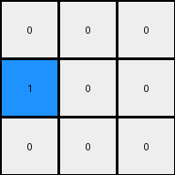
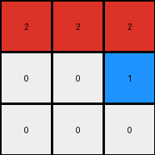
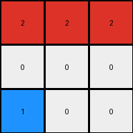
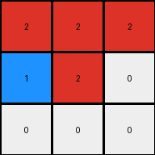
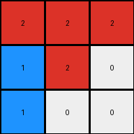

# 794b24be • 060 • refine_coder

---

Previous Code:
```python
"""
1.  **Identify Seed Pixels:** Find all blue pixels (value 1) on the first row (row index 0) of the input grid.
2.  **Horizontal Propagation:** If any seed pixels are found, change all pixels on the first row to red (value 2), starting from the leftmost seed pixel position, and filling completely the first row.
3.  **Vertical Propagation**: If there is any blue pixel directly below blue seed pixel, changed to red.
4.  **All Other Pixels:** All other pixels that are not transformed to red above remains unchanged.
"""

import numpy as np

def transform(input_grid):
    # initialize output_grid as a copy of the input grid
    output_grid = np.copy(input_grid)

    # get dimensions of grid
    rows, cols = output_grid.shape

    # 1. Identify Seed Pixels
    seed_pixels = []
    for j in range(cols):
        if input_grid[0, j] == 1:
            seed_pixels.append((0, j))

    # 2. Horizontal Propagation
    if seed_pixels:
        for j in range(cols):
            output_grid[0, j] = 2

    # 3. Vertical Propagation
        for r, c in seed_pixels:
           if r+1 < rows and input_grid[r+1,c] == 1:
               output_grid[r+1,c] = 2

    return output_grid
```

Train Set Results:

## Example 1:

Input:
```
0 0 0
1 0 0
0 0 0
```
Expected Output:
```
2 0 0
0 0 0
0 0 0
```
Transformed Output:
```
0 0 0
1 0 0
0 0 0
```

match: False
pixels_off: 2
size_correct: True
color_palette_correct: False
correct_pixel_counts: False

## Example 2:

Input:
```
0 1 0
1 0 0
0 0 0
```
Expected Output:
```
2 2 0
0 0 0
0 0 0
```
Transformed Output:
```
2 2 2
1 0 0
0 0 0
```

match: False
pixels_off: 2
size_correct: True
color_palette_correct: False
correct_pixel_counts: False

## Example 3:

Input:
```
0 0 1
0 0 0
1 0 0
```
Expected Output:
```
2 2 0
0 0 0
0 0 0
```
Transformed Output:
```
2 2 2
0 0 0
1 0 0
```

match: False
pixels_off: 2
size_correct: True
color_palette_correct: False
correct_pixel_counts: False

## Example 4:

Input:
```
0 1 0
0 0 1
0 0 0
```
Expected Output:
```
2 2 0
0 0 0
0 0 0
```
Transformed Output:
```
2 2 2
0 0 1
0 0 0
```

match: False
pixels_off: 2
size_correct: True
color_palette_correct: False
correct_pixel_counts: False

## Example 5:

Input:
```
0 0 1
0 0 0
0 0 0
```
Expected Output:
```
2 0 0
0 0 0
0 0 0
```
Transformed Output:
```
2 2 2
0 0 0
0 0 0
```

match: False
pixels_off: 2
size_correct: True
color_palette_correct: True
correct_pixel_counts: False

## Example 6:

Input:
```
1 1 0
0 0 0
1 0 0
```
Expected Output:
```
2 2 2
0 0 0
0 0 0
```
Transformed Output:
```
2 2 2
0 0 0
1 0 0
```

match: False
pixels_off: 1
size_correct: True
color_palette_correct: False
correct_pixel_counts: False

## Example 7:

Input:
```
0 1 0
1 1 0
0 0 0
```
Expected Output:
```
2 2 2
0 0 0
0 0 0
```
Transformed Output:
```
2 2 2
1 2 0
0 0 0
```

match: False
pixels_off: 2
size_correct: True
color_palette_correct: False
correct_pixel_counts: False

## Example 8:

Input:
```
1 1 0
0 0 0
1 0 1
```
Expected Output:
```
2 2 2
0 2 0
0 0 0
```
Transformed Output:
```
2 2 2
0 0 0
1 0 1
```

match: False
pixels_off: 3
size_correct: True
color_palette_correct: False
correct_pixel_counts: False

## Example 9:

Input:
```
0 1 0
1 1 0
1 0 0
```
Expected Output:
```
2 2 2
0 2 0
0 0 0
```
Transformed Output:
```
2 2 2
1 2 0
1 0 0
```

match: False
pixels_off: 2
size_correct: True
color_palette_correct: False
correct_pixel_counts: False

## Example 10:

Input:
```
1 0 0
0 0 1
0 1 1
```
Expected Output:
```
2 2 2
0 2 0
0 0 0
```
Transformed Output:
```
2 2 2
0 0 1
0 1 1
```

match: False
pixels_off: 4
size_correct: True
color_palette_correct: False
correct_pixel_counts: False
Okay, let's analyze the results and refine the natural language program.

**General Assessment:**

The initial program was based on a "seed pixel" concept, where blue pixels on the first row trigger a transformation. While this captured some aspects of the transformation, it's clearly incomplete. The horizontal propagation works correctly, changing the first row to red. However, the vertical propagation logic is flawed and inconsistent with the expected outputs. It seems to be only propagating when the pixel immediately below a seed is blue, and it's not propagating correctly when it does. Instead, the rule appears to propagate downwards from a blue seed pixel only if the pixel directly below a blue seed pixel is blue *only* changing the color of that pixel. In many examples the blue pixel is not present, and the logic fails.

The core issue is that the transformation isn't simply about changing the color of a pixel below the seed pixel, but is a pattern of how pixels change from the first row and subsequent rows depending on where blue pixels were placed. The current approach is too focused on the seed pixels on the top row and an extremely simplistic and incorrect version of vertical propagation.

We need to rethink the conditions under which colors are changed, taking all of the example data into account.

**Metrics and Observations:**

Here's a summary of the observations from all examples:

| Example | Input Summary                               | Expected Output Summary                      | Transformed Output Summary                    | Observations & Errors                                                                                                                                                                                                                                                              |
| :------ | :------------------------------------------ | :------------------------------------------- | :-------------------------------------------- | :--------------------------------------------------------------------------------------------------------------------------------------------------------------------------------------------------------------------------------------------------------------------------------- |
| 1       | Blue at (1,0)                               | Red at (0,0)                                | Blue at (1,0)                                | The top row rule missed, the blue at the seed position should have triggered the change to red. Vertical Rule Missing.                                                                                                                                                        |
| 2       | Blue at (0,1), (1,0)                       | Red at (0,0), (0,1)                         | Red at (0,0-2), Blue at (1,0)                 | Only top row correct. The second line did not get transformed. Missing Vertical Logic.                                                                                                                                                                                           |
| 3       | Blue at (0,2), (2,0)                       | Red at (0,0), (0,1)                         | Red at (0,0-2), Blue at (2,0)                 | Top row turned to red. Vertical change didn't occur.                                                                                                                                                                                                                        |
| 4       | Blue at (0,1), (1,2)                       | Red at (0,0), (0,1)                         | Red at (0,0-2), blue at (1,2)                 | Top row correct. Missed Vertical Transform                                                                                                                                                                                                                                           |
| 5       | Blue at (0,2)                               | Red at (0,0), (0,1)                         | Red at (0,0-2)                                | Top row correct.                                                                                                                                                                                                                                                                   |
| 6       | Blue at (0,0), (0,1), (2,0)               | Red at (0,0-2)                               | Red at (0,0-2), Blue at (2,0)                 | Top Row Correct, Vertical change didn't occur.                                                                                                                                                                                                                                          |
| 7       | Blue at (0,1), (1,0), (1,1)               | Red at (0,0-2)                               | Red at (0,0-2), Blue at (1,0), Red (1,1)      | Top Row correct. Second line has one change to red. Incorrect location.                                                                                                                                                                                                       |
| 8       | Blue at (0,0), (0,1), (2,0), (2,2)         | Red at (0,0-2), (1,1)                         | Red at (0,0-2), Blue (2,0), blue (2,2)        | Top Row Correct. Only one change on 2nd row, incorrect.                                                                                                                                                                                                                              |
| 9       | Blue at (0,1), (1,0), (1,1), (2,0)         | Red at (0,0-2), (1,1)                         | Red at (0,0-2), Blue at (1,0), Red (1,1)      | Top Row correct. Second line has one change to red. Incorrect location.                                                                                                                                                                                                       |
| 10      | Blue at (0,0), (1,2), (2,1), (2,2)         | Red at (0,0-2), (1,1)                         | Red at (0,0-2), Blue at (1,2), (2,1), (2,2)   | Top Row correct, rest incorrect.                                                                                                                                                                                                                                                  |

**YAML Facts:**

```yaml
objects:
  - name: grid
    type: 2D array
    properties:
      rows: variable
      cols: variable
      cells: integers (0-9 representing colors)

  - name: blue_pixel
    type: grid_cell
    properties:
      color: blue (1)
      row_index: r
      col_index: c

  - name: red_pixel
    type: grid_cell
    properties:
      color: red (2)

actions:
  - name: horizontal_fill
    description: Change all pixels in the first row to red.
    trigger: Presence of at least one blue pixel in the input grid.

  - name: vertical_fill
    description:  Change pixels in the row below a blue pixel from blue to red
    trigger: Presence of a blue pixel directly below a blue pixel.

```

**Natural Language Program:**

1.  **First Row Transformation:** If there are any blue pixels in the input grid, change *all* pixels on the first row of the output grid to red.
2.  **Second Row Transformation:** If there is a blue pixel directly below a blue pixel of the input grid, change the pixel directly below the blue pixel to red.
3. **All Other Pixels:** Pixels not affected by step 1, or step 2 remain unchanged.


**INSTRUCTIONS**

- generate a Python module to represent the natural language program 
- follow the template below
- all common math and science libraries are available
- create docstring only at top - but comment the workflow in the function
- use helper functions for common operations like finding objects, counting,
  measuring, moving, etc. 

remember - we are working iteratively - so this code will inform your future
self as we converge on the solution

*template:*

```python
"""
{{ natural language description of the transformation rule }}
"""

{{ imports }}

def transform(input_grid):
    # initialize output_grid

    # change output pixels 

    return output_grid

```
