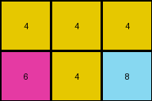

# 7b7f7511 • 017 • refine_dreamer

---


Previous Code:
```python
"""
The program transforms the input grid into the output grid by cropping it to its top-left quarter. Specifically:

1.  **Determine Dimensions:** Get the number of rows and columns of the input grid.
2.  **Calculate Output Rows**: Calculate the number of output rows. Divide the input rows by 2. If the input rows is even, that value is the result. If the input rows is odd, add the remainder of input rows / 2 to the result.
3.  **Calculate Output Columns**: the number of columns in the output is exactly half the number of columns in the input.
4.  **Crop Grid:** Create the output grid by selecting the input rows from the top (index 0) of the input grid up to, but not including, the calculated output rows, and the columns from the left (index 0) of the input grid, up to, but not including, the calculated output columns.
5.  **Output**: The output grid consists of the top-left quarter of the input grid.
"""

import numpy as np

def transform(input_grid):
    # initialize output_grid
    input_rows = len(input_grid)
    input_cols = len(input_grid[0])
    output_rows = input_rows // 2 + input_rows % 2
    output_cols = input_cols // 2
    output_grid = np.zeros((output_rows, output_cols), dtype=int)

    # change output pixels
    for i in range(output_rows):
        for j in range(output_cols):
            output_grid[i][j] = input_grid[i][j]

    return output_grid
```

Train Set Results:

## Example 1:

Input:
```
1 1 3 2 1 1 3 2
1 1 3 3 1 1 3 3
3 3 1 1 3 3 1 1
2 3 1 1 2 3 1 1
```
Expected Output:
```
1 1 3 2
1 1 3 3
3 3 1 1
2 3 1 1
```
Transformed Output:
```
1 1 3 2
1 1 3 3
```

match: False
pixels_off: None
size_correct: False
color_palette_correct: True
correct_pixel_counts: False

## Example 2:

Input:
```
4 4 4 4 4 4
6 4 8 6 4 8
6 6 8 6 6 8
```
Expected Output:
```
4 4 4
6 4 8
6 6 8
```
Transformed Output:
```
4 4 4
6 4 8
```

match: False
pixels_off: None
size_correct: False
color_palette_correct: True
correct_pixel_counts: False

## Example 3:

Input:
```
2 3
3 2
4 4
2 3
3 2
4 4
```
Expected Output:
```
2 3
3 2
4 4
```
Transformed Output:
```
2
3
4
```

match: False
pixels_off: None
size_correct: False
color_palette_correct: True
correct_pixel_counts: False

**INSTRUCTIONS**

The code above was generated based on observations from the first training
example

we have tested the transform function on each of the task example inputs and
compared with the expected output

review each of the examples provided and the results and consider how the
natural language program should be updated to accommodate this new knowledge

respond with the following deliverables:

- general assessment of the information provided and strategy for resolving the
  errors
- gather metrics about each of the examples and results - use code_execution to
  develop accurate reports on your assumptions
- a YAML block documenting facts - Focus on identifying objects, their properties, and the actions performed on them.
- a natural language program - Be as clear and concise as possible, providing a complete description of the transformation rule.


your responses should be considered as information in a report - not a
conversation
