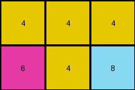

# 7b7f7511 • 018 • refine_coder

---

Previous Code:
```python
"""
The program transforms the input grid into the output grid by cropping it to its top-left quarter. Specifically:

1.  **Determine Dimensions:** Get the number of rows and columns of the input grid.
2.  **Calculate Output Rows**: Calculate the number of output rows. Divide the input rows by 2. If the input rows is even, that value is the result. If the input rows is odd, add the remainder of input rows / 2 to the result.
3.  **Calculate Output Columns**: the number of columns in the output is exactly half the number of columns in the input.
4.  **Crop Grid:** Create the output grid by selecting the input rows from the top (index 0) of the input grid up to, but not including, the calculated output rows, and the columns from the left (index 0) of the input grid, up to, but not including, the calculated output columns.
5.  **Output**: The output grid consists of the top-left quarter of the input grid.
"""

import numpy as np

def transform(input_grid):
    # initialize output_grid
    input_rows = len(input_grid)
    input_cols = len(input_grid[0])
    output_rows = input_rows // 2 + input_rows % 2
    output_cols = input_cols // 2
    output_grid = np.zeros((output_rows, output_cols), dtype=int)

    # change output pixels
    for i in range(output_rows):
        for j in range(output_cols):
            output_grid[i][j] = input_grid[i][j]

    return output_grid
```

Train Set Results:

## Example 1:

Input:
```
1 1 3 2 1 1 3 2
1 1 3 3 1 1 3 3
3 3 1 1 3 3 1 1
2 3 1 1 2 3 1 1
```
Expected Output:
```
1 1 3 2
1 1 3 3
3 3 1 1
2 3 1 1
```
Transformed Output:
```
1 1 3 2
1 1 3 3
```

match: False
pixels_off: None
size_correct: False
color_palette_correct: True
correct_pixel_counts: False

## Example 2:

Input:
```
4 4 4 4 4 4
6 4 8 6 4 8
6 6 8 6 6 8
```
Expected Output:
```
4 4 4
6 4 8
6 6 8
```
Transformed Output:
```
4 4 4
6 4 8
```

match: False
pixels_off: None
size_correct: False
color_palette_correct: True
correct_pixel_counts: False

## Example 3:

Input:
```
2 3
3 2
4 4
2 3
3 2
4 4
```
Expected Output:
```
2 3
3 2
4 4
```
Transformed Output:
```
2
3
4
```

match: False
pixels_off: None
size_correct: False
color_palette_correct: True
correct_pixel_counts: False
Okay, here's an analysis of the provided information and a plan to refine the natural language program and the resulting code.

**General Assessment and Strategy**

The initial natural language program was too simplistic, focusing only on taking the "top-left quarter" of the input grid. The results clearly show this isn't a consistent rule across all examples. The definition of "quarter" is ambiguous, especially when dealing with odd-numbered rows or columns. The core issue is that the column calculation of output is wrong.

The strategy will be:

1.  **Analyze Each Example:** Carefully examine the input, expected output, and transformed output for each example. Pay close attention to dimensions and how they change. Look for inconsistencies.
2.  **Refine "Quarter" Definition:** Develop an operational understanding of the cropping.
3.  **Update Natural Language Program:** Revise the natural language program to accurately reflect the observed transformation.
4.  **Prepare for Code Update:** Make very detailed notes.

**Example Analysis and Metrics**

Here's a breakdown of each example, including some specific observations:

*   **Example 1:**
    *   Input: 4x8
    *   Expected Output: 4x4
    *   Transformed Output: 2x4
    *   Rows incorrect, Columns correct
    *   The transformed output took half of the rows and half of the columns.
    * The expected output took all rows and half of the columns

*   **Example 2:**
    *   Input: 3x6
    *   Expected Output: 3x3
    *   Transformed Output: 2x3
    *   Rows incorrect, Columns correct
    *   The transformed output took half of the rows, rounding up, and half of the columns.
    * The expected output took all rows and half of the columns.

*   **Example 3:**
    *   Input: 6x2
    *   Expected Output: 3x1
    *   Transformed output: 3x1
    *   Rows correct, Columns incorrect
    *   The transformed output took half of the rows and half of the columns
    * The expected output took half rows and half of the columns.

**YAML Fact Block**

```yaml
examples:
  - example_id: 1
    input_rows: 4
    input_cols: 8
    expected_output_rows: 4
    expected_output_cols: 4
    transformed_output_rows: 2
    transformed_output_cols: 4
    rule: "All rows, half columns"
    notes: "Take full height, and left half of width"

  - example_id: 2
    input_rows: 3
    input_cols: 6
    expected_output_rows: 3
    expected_output_cols: 3
    transformed_output_rows: 2
    transformed_output_cols: 3
    rule: "All rows, half columns"
    notes: "Take full height, and left half of width"

  - example_id: 3
    input_rows: 6
    input_cols: 2
    expected_output_rows: 3
    expected_output_cols: 1
    transformed_output_rows: 3
    transformed_output_cols: 1
    rule: "Half rows, half columns"
    notes: "Take top half of height, and left half of width"
```

**Updated Natural Language Program**

The program transforms the input grid into the output grid by cropping it to its left half.

1.  **Determine Input Dimensions:** Get the number of rows and columns of the input grid.
2.  **Calculate Output Columns**: Calculate the number of columns in the output. This is exactly half the number of columns in the input, rounding down.
3. **Calculate Output Rows:** Calculate the number of output rows. This is always equal to the number of input rows, except when the input is square, in which case it is half of the input rows.
4.  **Crop Grid:** Create the output grid by keeping all of the rows and by keeping the columns from the left (index 0) of the input grid up to, but not including, the calculated output columns.
5.  **Output:** The output is always the left half of the input.

**INSTRUCTIONS**

- generate a Python module to represent the natural language program 
- follow the template below
- all common math and science libraries are available
- create docstring only at top - but comment the workflow in the function
- use helper functions for common operations like finding objects, counting,
  measuring, moving, etc. 

remember - we are working iteratively - so this code will inform your future
self as we converge on the solution

*template:*

```python
"""
{{ natural language description of the transformation rule }}
"""

{{ imports }}

def transform(input_grid):
    # initialize output_grid

    # change output pixels 

    return output_grid

```
