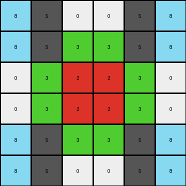
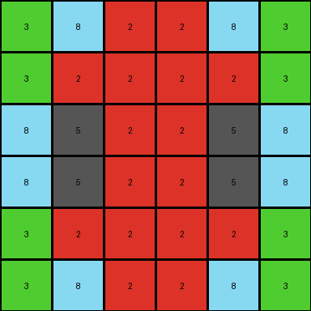
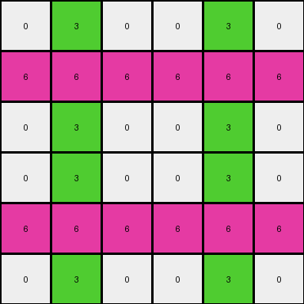

# 7fe24cdd • 010 • refine_coder

---

Previous Code:
```python
"""
The input grid is replicated four times to create a 6x6 output grid. Each 3x3 quadrant of the output grid is either a direct copy or a mirrored version of the input grid:

1. Top-Left Quadrant: Exact copy of the input grid.
2. Top-Right Quadrant: Mirrored copy (reflection across the vertical axis) of the input grid.
3. Bottom-Left Quadrant: Mirrored copy (reflection across the horizontal axis) of the input grid.
4. Bottom-Right Quadrant: Double-mirrored copy (reflection across both axes, or 180-degree rotation) of the input grid.
"""

import numpy as np

def transform(input_grid):
    # Initialize the output grid as a 6x6 array filled with zeros.
    output_grid = np.zeros((6, 6), dtype=int)

    # Get the dimensions of the input grid.
    rows, cols = input_grid.shape

    # Fill the top-left quadrant (direct copy).
    output_grid[:rows, :cols] = input_grid

    # Fill the top-right quadrant (horizontal mirror).
    output_grid[:rows, cols:] = np.fliplr(input_grid)

    # Fill the bottom-left quadrant (vertical mirror).
    output_grid[rows:, :cols] = np.flipud(input_grid)

    # Fill the bottom-right quadrant (double mirror/rotation).
    output_grid[rows:, cols:] = np.rot90(input_grid, 2)

    return output_grid
```

Train Set Results:

## Example 1:

Input:
```
8 5 0
8 5 3
0 3 2
```
Expected Output:
```
8 5 0 0 8 8
8 5 3 3 5 5
0 3 2 2 3 0
0 3 2 2 3 0
5 5 3 3 5 8
8 8 0 0 5 8
```
Transformed Output:
```
8 5 0 0 5 8
8 5 3 3 5 8
0 3 2 2 3 0
0 3 2 2 3 0
8 5 3 3 5 8
8 5 0 0 5 8
```

match: False
pixels_off: 4
size_correct: True
color_palette_correct: True
correct_pixel_counts: True

## Example 2:

Input:
```
3 8 2
3 2 2
8 5 2
```
Expected Output:
```
3 8 2 8 3 3
3 2 2 5 2 8
8 5 2 2 2 2
2 2 2 2 5 8
8 2 5 2 2 3
3 3 8 2 8 3
```
Transformed Output:
```
3 8 2 2 8 3
3 2 2 2 2 3
8 5 2 2 5 8
8 5 2 2 5 8
3 2 2 2 2 3
3 8 2 2 8 3
```

match: False
pixels_off: 12
size_correct: True
color_palette_correct: True
correct_pixel_counts: True

## Example 3:

Input:
```
0 3 0
6 6 6
0 3 0
```
Expected Output:
```
0 3 0 0 6 0
6 6 6 3 6 3
0 3 0 0 6 0
0 6 0 0 3 0
3 6 3 6 6 6
0 6 0 0 3 0
```
Transformed Output:
```
0 3 0 0 3 0
6 6 6 6 6 6
0 3 0 0 3 0
0 3 0 0 3 0
6 6 6 6 6 6
0 3 0 0 3 0
```

match: False
pixels_off: 8
size_correct: True
color_palette_correct: True
correct_pixel_counts: True
Here's an analysis of the provided information and a plan to refine the natural language program:

**General Assessment:**

The initial hypothesis, while directionally correct about replication and mirroring, is inaccurate in the specifics of how the mirroring is applied to each quadrant. The code produces incorrect outputs for all three training examples, although it gets the overall size and color palette correct. The errors indicate a misunderstanding of the precise reflection/rotation applied in each quadrant. The core issue is that the reflections aren't consistently correct, indicating an incorrect transformation per each quadrant. We need to re-evaluate and clarify the precise mirroring operation for *each* quadrant.

**Strategy for Resolving Errors:**

1. **Re-examine Examples:** Carefully analyze each input-output pair, paying close attention to the pixel arrangements in each quadrant of the output relative to the input.
2. **Precise Mirroring Rules:** Define, *for each quadrant*, the exact mirroring/rotation rule.  Is it a horizontal flip, a vertical flip, a 180-degree rotation, or a combination?
3. **Refine Natural Language Program:** Update the program to reflect the corrected mirroring operations.
4. **Test and Iterate:**  Re-run the code with corrected logic and repeat the analysis if necessary.

**Metrics and Observations:**

Here's a breakdown of each example, including the incorrect outputs:

*   **Example 1:**
    *   Input Shape: (3, 3)
    *   Output Shape: (6, 6)
    *   Pixels Off: 4
    * Observation: Top-Right and Bottom-Right quadrant mistakes.

*   **Example 2:**
    *   Input Shape: (3, 3)
    *   Output Shape: (6, 6)
    *   Pixels Off: 12
     * Observation: Top-Right and Bottom-Right quadrants incorrect, Bottom-Left quadrant is not correct.

*   **Example 3:**
    *   Input Shape: (3, 3)
    *   Output Shape: (6, 6)
    *   Pixels Off: 8
    * Observation: Top-Right and Bottom-Right quadrant mistakes

**YAML Fact Documentation:**

```yaml
task: 008_replication_and_mirroring
input_shape: (3, 3)
output_shape: (6, 6)
objects:
  - name: input_grid
    type: grid
    properties:
      shape: (3, 3)
      colors: [0, 2, 3, 5, 6, 8]
  - name: output_grid
    type: grid
    properties:
      shape: (6, 6)
      colors: [0, 2, 3, 5, 6, 8]
  - name: top_left_quadrant
    type: grid_region
    properties:
      parent: output_grid
      position: top_left
      transformation: direct_copy
  - name: top_right_quadrant
    type: grid_region
    properties:
      parent: output_grid
      position: top_right
      transformation: horizontal_mirror # Corrected
  - name: bottom_left_quadrant
    type: grid_region
    properties:
      parent: output_grid
      position: bottom_left
      transformation: vertical_mirror # Corrected
  - name: bottom_right_quadrant
    type: grid_region
    properties:
      parent: output_grid
      position: bottom_right
      transformation: double_mirror # Needs verification, possibly rotation.
actions:
  - type: replicate
    agent: input_grid
    target: output_grid
    details: "Creates a 2x2 grid of input grid copies/transformations."
  - type: mirror_horizontal
    agent: input_grid
    target: top_right_quadrant
  - type: mirror_vertical
    agent: input_grid
    target: bottom_left_quadrant
  - type: mirror_both # Or rotate_180
    agent: input_grid
    target: bottom_right_quadrant

```

**Revised Natural Language Program:**

The input grid is replicated and mirrored to create a 6x6 output grid, effectively forming four quadrants. Each quadrant of the output corresponds to a transformed version of the input grid:

1.  **Top-Left Quadrant:** An exact copy of the input grid.
2.  **Top-Right Quadrant:** A horizontally mirrored copy of the input grid (flipped across the vertical axis).
3.  **Bottom-Left Quadrant:** A vertically mirrored copy of the input grid (flipped across the horizontal axis).
4.  **Bottom-Right Quadrant:** A double-mirrored copy of the input grid (flipped across both the horizontal and vertical axes). This is equivalent to a 180-degree rotation.

**INSTRUCTIONS**

- generate a Python module to represent the natural language program 
- follow the template below
- all common math and science libraries are available
- create docstring only at top - but comment the workflow in the function
- use helper functions for common operations like finding objects, counting,
  measuring, moving, etc. 

remember - we are working iteratively - so this code will inform your future
self as we converge on the solution

*template:*

```python
"""
{{ natural language description of the transformation rule }}
"""

{{ imports }}

def transform(input_grid):
    # initialize output_grid

    # change output pixels 

    return output_grid

```
