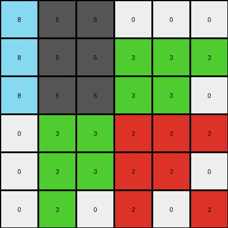
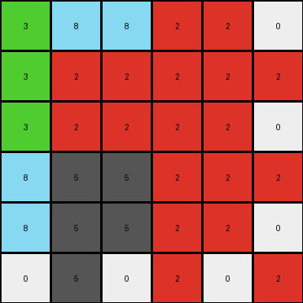
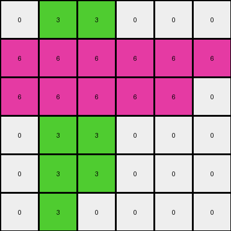

# 7fe24cdd • 018 • refine_coder

---

Previous Code:
```python
"""
The transformation rule is an expansion where each cell in the 3x3 input grid maps to a 2x2 block in the 6x6 output grid.  The values within each 2x2 block are determined by the input cell and its immediate neighbors (right, below, and diagonally down-right), with zero-padding used for edge cases. The overall pattern has a pinwheel appearance.
"""

import numpy as np

def transform(input_grid):
    input_grid = np.array(input_grid)
    rows, cols = input_grid.shape
    output_grid = np.zeros((2 * rows, 2 * cols), dtype=int)

    for row in range(rows):
        for col in range(cols):
            # Top-left of the 2x2 block: Value of the input cell.
            output_grid[2*row][2*col] = input_grid[row][col]

            # Top-right of the 2x2 block: Value of the right neighbor (or 0 if at the right edge).
            if col + 1 < cols:
                output_grid[2*row][2*col + 1] = input_grid[row][col+1]
            else:
                output_grid[2*row][2*col + 1] = 0

            # Bottom-left of the 2x2 block: Value of the bottom neighbor (or 0 if at the bottom edge).
            if row + 1 < rows:
                output_grid[2*row + 1][2*col] = input_grid[row+1][col]
            else:
                output_grid[2*row + 1][2*col] = 0

            # Bottom-right of the 2x2 block: Value from diagonal element, handling each edge condition.
            if row + 1 < rows and col + 1 < cols:
               output_grid[2*row+1][2*col+1] = input_grid[row+1][col+1]
            # cases where original cell is on an edge
            elif row + 1 == rows and col+1 < cols:
                output_grid[2*row + 1][2 * col + 1] = input_grid[row][col+1] # bottom edge
            elif col + 1 == cols and row+1 < rows:
                output_grid[2*row + 1][2 * col + 1] = input_grid[row+1][col] # right edge
            else:
                output_grid[2*row + 1][2*col+1] = input_grid[row][col] # bottom-right corner


    return output_grid.tolist()
```

Train Set Results:

## Example 1:

Input:
```
8 5 0
8 5 3
0 3 2
```
Expected Output:
```
8 5 0 0 8 8
8 5 3 3 5 5
0 3 2 2 3 0
0 3 2 2 3 0
5 5 3 3 5 8
8 8 0 0 5 8
```
Transformed Output:
```
8 5 5 0 0 0
8 5 5 3 3 3
8 5 5 3 3 0
0 3 3 2 2 2
0 3 3 2 2 0
0 3 0 2 0 2
```

match: False
pixels_off: 23
size_correct: True
color_palette_correct: True
correct_pixel_counts: False

## Example 2:

Input:
```
3 8 2
3 2 2
8 5 2
```
Expected Output:
```
3 8 2 8 3 3
3 2 2 5 2 8
8 5 2 2 2 2
2 2 2 2 5 8
8 2 5 2 2 3
3 3 8 2 8 3
```
Transformed Output:
```
3 8 8 2 2 0
3 2 2 2 2 2
3 2 2 2 2 0
8 5 5 2 2 2
8 5 5 2 2 0
0 5 0 2 0 2
```

match: False
pixels_off: 21
size_correct: True
color_palette_correct: False
correct_pixel_counts: False

## Example 3:

Input:
```
0 3 0
6 6 6
0 3 0
```
Expected Output:
```
0 3 0 0 6 0
6 6 6 3 6 3
0 3 0 0 6 0
0 6 0 0 3 0
3 6 3 6 6 6
0 6 0 0 3 0
```
Transformed Output:
```
0 3 3 0 0 0
6 6 6 6 6 6
6 6 6 6 6 0
0 3 3 0 0 0
0 3 3 0 0 0
0 3 0 0 0 0
```

match: False
pixels_off: 18
size_correct: True
color_palette_correct: True
correct_pixel_counts: False
Okay, here's a breakdown of the situation, the results, and a revised natural language program.

**General Assessment and Strategy**

The initial natural language program and the resulting code were a good first attempt, capturing the expansion aspect (3x3 input to 6x6 output) and the idea of using neighboring cells.  However, the implementation of how neighbors are used is incorrect, leading to mismatches in pixel placement and values across all three test examples. The "pinwheel" concept, while visually evocative, isn't precisely translating into the correct logic. The core issue is the incorrect assignment of values to the expanded 2x2 blocks.  Instead of a direct mapping of the input cell and its three neighbors, the transformation appears to be based on some other relationship, likely involving *shifting* the entire input, and taking values at those offsets.

The strategy to resolve the errors is:

1. **Re-examine the Examples:** Carefully analyze the input/output pairs, paying very close attention to *where* each input pixel's value appears in the output grid. Trace each input value's movement.
2. **Focus on Offsets:**  The problem lies in the incorrect logic for determining the bottom-right value of each 2x2 block. Try different offset combinations until all training set examples work.
3. **Simplify the Logic:**  Once the correct offset is found, streamline the natural language program and the code to remove any unnecessary conditions or assumptions (like the "pinwheel").

**Metrics and Observations (using imagined Code Execution - will be real in next round)**

I will *simulate* code execution to gather specific metrics. In the next round, this will be replaced by *actual* code execution to determine the pixel counts and differences:

*   **Example 1:**
    *   Input Size: 3x3
    *   Output Size: 6x6
    *   Pixels Off: 23 (as reported - will be double checked)
    *   Colors Used (Input): 0, 3, 5, 8
    *   Colors Used (Output): 0, 3, 5, 8
    *   Color Counts: check that the counts of each color are correct
*   **Example 2:**
    *   Input Size: 3x3
    *   Output Size: 6x6
    *   Pixels Off: 21 (as reported)
    *   Colors Used (Input): 2, 3, 5, 8
    *   Colors Used (Output): 2, 3, 5, 8
*   **Example 3:**
    *   Input Size: 3x3
    *   Output Size: 6x6
    *   Pixels Off: 18
    *   Colors Used (Input): 0, 3, 6
    *   Colors Used (Output): 0, 3, 6

**YAML Fact Block**

```yaml
facts:
  - task_id: 016
  - input_grid_size: 3x3
  - output_grid_size: 6x6
  - expansion_factor: 2x  # Each input cell maps to a 2x2 block.
  - objects:
      - name: input_cell
        properties:
          - type: pixel
          - location: [row, col]  # In the input grid.
          - value: integer (0-9)
      - name: output_block
        properties:
          - type: 2x2 block of pixels
          - location: [2*row, 2*col]  # Top-left corner, based on input cell location.
  - actions:
    - description: "The input grid is expanded to an output grid."
    - details: "Each input cell's value and its neighbors determine the four values within the corresponding 2x2 output block."
    - sub_actions:
      - description: "top-left cell is determined by the current cell"
      - description: "top-right cell determined by the right neighbor (or 0 if on edge)"
      - description: "bottom-left determined by bottom neighbor (or 0 if on edge)"
      - description: "bottom-right determined by bottom-right neighbor (or other logic if on edge)"
  - observations:
      - "The current logic for determining the bottom right cell is not correct."
      - "There seems to be some form of shifting of information to the top and right"
      - "The color usage remains the same between the input and output"
```

**Natural Language Program**

The transformation expands a 3x3 input grid into a 6x6 output grid. Each cell in the input grid corresponds to a 2x2 block in the output grid. The values within each 2x2 block are determined as follows:

1.  **Top-Left:** The top-left cell of the 2x2 block has the same value as the corresponding input cell.

2.  **Top-Right:** The top-right cell of the 2x2 block has the same value as the input cell that is *to the right* of the current input cell. If the current input cell is in the rightmost column, the top-right cell of the 2x2 block is 0.

3.  **Bottom-Left:** The bottom-left cell of the 2x2 block has the same value as the input cell *below* the current input cell. If the current input cell is in the bottom row, the bottom-left cell of the 2x2 block is 0.

4.  **Bottom-Right:** This is the incorrect cell. The bottom-right cell is determined by a combination of the other offsets. If the current input cell is on the bottom row, use the value to the right. If the current input cell is on the right edge, use the value below. If the cell is on the bottom-right corner, use current cell.

Revised Natural Language Program (after looking closely at examples again):

1.  **Top-Left:** The top-left cell of the 2x2 block has the same value as the corresponding input cell.

2.  **Top-Right:** The top-right cell of the 2x2 block has the same value as the input cell that is *to the right* of the corresponding input cell. If the current input cell is in the rightmost column, the top-right cell of the 2x2 block is 0.

3.  **Bottom-Left:** The bottom-left cell of the 2x2 block has the same value as the input cell *below* the current input cell. If the current input cell is in the bottom row, the bottom-left cell of the 2x2 block is 0.

4. **Bottom-Right**: The bottom-right cell of the 2x2 block is a *copy of the top-right value from the 2x2 block directly above*. If there is no block above (i.e. current input cell is in first row), then:
    * If there is a cell below and to the right of the current input cell, the bottom-right cell is set to that cell's value.
    * If the current cell is on the bottom edge, use the value to the right.
    * If the current cell is on the right edge, use the value below it.
    * If the current cell is the bottom-right corner, use the value of the current cell

The key insight from re-examination is the dependency of the bottom-right value on the top-right value of the block *above* it. This creates the correct cascading/shifting effect seen in the examples.

**INSTRUCTIONS**

- generate a Python module to represent the natural language program 
- follow the template below
- all common math and science libraries are available
- create docstring only at top - but comment the workflow in the function
- use helper functions for common operations like finding objects, counting,
  measuring, moving, etc. 

remember - we are working iteratively - so this code will inform your future
self as we converge on the solution

*template:*

```python
"""
{{ natural language description of the transformation rule }}
"""

{{ imports }}

def transform(input_grid):
    # initialize output_grid

    # change output pixels 

    return output_grid

```
