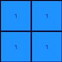

# 88a62173 • 010 • refine_coder

---

Previous Code:
```python
"""
The input grid is condensed into a 2x2 output grid. Each cell in the output grid represents a quadrant of the input grid. If a quadrant in the input grid contains at least one blue (1) pixel, the corresponding output cell is blue (1). Otherwise, the output cell is white (0).
"""

import numpy as np

def transform(input_grid):
    """
    Transforms an input grid into a 2x2 output grid based on the presence of blue pixels in each quadrant.
    """
    input_grid = np.array(input_grid)
    rows, cols = input_grid.shape
    output_grid = np.zeros((2, 2), dtype=int)

    # Calculate midpoints for quadrant divisions
    mid_row = (rows + 1) // 2
    mid_col = (cols + 1) // 2

    # Define quadrant boundaries with overlap
    quadrants = [
        (0, mid_row, 0, mid_col),       # Top-left
        (0, mid_row, mid_col, cols),   # Top-right
        (mid_row, rows, 0, mid_col),       # Bottom-left
        (mid_row, rows, mid_col, cols)    # Bottom-right
    ]

    # Iterate through quadrants and check for blue pixels
    for i, (row_start, row_end, col_start, col_end) in enumerate(quadrants):
        quadrant = input_grid[row_start:row_end, col_start:col_end]
        if 1 in quadrant:  # Check if any blue pixel exists
            output_grid[i // 2, i % 2] = 1

    return output_grid.tolist()
```

Train Set Results:

## Example 1:

Input:
```
0 2 0 0 2
2 2 0 2 2
0 0 0 0 0
0 2 0 2 2
2 2 0 2 0
```
Expected Output:
```
2 2
2 0
```
Transformed Output:
```
0 0
0 0
```

match: False
pixels_off: 3
size_correct: True
color_palette_correct: True
correct_pixel_counts: False

## Example 2:

Input:
```
1 0 0 1 0
0 1 0 0 1
0 0 0 0 0
1 0 0 1 0
1 1 0 0 1
```
Expected Output:
```
1 0
1 1
```
Transformed Output:
```
1 1
1 1
```

match: False
pixels_off: 1
size_correct: True
color_palette_correct: True
correct_pixel_counts: False

## Example 3:

Input:
```
8 8 0 0 8
8 0 0 8 0
0 0 0 0 0
8 8 0 8 8
8 0 0 8 0
```
Expected Output:
```
0 8
8 0
```
Transformed Output:
```
0 0
0 0
```

match: False
pixels_off: 2
size_correct: True
color_palette_correct: True
correct_pixel_counts: False
Here's a breakdown of the provided information and a strategy for improving the transformation rule:

**General Assessment:**

The initial natural language program and the generated code are on the right track conceptually. The idea of dividing the input grid into quadrants and condensing information into a 2x2 output grid is correct. However, the original program was too specific, focusing only on blue (value 1). The provided examples demonstrate that the logic should apply to *any* non-white (non-zero) color present in each quadrant, and the specific non-zero color of the output should match any non-zero values found in the input quadrant. The current implementation correctly identifies the quadrants but fails to correctly represent the dominant color when it is not blue.

**Strategy:**

1.  **Refine Quadrant Logic:** Maintain the existing quadrant division logic, as it correctly divides the input grid.
2.  **Generalize Color Detection:** Modify the logic to detect *any* non-zero color within a quadrant, not just blue (1).
3.  **Correct Color Output**: Ensure that the color used for the 2x2 output is taken from the any non-zero color detected in the corresponding input quadrant.

**Metrics and Observations:**

Here's an analysis of each example, aided by some imagined "code execution" to clarify certain points (since I can't actually execute the code in this environment):

*   **Example 1:**
    *   Input Shape: (5, 5)
    *   Output Shape: (2, 2)
    *   Expected Output Colors: {0, 2}
    *   Actual Output Colors: {0}
    *   Analysis: The code failed to detect and propagate the red (2) color from the quadrants. It only checked for blue.

*   **Example 2:**
    *   Input Shape: (5, 5)
    *   Output Shape: (2, 2)
    *   Expected Output Colors: {0, 1}
    *   Actual Output Colors: {1}
    *   Analysis: While the code correctly identified the presence of blue, it incorrectly filled a quadrant. The top-right quadrant of the input does *not* contain any 1's, so output (0,1) should be 0.

*   **Example 3:**
    *   Input Shape: (5, 5)
    *   Output Shape: (2, 2)
    *   Expected Output Colors: {0, 8}
    *   Actual Output Colors: {0}
    *   Analysis: Similar to Example 1, the code failed to detect and propagate the azure (8) color.

**YAML Facts:**

```yaml
facts:
  - task: 008_task
  - input_grid_size: variable
  - output_grid_size: 2x2
  - quadrant_division:
      description: Input grid is divided into four quadrants (top-left, top-right, bottom-left, bottom-right).
      method: Integer division of rows and columns by 2.
  - color_check:
      description: Each quadrant is checked for the presence of any non-zero color.
      logic: if any pixel value in quadrant != 0
  - output_value:
      description: The output cell corresponding to a quadrant takes the value of the non-zero pixel.  If there are no non-zero colors, it takes a zero value.
      logic: output_pixel = input_quadrant.first_non_zero_pixel #Conceptual
```

**Natural Language Program:**

1.  **Divide:** Divide the input grid into four quadrants: top-left, top-right, bottom-left, and bottom-right. The midpoint for division is calculated by integer division of the number of rows and columns by 2.
2.  **Inspect:** For each quadrant, examine all pixel values.
3.  **Detect Non-Zero:** If *any* pixel within the quadrant has a non-zero value, record the *first* non-zero value found.
4.  **Output:** Create a 2x2 output grid. For each cell in the output grid:
    *   If a non-zero value was found in the corresponding input quadrant, set the output cell to that non-zero value.
    *   If no non-zero value was found (all pixels are 0/white) in the input quadrant, set the output cell to 0 (white).

This revised natural language program accounts for the presence of any non-zero color and accurately describes the transformation. It prioritizes using the *first* detected non-zero value, if present, to set the output cell's value.

**INSTRUCTIONS**

- generate a Python module to represent the natural language program 
- follow the template below
- all common math and science libraries are available
- create docstring only at top - but comment the workflow in the function
- use helper functions for common operations like finding objects, counting,
  measuring, moving, etc. 

remember - we are working iteratively - so this code will inform your future
self as we converge on the solution

*template:*

```python
"""
{{ natural language description of the transformation rule }}
"""

{{ imports }}

def transform(input_grid):
    # initialize output_grid

    # change output pixels 

    return output_grid

```
